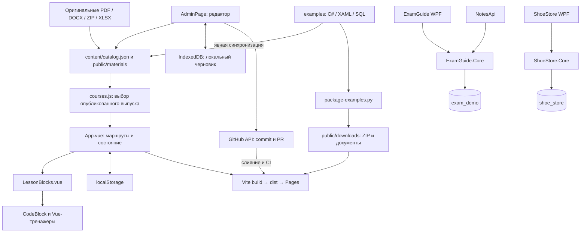

# Контекст проекта «По полочкам» для дальнейшей разработки

Дата сверки с исходниками: **8 октября 2026 года**. Базовый commit: `970938b`, ветка на момент подготовки: `main`. Документ описывает рабочее дерево, а не только этот commit. Это справочник для разработчика и следующих сессий агента: назначение, функции, контракты, зависимости и порядок расширения.

При расхождении текста с реализацией сначала изучить текущий код и обновить этот файл. Исторические отчёты в `docs/` не заменяют проверку исходников. Документ не устанавливает новые разрешения на публикацию, изменение пользовательских данных или внешних сервисов.

**Обязательное условие экзаменационной площадки, уточнено пользователем 08.10.2026: на экзамене нет интернета и нельзя устанавливать сторонние пакеты.** Текущие описанные ниже .NET 10/NuGet-примеры — снимок существующей реализации, а не подтверждённый маршрут для этой площадки. Не предлагать предварительный restore, личный кеш NuGet или перенос DLL как автоматически разрешённый обход. Использовать только подтверждённую установленную среду. Сверка ИС и план адаптации: [information-systems-exam-audit.md](docs/information-systems-exam-audit.md).

**Обновление архитектуры 08.10.2026 — редактор и архив реализованы.** Основной источник учебного контента теперь `content/catalog.json`, а не JS-массивы уроков. Выпуски и файлы имеют собственные версии; редактор сохраняет черновики в IndexedDB и отправляет изменения через GitHub API в отдельную ветку/PR. Подробная карта новых функций — [раздел 19](#19-редактор-архив-и-git-хранилище); пользовательская инструкция — [admin-and-archive.md](docs/admin-and-archive.md). Данные и генераторы C#/SQL ниже сохранены, но старые raw-источники автоматически не переписывают JSON-снимки.

## Содержание

1. [Назначение и границы](#1-назначение-и-границы)
2. [Архитектура и зависимости](#2-архитектура-и-зависимости)
3. [Карта репозитория](#3-карта-репозитория)
4. [Курсы и модель учебного контента](#4-курсы-и-модель-учебного-контента)
5. [Сайт: состояние, навигация и функции](#5-сайт-состояние-навигация-и-функции)
6. [Компоненты и интерактивные примеры](#6-компоненты-и-интерактивные-примеры)
7. [Оформление и публичные файлы](#7-оформление-и-публичные-файлы)
8. [ExamGuide и ExamGuide.Core](#8-examguide-и-examguidecore)
9. [NotesApi](#9-notesapi)
10. [ShoeStore и ShoeStore.Core](#10-shoestore-и-shoestorecore)
11. [SQL и модели данных](#11-sql-и-модели-данных)
12. [Генерация и упаковка материалов](#12-генерация-и-упаковка-материалов)
13. [Запуск, проверки и публикация](#13-запуск-проверки-и-публикация)
14. [Правила расширения](#14-правила-расширения)
15. [Ограничения и направления развития](#15-ограничения-и-направления-развития)
16. [Памятка следующей сессии](#16-памятка-следующей-сессии)
17. [Полный каталог уроков и разделов](#17-полный-каталог-уроков-и-разделов)
18. [Карта исходников показанного кода](#18-карта-исходников-показанного-кода)
19. [Редактор, архив и Git-хранилище](#19-редактор-архив-и-git-хранилище)

## 1. Назначение и границы

«По полочкам» — русскоязычная методичка с выпусками по годам и направлениям. Первый выпуск 2027 построен по двум предоставленным КИМ и приложениям специальности 09.02.07; редактор позволяет добавлять новые специальности и следующие годы.

| Направление | Идентификатор | КИМ | Предметная область | ПА | ГИА базового уровня |
|---|---|---|---|---|---|
| Специалист по информационным системам | `information-systems` | `09.02.07-5-2027` | Производство мебели | 3 задания, 70 минут | 6 заданий, 210 минут |
| Программист | `programmer` | `09.02.07-2-2027` | Магазин «Чудо Обувь» | 2 задания, 90 минут | 4 задания, 210 минут |

Для каждого курса есть подготовка, уроки, словарь, материалы, отдельный ZIP и чек-листы. Сайт показывает примеры C#/XAML/SQL, позволяет переключать СУБД, искать по методичке, отмечать выполненное и проходить небольшие тренажёры.

**Три границы исполнения:**

- Сайт — статический Vue SPA. Читается без .NET и без подключения к БД. Пользовательские отметки остаются в браузере.
- `ExamGuide` и `ShoeStore` — скачиваемые Windows-приложения WPF с настоящей БД. Это два независимых учебных решения.
- `NotesApi` — отдельный ASP.NET Core процесс, использующий БД информационных систем. Сайт его не вызывает; WPF не запускает HTTP-сервер.

Разбирается образец заданий. Профильная вариативная часть колледжа в предоставленных файлах отсутствует. Выбор .NET/WPF — принятый учебный маршрут. Учебные допущения при несовпадении исходных данных должны оставаться явными.

## 2. Архитектура и зависимости



Схема показывает зависимости и сборку. Исходники примеров можно явно синхронизировать в JSON-снимок текущего 2027 года; C# внутри сайта не исполняется. Редактор и архив загружаются отдельными Vue-чанками.

### 2.1. Технологии

Версии ниже — объявления текущих `package.json`/`.csproj`, а не рекомендация использовать последние релизы.

| Часть | Технологии |
|---|---|
| Frontend | JavaScript ESM, Vue `^3.5.22`, Composition API, `<script setup>` |
| Сборка | Vite `^7.1.7`, `@vitejs/plugin-vue` `^6.0.1` |
| UI | `lucide-vue-next` `^0.468.0`, обычный CSS, локальные шрифты |
| Подсветка | PrismJS `^1.30.0` |
| WPF | .NET 10, `net10.0-windows`, `UseWPF`, `EnableWindowsTargeting` |
| Общая логика | Библиотеки `.Core`, `net10.0`, ADO.NET |
| PostgreSQL | Npgsql `10.0.3` |
| SQL Server | Microsoft.Data.SqlClient `6.1.7` |
| Настройки .NET | Microsoft.Extensions.Configuration.Json `10.0.0` |
| Хеширование паролей | Microsoft.Extensions.Identity.Core `10.0.0`, только ExamGuide.Core |
| XLSX-импорт | ClosedXML `0.105.1`, только ShoeStore.Core |
| Подготовка артефактов | Python 3, Node.js |

Нет Vue Router, Pinia, TypeScript, ORM, автоматических миграций БД, серверной части сайта и service worker. Есть собственный редактор JSON-контента с GitHub-хранилищем. WPF использует события и code-behind, без отдельного слоя MVVM. `App.vue` управляет основными маршрутами; редактор и архив выделены в компоненты, данные уроков отделены от шаблонов.

### 2.2. Важная особенность `.Core`

Физически общая C#-логика находится в `examples/ExamGuide/Data/*.cs` и `examples/ShoeStore/Data/*.cs`. Проекты `.Core` включают её через `<Compile Include="../.../Data/*.cs" Link="Data/..." />`. WPF-проекты исключают эти файлы из собственной компиляции через `<Compile Remove="Data/**/*.cs" />` и ссылаются на `.Core`.

Поэтому отсутствие `.cs` в каталогах `.Core` нормально. Изменять нужно исходник в `Data`, сохраняя связи `.csproj`. В архиве проекты приложения и библиотеки должны оставаться рядом. `NotesApi` также ссылается на `ExamGuide.Core`.

## 3. Карта репозитория

```text
spravka/
├── PROJECT_CONTEXT.md             # Этот справочник для дальнейшей работы
├── README.md                      # Краткое назначение и запуск
├── package.json / package-lock.json
├── index.html                     # Русский HTML, #app, вход src/main.js
├── vite.config.js                 # Vue plugin, VITE_BASE_PATH
├── src/
│   ├── main.js                    # createApp и порядок CSS
│   ├── App.vue                    # Состояние, hash, все страницы сайта
│   ├── components/                # Рендерер блоков, код, четыре тренажёра/схемы
│   ├── data/
│   │   ├── course-meta.js         # Метаданные, маршруты, ключи прогресса
│   │   ├── courses.js             # Сборка объектов двух курсов
│   │   ├── lessons.js             # Уроки, словарь, ресурсы ИС
│   │   ├── programmer-lessons.js  # Уроки, словарь, ресурсы программистов
│   │   ├── code.js                # ?raw исходники ИС
│   │   ├── programmer-code.js     # ?raw исходники магазина
│   │   └── shoes.json             # Статическая выборка 31 модели для сайта
│   ├── utils/public-url.js        # URL файлов относительно адреса публикации
│   ├── style.css / fonts.css      # Базовый и исторический слой, Golos/Manrope
│   └── design-*.css               # Текущее оформление, темы, адаптивность
├── examples/
│   ├── ExamGuide/                 # WPF ИС, Data, SQL, пазл, настройки, README
│   ├── ExamGuide.Core/            # Библиотека логики ИС
│   ├── NotesApi/                  # HTTP API заметок, свои настройки
│   ├── ShoeStore/                 # WPF магазина, Data, SQL, XLSX, фотографии
│   ├── ShoeStore.Core/            # Библиотека логики магазина
│   ├── er-diagram.drawio / shoe-er.drawio
│   ├── notes.postman_collection.json
│   └── api-documentation.md
├── content/catalog.json          # Выпуски, направления, уроки, код, ссылки
├── src/content/catalog.js        # Контракт, валидация, копирование
├── src/services/                 # GitHub API и IndexedDB
├── public/
│   ├── materials/<year>/<course>/ # Версии приложений и примеров выпусков
│   ├── downloads/                 # Подготовленные ZIP, схемы, Postman, Markdown
│   ├── sources/                   # Оригиналы заданий и четыре картинки пазла
│   ├── shoes/                     # Фото для Vue-каталога, заглушка и логотип
│   └── fonts/                     # WOFF2 и лицензии OFL
├── scripts/                       # Генераторы, упаковщики и проверки
├── tests/content/                # Каталог, маршруты, безопасные ссылки, GitHub
├── tests/CoreChecks/              # Общая логика + опциональная интеграция PG
├── tests/WpfSmoke/                # Отрисовка настоящего XAML на Windows
├── docs/                          # Исторические проверки и исследования
├── design-qa.md                   # Отчёт по оформлению, 02.10.2026
└── .github/workflows/            # Pages + проверки content-check для PR
```

`node_modules`, `dist`, `tmp`, `.NET bin/obj` — локальные/генерируемые каталоги, исключённые из Git. `.gitignore` также исключает `.env`, `.env.*`, `.DS_Store`, оставляя возможность `.env.example`.

## 4. Курсы и модель учебного контента

### 4.1. Реестр курсов

`course-meta.js` экспортирует `courseMeta` и три функции:

| Функция | Контракт |
|---|---|
| `progressKey(course, id, index, year=2027)` | Для 2027 сохраняет прежние ключи ИС/других направлений; остальные годы добавляют `${year}:` перед ключом. |
| `route(course, id='overview', section='', year)` | Без year сохраняет старую форму; с year строит `#year/YYYY/course/id[/section]`. |
| `parseRoute(hash, registry=courseMeta)` | Разбирает admin/archive, выбор, годовой маршрут и старые ссылки; registry позволяет распознать новые направления текущего года. Сам урок не валидирует. |

Метаданные содержат `id`, `title`, `short`, `kim`, `paCount`, `paTime`, `pages`, `download`, `subtitle`, `domain`, `description`, `verification`. `pages` — число страниц исходного КИМ (45/55), не число экранов сайта. `download` строится через `publicUrl`.

`courses.js` импортирует JSON-каталог и экспортирует `catalog`, `coursesForYear(year)` и текущий `courses`. Функция отбирает только published-направления нужного выпуска, преобразует ссылки через `publicUrl` и возвращает реестр ID → курс. Метаданные JS выше сохранены для исходных проверок 2027. Весь JSON входит в основную сборку; страницы редактора/архива загружаются лениво.

### 4.2. Структура урока

Каждый файл уроков экспортирует ровно `lessons`, `glossary`, `resources`. Эти JS-массивы сохранены как исходная учебная версия 2027; читатель и редактор используют такие же объекты из `content/catalog.json`. Контракт урока:

```js
{
  id: 'stable-lesson-id',        // URL и ключи прогресса
  number: '01',                 // строка для отображения с ведущим нулём
  title: 'Название',
  short: 'Краткий текст карточки',
  icon: 'Database',             // ключ таблицы icons в App.vue
  time: 30,                    // минуты; setup имеет 0
  tag: 'ПА · ГИА',
  summary: 'Вводный текст',
  deliverable: 'Что нужно получить',
  source: 'На какой исходник опирается урок',
  sections: [{ id: 'stable-section-id', title: 'Раздел', blocks: [] }],
  checks: ['Критерий самопроверки']
}
```

Порядок массива — учебный маршрут и порядок кнопки «Дальше». Подготовка `setup` необязательна; ПА показывает её, если она есть, и первые `paCount` обычных заданий, а не отбирает по `tag`. Остальные уроки должны идти в порядке ПА, затем ГИА. В исходных направлениях 2027 общая длительность без подготовки — 210 минут; ПА — 70/90 минут. Новые направления задают своё время и баллы в метаданных.

На момент описания: ИС — 7 уроков с подготовкой, 29 разделов, 30 чекбоксов (26 без подготовки), 22 термина, 9 ресурсов. Программисты — 5 уроков с подготовкой, 21 раздел, 24 чекбокса (20 без подготовки), 18 терминов, 6 ресурсов.

### 4.3. Контракт блоков

Рендерер находится в `LessonBlocks.vue`. Все поддерживаемые типы:

| `type` | Поля | Поведение |
|---|---|---|
| `p` | `text` | Обычный абзац, Vue экранирует текст. |
| `list` | `items: string[]` | Нумерованные шаги. |
| `note` | `title`, `text`, `tone` | Информационная/предупреждающая вставка; `warning` меняет значок. |
| `table` | `headers: string[]`, `rows: string[][]` | Таблица в контейнере с прокруткой. |
| `code` | `title`, `language`, `key` либо `text` | Исходник по ключу курса либо встроенный текст. |
| `dbSetup` | необязательный `name` | Инструкции создания БД, default `exam_demo`, SQL под выбранную СУБД. |
| `diagram` | дополнительных полей нет | Компактная ER-схема мебели. |
| `calculator` | дополнительных полей нет | Калькулятор стоимости столов. |
| `authDemo` | дополнительных полей нет | Vue-тренажёр пароля, пазла и блокировки. |
| `shoeDemo` | дополнительных полей нет | Vue-каталог и расчёт скидки. |

`databaseName(block)` берёт `block.name || 'exam_demo'`. `sqlCreate(block)` для PostgreSQL возвращает `CREATE DATABASE ...;`, для SQL Server добавляет `GO / USE / GO`. `getCode(block)` сначала берёт строковый `text`, включая пустую строку, затем `(codeSet || {})[key]`. Строка показывается напрямую; объект выбирается по `db`: `postgres`/`mssql`.

Неизвестный тип молча не отрисуется. Отсутствующий ключ кода отклоняет валидатор; рендерер также возвращает пустую строку при отсутствии ключа. `code` ожидается строкой. При добавлении типа следует изменить рендерер, проверки и поиск, если блок содержит текст для поиска.

`glossary` — массив `[термин, определение]`. Ресурс — `{title, description, url, type}`. В JSON `url` пишется относительно `public/` без начального `/`; `coursesForYear` применяет `publicUrl`. Внешние http(s)-адреса тоже разрешены, javascript/data/обход каталога отклоняются. PDF открывается в новой вкладке; остальные типы получают атрибут `download`.

## 5. Сайт: состояние, навигация и функции

### 5.1. Инициализация и постоянное состояние

`src/main.js` монтирует `App` в `#app`. `stored(key, fallback)` читает JSON из `localStorage`, возвращая fallback при отсутствии, `null` или исключении.

| Ключ localStorage | Значение | Default / особенности |
|---|---|---|
| `spravka-theme` | JSON-строка `light`/`dark` | `light`; любое другое значение нормализуется в `light`. |
| `spravka-db` | `postgres`/`mssql` | `postgres`; неизвестное значение исправляется. Общий для курсов. |
| `spravka-mode` | `gia`/`pa` | `gia`; неизвестное значение исправляется. Общий для курсов. |
| `spravka-track` | ID курса | При отсутствии/неизвестном ID показывается выбор направления. |
| `spravka-checks` | объект `ключ → boolean` | `{}`; отметки двух направлений в одном объекте. |

Hash с известным курсом имеет приоритет над сохранённым направлением. Если курс не выбран, внутренний fallback — первое опубликованное направление текущего года, но пользователь видит chooser. Отказ браузера в сохранении обрабатывается; отметки остаются в памяти текущей страницы. Для `checks` нет полной проверки формы JSON: это точка возможного улучшения.

Нет синхронизации между устройствами или обработчика `storage` для нескольких вкладок. Состояние Vue-тренажёров не пишется в localStorage. Данные браузера изолированы по origin: смена домена не переносит прогресс.

### 5.2. Навигация

| Адрес | Результат |
|---|---|
| `#specialties` | Выбор направления текущего года. |
| `#admin`, `#archive` | Редактор и каталог выпусков. |
| `#year/2027/information-systems/sql/query` | Закреплённый годовой маршрут с разделом. |
| `#information-systems/overview` | Обзор ИС. |
| `#programmer/catalog/discount` | Урок каталога, прокрутка к скидке. |
| `#course/lesson/checklist` | Чек-лист урока. |
| `#sql/query` | Совместимая старая ссылка на ИС. |
| `#course/glossary`, `/resources`, `/cheatsheet` | Словарь, материалы, подготовка к сдаче. |
| Неизвестный урок известного курса | Обзор этого курса. |

В последней строке «неизвестный» может означать и урок ГИА, скрытый текущим режимом ПА. Неизвестный первый сегмент интерпретируется как старый ID урока ИС, не как новый неизвестный курс. Реального server routing нет: все адреса обслуживаются одним `index.html`.

### 5.3. Все именованные функции `App.vue`

| Функция | Назначение и побочные эффекты |
|---|---|
| `stored` | Безопасное чтение JSON из localStorage. |
| `href(id, section)` | Строит маршрут выбранного курса через `route`. |
| `selectCourse(id)` | Меняет курс, закрывает chooser, очищает поисковые строки, сохраняет track, открывает обзор. |
| `chooseSpecialty()` | Закрывает поиск/мобильное меню, ставит `#specialties`, включает chooser, прокручивает вверх. |
| `trackSection()` | Находит последний раздел/чек-лист с верхней координатой ≤145 px; обновляет активный TOC. При отсутствии берёт первый. |
| `key(id, index)` | Обёртка над `progressKey` для текущего курса. |
| `isDone(lesson)` | Требует непустой чек-лист и отметки всех пунктов. |
| `syncHash()` | Разбирает hash с реестром текущего года, выбирает выпуск, курс или globalPage (admin/archive), при недоступном выпуске открывает архив; проверяет доступность урока, закрывает мобильное меню, ждёт DOM, прокручивает и меняет `document.title`. |
| `navigate(id, section)` | Закрывает chooser/поиск и меняет hash; при том же hash явно вызывает `syncHash`, чтобы повторный TOC-переход прокручивал страницу. |
| `markDone()` | Ставит всем чекбоксам текущего урока одно значение; если урок был готов, снимает всё. |
| `reset()` | Удаляет ключи известных чекбоксов всех уроков текущего курса, включая скрытые ГИА и setup. Другой курс и настройки сохраняются. Закрывает диалог. |
| `keyboard(event)` | Ctrl/Cmd+K переключает поиск; Escape закрывает поиск, меню и сброс; Tab/Shift+Tab удерживают фокус в открытом диалоге. |
| `printPage()` | Вызывает `window.print()`. |
| `focusMain()` | Фокусирует `#main` по skip-link, без изменения hash. |

Транзиентные refs: `editionYear`, `globalPage`, `active`, `choosing`, `searchOpen`, `query`, `glossaryQuery`, `mobileOpen`, `searchInput`, `saveStatus`, `resetOpen`, `currentSection`; `returnFocus` хранит элемент до открытия диалога.

### 5.4. Вычисляемое состояние

| Вычисление | Смысл |
|---|---|
| `course`, `lessons`, `glossary`, `resources` | Данные текущего направления. |
| `shownLessons` | Полный маршрут ГИА либо подготовка + первые `paCount` заданий. |
| `tasks` | `shownLessons` без `setup`. |
| `current` | Урок по `active` из полного массива; доступность при навигации проверяет `syncHash`. |
| `currentIndex` | Индекс в видимом маршруте для кнопки «Дальше». |
| `done` | Число полностью отмеченных видимых заданий без подготовки. |
| `allCheckCount`, `checkCount` | Всего/отмечено чекбоксов видимых заданий без подготовки. |
| `percent` | Округлённый процент по чекбоксам, не по количеству уроков. |
| `nextLesson` | Первый неготовый видимый урок, включая setup; если все готовы — последний. |
| `modeTime` | ПА — paTime курса, ГИА — giaTime курса. |
| `searchResults` | До 25 результатов по текущему видимому маршруту и всему словарю курса. |
| `filteredGlossary` | Термины и определения, содержащие строку словарного поиска. |

Подготовка может быть не отмечена даже при 100% общего прогресса; «Продолжить» тогда ведёт в неё. Это следствие разных наборов для `percent` и `nextLesson`. При нуле пунктов процент равен 0; валидатор требует задания и непустые чек-листы у опубликованного направления.

### 5.5. Watchers и lifecycle

- `theme`: сразу ставит `document.documentElement.dataset.theme`, сохраняет настройку.
- `active`: после `nextTick` обновляет TOC.
- `db`: сохраняет выбор; при ошибке выставляет статус сохранения.
- `mode`: сохраняет выбор; переводит на обзор, если текущий урок скрыт режимом ПА.
- `checks`, deep watcher: сохраняет объект отметок и сообщает результат через `role=status`.
- `[searchOpen, resetOpen]`: запоминает фокус, фокусирует поле поиска/первую кнопку сброса, после закрытия возвращает фокус; закрытый поиск очищает `query`.
- `onMounted`: первичный `syncHash`, подписки на `hashchange`, `keydown`, пассивный `scroll`.
- `onUnmounted`: снимает эти три подписки.

### 5.6. Поиск и страницы

Поиск приводит строку к нижнему регистру с локалью `ru`, обрезает края. Пустой запрос показывает первые пять видимых уроков. Непустой проверяет название/summary/short уроков, заголовки разделов и текст блоков. В каждом блоке используется первое непустое из `text`, `title`, `items.join`, `rows.flat().join`; это не полный поиск по всем полям. Сырые C#/SQL-файлы, заголовки таблиц и материалы не индексируются. Затем добавляются термины словаря. Результаты идут в порядке обхода, без релевантности; Enter открывает первый.

Страницы: chooser; обзор с экзаменационными параметрами, темами и СУБД; урок с ожидаемым результатом, блоками, чек-листом и TOC; фильтруемый словарь; материалы и внешние ссылки; список перед сдачей с артефактами заданий, печатью и сбросом. Общая оболочка — sidebar, topbar, footer, мобильное меню. В шаблоне сдачи есть ветка `selected==='information-systems'`, иначе выводится структура магазина: третий курс потребует отдельного решения.

## 6. Компоненты и интерактивные примеры

### 6.1. `CodeBlock.vue`

Props: `code`, `title`, `language` (default `csharp`). `long` означает больше 26 строк; `expanded` управляет CSS-сворачиванием. `highlighted` использует Prism и grammar языка, fallback `plain`. Загружены C#, SQL, JSON, PowerShell и Markdown. Подсвеченный HTML вставляется через `v-html` из результата Prism.

`copy()` записывает исходную строку через `navigator.clipboard.writeText`, показывает «Скопировано» на 2200 ms; при отказе предлагает выделение и Ctrl+C. Кнопка разворачивания меняет `expanded`; показывается полное число строк. Даже свёрнутый блок хранит весь текст. Не следует передавать в `code` `undefined` или объект диалектов.

### 6.2. `CostCalculator.vue`

Фиксированные пять материалов и три операции на стол «Самобранка». `quantity` начинается с 2. `valid` разрешает целые значения 1–10 000. Материалы: 4987.14; операции: 2200; одно изделие: 7187.14; два изделия: **14374.28**.

`money(value)` форматирует два знака по `ru-RU`. `adjust(delta)` меняет количество с ограничением 1–10 000. Итог = `(costMaterials + costOperations) × quantity`. Этот Vue-пример не выполняет SQL и не читает БД; числа продублированы из учебной модели.

### 6.3. `AuthDemo.vue`

Локальные refs: четыре фрагмента `[3,1,4,2]`, выбранная позиция, `login='user'`, пароль, попытки, блокировка, сообщение, успех. `solved` сравнивает порядок с `[1,2,3,4]`.

| Функция | Поведение |
|---|---|
| `swap(index)` | Первое нажатие выбирает позицию, второе меняет два фрагмента и снимает выбор. |
| `shuffle()` | Возвращает фиксированный учебный порядок; случайной перестановки нет. |
| `submit()` | Пустые поля/неизвестный логин не увеличивают счётчик. Для `user` проверяет блокировку, пароль `Test123!` и пазл; третья ошибка блокирует. Успех обнуляет попытки. |
| `reset()` | Снимает блокировку, очищает пароль/попытки/успех, возвращает исходный пазл. |

Состояние сбрасывается при размонтировании. Учётная запись и пароль здесь отличаются от `ExamGuide` (`User123!`); Vue-демо не является точной реализацией `AuthService`. Надпись компонента о выполнении проверки «сервером» историческая: в актуальном WPF это C#-логика приложения и БД.

### 6.4. `ErDiagram.vue`

Статический массив восьми сущностей мебели: customers, customer_orders, customer_order_items, products, specification_materials, materials, specification_operations, operations. Показаны PK/FK и подписи связей; скачивается полная схема из DRAWIO-ресурса выбранного выпуска (его версия файла), если такой ресурс есть. Производственные таблицы и users/notes есть в полном SQL, но не в компактном визуальном компоненте. Изменение SQL само по себе не обновляет этот массив.

### 6.5. `ShoeDemo.vue`

Источник — `src/data/shoes.json`: 31 объект `{id,name,category,manufacturer,image,description,price,available,orderedDates}`. Категории выводятся из fixture. Начальная дата `2026-05-15`, цена сортируется по возрастанию.

`period` строит начала предыдущего и текущего календарного месяца, включая переход января к декабрю. `rows` для каждой модели проверяет наличие даты заказа в полуинтервале `[start,end)`, назначает скидку 25% при отсутствии истории, округляет цену до копеек, совмещает поиск по имени/описанию с категорией и сортировкой. `money` выводит два знака по `ru-RU`.

Остаток ≤3 выделяется, >5 означает «много», иначе «мало». Изображения ленивые; при ошибке — `shoes/picture.png`. Корзины, оформления и сохранения заказов здесь нет. Без корректной даты компонент показывает подсказку; вычисление строк при этом всё равно трактует историю как отсутствующую. Полноценная валидация даты — возможное улучшение.

## 7. Оформление и публичные файлы

CSS импортируется последовательно: `style.css` → `design-shell.css` → `design-content.css` → `design-home.css`. Базовый `style.css` импортирует `fonts.css`; часть исторических правил остаётся и переопределяется поздними слоями.

| Файл | Ответственность |
|---|---|
| `fonts.css` | Локальные Golos Text и Manrope, @font-face. |
| `style.css` | Базовые/исторические правила, компоненты, responsive/print. |
| `design-shell.css` | Общие цветовые tokens, светлая/тёмная тема, оболочка, sidebar/topbar, модальные окна и фокус. |
| `design-content.css` | Статья, TOC, таблицы, код, тренажёры, материалы/сдача, mobile/print. |
| `design-home.css` | Inter Latin/Cyrillic, итоговые шрифты, обзор, chooser, карточки, дополнительные переопределения. |

Тема задаётся `data-theme` на `<html>`. Основной акцент `#2f53f1`; используются переменные поверхностей/текста/границ. Текущий основной шрифт Inter; Golos Text и системный sans-serif — fallback. Локальные шрифты исключают необходимость внешнего CDN. Есть лицензии OFL. Lucide — иконки, Prism — подсветка.

Responsive-правила встречаются на 1600, 1200, 1100, 1000, 820 и 600 px. Sidebar переходит в открываемую мобильную панель; TOC и сетки меняются по ширине. У печати отдельные правила скрытия управления и разворачивания содержимого. При изменении стилей проверить все четыре CSS-слоя: имя класса может иметь несколько определений.

Доступность реализована skip-link, именами кнопок, `aria-current`, `aria-pressed`, `role=dialog`, `aria-modal`, удержанием/возвратом фокуса, Escape и status/live regions. Это существующие механизмы, не утверждение о полном соответствии стандарту доступности.

`publicUrl(path)` в `src/utils/public-url.js` оставляет scheme URL, `//...` и hash неизменными; прочие пути присоединяет к `import.meta.env.BASE_URL` с нормализованным `/`. В обычном Node без Vite используется `/`. `vite.config.js` берёт base из `VITE_BASE_PATH` либо `/`.

Для runtime ссылок из Vue/JS всегда применять `publicUrl('downloads/...')`, `publicUrl('sources/...')`, `publicUrl('shoes/...')`. CSS `url('/fonts/...')` обрабатывает Vite. `public/` копируется в `dist` целиком. Оригиналы в `public/sources` — публично доступные материалы сайта.

## 8. ExamGuide и ExamGuide.Core

### 8.1. Назначение и запуск

WPF реализует вход, пазл, постоянную блокировку и управление пользователями. Мебельная модель и расчёт стоимости представлены SQL/учебными материалами; отдельного WPF-редактора производственных заказов сейчас нет.

`App.OnStartup` читает `appsettings.json` относительно `AppContext.BaseDirectory`, создаёт `Database`, `UserRepository`, `AuthService` и открывает `LoginWindow`. Ошибка запуска показывает сообщение и завершает приложение с кодом 1. `App.Users` и `App.Auth` — общие статические объекты текущего процесса.

`Database.CreateConnection()` выбирает `Postgres`/`SqlServer` и соответствующую `ConnectionStrings`; неизвестный провайдер или отсутствие строки — исключение. `Database.Command(connection, sql, parameters)` создаёт ADO.NET-команду с параметрами, преобразует `null` в `DBNull.Value`. Класс не открывает соединение, не управляет транзакцией и не создаёт схему: этим занимается вызывающая сторона. В ShoeStore находится отдельная реализация с тем же контрактом.

### 8.2. Модели и `UserRepository`

`AppUser`: `Id, Login, PasswordHash, Role, FailedAttempts, IsBlocked`. Роли — русские строки `Администратор` / `Пользователь`.

`Customer`: строковые `Id, Name, Inn, Address, Phone, Type`. JSON-ключ адреса **`addres`** задан `JsonPropertyName`: это опечатка исходного файла, которую необходимо сохранить при импорте. ID/ИНН/телефон не превращать в числа: важны ведущие нули.

| Метод | Назначение |
|---|---|
| `Verify(user, password)` | Проверка `PasswordHasher<string>`; результат, отличный от `Failed`, принимается. Автоматического обновления хеша при `SuccessRehashNeeded` нет. |
| `FindAsync(login)` | Поиск по trim + lower invariant, возвращает пользователя либо null. |
| `AllAsync()` | Полный список с хешами/ролью/попытками, сортировка по ID. |
| `RegisterFailureAsync(id)` | Одним UPDATE увеличивает попытки и ставит блокировку при третьей. |
| `ResetFailuresAsync(id)` | Обнуляет счётчик; сам по себе не снимает `is_blocked`. |
| `AddAsync(login,password,role)` | Нормализует логин, проверяет поля/роль/дубликат, выделяет MAX+1 и вставляет хеш в Serializable-транзакции. |
| `EditAsync(id,login,password,role,unblock)` | Меняет логин/роль; непустой пароль заменяет хеш, пустой сохраняет; `unblock` обнуляет попытки и блокировку. Проверяет дубликат и существование записи. |
| `SeedAsync()` | При отсутствии создаёт учебные admin/user, вставляет три заметки по фиксированным ID без дублирования. Не создаёт SQL-схему. |
| `ImportCustomersAsync(path)` | Десериализует JSON, в одной транзакции добавляет отсутствующие ID, не обновляя существующие записи. |

Учебные аккаунты: `admin / Admin123!`, `user / User123!`. Они создаются логикой seed, не хранятся в SQL в виде открытого пароля.

### 8.3. `Puzzle` и `AuthService`

`Puzzle` хранит приватные четыре числа. `Tiles` отдаёт read-only view, `IsSolved` сравнивает фактический порядок с 1–4. Конструктор вызывает `Shuffle`; случайная перестановка дополнительно меняет первые два элемента, если случайно получился готовый пазл. `Swap(first,second)` проверяет диапазон 0–3 и меняет элементы.

`AuthService.LoginAsync(login,password,puzzle)`:

1. Отказывает при пустых обязательных полях без учёта попытки.
2. Находит пользователя; уже заблокированному отказывает.
3. Считывает `IsSolved`, затем перемешивает пазл для одноразового использования отправки.
4. Неверный пазл/пароль увеличивает попытку известного пользователя ровно на один. Неизвестный пользователь не создаёт запись попыток.
5. После третьей ошибки читает блокировку из БД и сообщает о ней.
6. При успехе сбрасывает счётчик и ставит `Current` по свежей записи.

`RequireUserAsync(administrator=false)` перечитывает пользователя по ID: исчезнувшая/заблокированная учётная запись сбрасывает `Current`; роль проверяется по свежей записи. `Logout()` очищает `Current`. Состояние входа находится в памяти процесса; блокировка — в БД.

Репозиторий не авторизует административные вызовы самостоятельно. В существующем WPF перед каждым таким действием вызывается `RequireUserAsync(true)`; этот порядок необходимо сохранять и для новых точек входа.

### 8.4. Все функции окон

| Файл | Функции и ответственность |
|---|---|
| `LoginWindow.xaml.cs` | Конструктор и `DrawPuzzle` создают кнопки/картинки; `Tile_Click` выбирает/меняет фрагменты; `Shuffle_Click` перемешивает; `Login_Click` блокирует кнопки, вызывает Auth, открывает MainWindow, очищает пароль; `Seed_Click` готовит аккаунты/заметки и JSON; `ShowError` отображает понятную ошибку. |
| `MainWindow.xaml.cs` | Конструктор/`RefreshIdentity` показывают логин и роль; `Admin_Click` проверяет Admin, открывает модальное управление, обновляет роль после закрытия; `Refresh_Click` проверяет актуальность входа; `Logout_Click` вызывает `Logout`, который очищает Auth и возвращает LoginWindow. |
| `AdminWindow.xaml.cs` | Конструктор запускает загрузку при Loaded; `LoadUsersAsync` проверяет Admin и читает список; `SelectionChanged` заполняет форму; `New_Click` сбрасывает editingId; `Save_Click` заново проверяет Admin, добавляет/редактирует; `Error` сообщает ошибку; `Refresh_Click` обновляет; `Back_Click` закрывает. |

`.xaml` определяет поля, DataGrid, команды кнопок, названия и размеры; `App.xaml` — общие стили. Это code-behind, привязки данных и событий, не браузерные страницы.

## 9. NotesApi

`examples/NotesApi/Program.cs` — Minimal API. DI: `Database` singleton; `UserRepository` и `NotesRepository` scoped. Имеется только GET **`/notes`**. Альтернативный `/api/notes` упоминается в учебном deliverable, но не реализован текущим приложением.

| Запрос/состояние | Ответ |
|---|---|
| `/notes` | 200, все заметки с преобразованными полями. |
| `/notes?user_id=2` | 200, фильтр по ID пользователя. |
| Нет совпадений | 200 и `[]`. |
| Неизвестный ключ query | 400, JSON `{error}`. |
| Повторный user_id, нецелое, пустое, <1 или вне int | 400, JSON `{error}`. |
| Сбой чтения/подключения БД | 500, JSON `{error}`; исключение записывается в logger. |

Валидация query выполняется до обращения к БД. Проверка имени ключа регистрозависима. Авторизация API по учебному ТЗ не требуется; эндпоинтов записи, Swagger и явной настройки CORS сейчас нет.

`NotesRepository.GetAsync(int? userId)` делает JOIN notes/users, опционально добавляет параметризованный WHERE, сортирует по `n.id` и создаёт `NoteResponse`:

```json
{"id":1,"title_user":"Конференция ИТ - user","content":"Содержание заметки 1","formatted_date":"15.03.2027"}
```

`title_user` = название заметки + ` - ` + логин; дата — `dd.MM.yyyy` через invariant culture. Атрибуты `JsonPropertyName` фиксируют имена полей. Менять контракт нужно одновременно с документацией, Postman и уроками.

Флаг `--seed` вызывает общий UserRepository, импортирует `Data/customers.json`, пишет сообщение и завершает процесс без запуска HTTP. Обычный запуск: `dotnet run --project examples/NotesApi/NotesApi.csproj --urls http://localhost:5080`. Настройки API отдельные; подключение должно указывать на ту же `exam_demo`, что WPF.

Postman-коллекция имеет две папки: три штатных запроса (200 со структурой/датой, 400, 200 пустой массив) и один запрос 500 при остановленной БД. Проверка всех допустимых/недопустимых query-вариантов в неё не включена. Markdown-документация — пример для переноса в оригинальный DOCX-шаблон, не генератор DOCX.

## 10. ShoeStore и ShoeStore.Core

### 10.1. Создание приложения и модели

`App.OnStartup` читает настройки рядом с `.exe`, создаёт `Database`, `CatalogRepository`, `OrderRepository`, `StoreClock`, `StoreService`, `ImportService` с каталогом `Data` и открывает каталог. `App.Store`/`App.Importer` — статические объекты процесса. `App.Error(owner,ex)` показывает сообщения ожидаемых ошибок либо общую подсказку о БД.

Модели в `StoreModels.cs`: `StoreUser`, `Product`, `StockItem`, `BasketLine`, `OrderHeader`, `OrderLine`. `OrderLine.Total = Quantity × UnitPrice`. `Product` содержит справочные поля, базовую/текущую цену и суммарный остаток. `StockItem` — конкретная модель/decimal-размер/остаток. `CartRow` в `StoreService.cs` добавляет имя/размер/цену для интерфейса и вычисляет `Total`.

`StoreClock.Today` читает корневой `CalculationDate` в точном формате `yyyy-MM-dd`, иначе возвращает `DateTime.Today`. Настройка не обязательна и в текущем appsettings отсутствует. Для тренировки используется `2026-05-15`, перед сдачей фиксированную дату удаляют.

`DiscountCalculator.Period(date)` возвращает начало предыдущего и текущего месяца. `Price(basePrice, orderedLastMonth)` сохраняет базовую цену при истории, иначе умножает на `0.75m` и округляет до двух знаков `AwayFromZero`.

### 10.2. `ImportService`

`Normalize(text)` заменяет NBSP обычным пробелом, сжимает whitespace и обрезает края. `ProductName(text)` дополнительно явно сопоставляет сокращённое название «Черные туфли в классическом стиле» с полным названием каталога. `Size(cell)` читает decimal с заменой запятой на точку. `Rows(name,out workbook)` открывает первый лист XLSX и пропускает заголовок.

`RunAsync()` открывает одно соединение/транзакцию и проверяет `COUNT(products)==0`. Затем импортирует:

1. `Users_import.xlsx`: ФИО, логин, перевод ролей в Admin/Manager/User.
2. `Sizes_import.xlsx`: справочник decimal-размеров.
3. `Products_import.xlsx`: категории, подкатегории, производители и модели.
4. `Stock_Items_import.xlsx`: соответствие по нормализованным модели/производителю/размеру, доступное количество.
5. `Orders_import.xlsx`: заголовки по номеру и строки по складской позиции.

Внутренняя `Insert` привязывает каждую команду к той же транзакции. Противоречащие дата/ФИО одного номера заказа вызывают исключение. Идентификаторы назначаются порядком импорта, исторические номера заказов берутся из файла. Ожидается 31 модель, 92 позиции, 35 размеров, 20 пользователей, 10 заказов, 30 строк.

**Исходный склад уже содержит доступный остаток. Исторические заказы при импорте повторно не списываются.** Проверка пустоты смотрит только products: partially-filled БД без products может упасть по другим ограничениям. Импорт не является повторяемым upsert.

### 10.3. `CatalogRepository`

| Метод | Поведение |
|---|---|
| `FindUserAsync(login)` | Вход по trim-логину, без пароля; регистр зависит от СУБД/сопоставления. |
| `UsersAsync()` | Все пользователи с ФИО/ролью, по ID. |
| `ProductsAsync(date)` | Читает DISTINCT модели с историей заказов прошлого месяца, затем справочные поля/суммарные остатки; цены рассчитывает DiscountCalculator. |
| `StockAsync(productId)` | Размеры конкретной модели с остатками, по size. |

Критерий скидки — наличие строки заказа **любой размерной позиции модели** в предыдущем календарном месяце. Не продажи за 30 дней, не остаток и не скидка только для одного размера. Показанный `discountSql` — учебный эквивалент; сам CatalogRepository выполняет два запроса и считает цену в C#.

### 10.4. `StoreService`: состояние и операции

Хранит `Current` и приватный `List<BasketLine> basket` в памяти. `BasketCount` — сумма пар, не число строк. `Staff` — Admin/Manager; `Administrator` — Admin; `Today` берётся из StoreClock.

| Метод | Контракт |
|---|---|
| `LoginAsync(login)` | Проверяет непустой логин/существование; устанавливает Current, очищает корзину. |
| `Logout()` | Сбрасывает Current и корзину. |
| `RequireAsync(staff,admin)` | Приватно перечитывает пользователя по ID, обновляет роль, проверяет права; отсутствующий пользователь вызывает Logout. |
| `ProductsAsync()` / `StockAsync(productId)` | Доступные гостю чтения каталога и размеров. |
| `AddAsync(productId,stockId,quantity)` | Требует вход, валидирует позицию/quantity≥1/общий остаток с уже добавленным; объединяет строку по stockId. |
| `CartAsync()` | Требует вход; связывает basket с текущими моделями/размерами и актуальными ценами. Исчезнувшая позиция вызывает ошибку. |
| `QuantityAsync(stockId,quantity)` | Требует вход; quantity≥0 и ≤остатка, 0 удаляет строку. БД не меняет. |
| `Cancel()` | Очищает только basket. |
| `CustomersAsync()` | Только staff; сейчас возвращает всех пользователей, включая staff. |
| `ConfirmAsync(customerId)` | Требует вход. User оформляет только для себя; staff может выбрать существующего клиента. Передаёт копию корзины репозиторию, очищает её только после commit. |
| `OrdersAsync()` / `LinesAsync(id)` | Чтение управления заказами только staff. |
| `ChangeDateAsync(id,date)` | Только Admin. |
| `RemoveOrderAsync(id)` | Admin/Manager. |
| `RemoveLineAsync(id,lineId)` | Только Admin. |

Перед каждым защищённым вызовом роль перечитывается; UI-видимость не является единственной проверкой. Репозиторий не содержит ролевой политики: новые UI/API-входы должны обращаться через сервис либо эквивалентную проверку.

| Действие | Гость | User | Manager | Admin |
|---|---|---|---|---|
| Каталог/подробности | Да | Да | Да | Да |
| Фильтры в WPF | Нет | Да | Да | Да |
| Корзина и заказ | Нет | Для себя | Для выбранного клиента | Для выбранного клиента |
| Список/состав заказов | Нет | Нет | Да | Да |
| Удалить весь заказ | Нет | Нет | Да | Да |
| Изменить дату / удалить строку | Нет | Нет | Нет | Да |

Ограничение фильтров гостю реализовано в WPF; статический Vue-каталог позволяет фильтровать без входа.

### 10.5. `OrderRepository`: транзакции

`CreateAsync(userId,basket,date)` проверяет непустую корзину/положительное количество, группирует дубликаты stockId, суммирует в checked-контексте и сортирует по stockId. В Serializable-транзакции для каждой строки:

1. Находит модель и базовую цену.
2. Проверяет историю модели за `[start,end)`.
3. Условным UPDATE уменьшает остаток только если его достаточно.
4. Запоминает рассчитанную цену.

Все цены определяются **до вставки заголовка нового заказа**. Затем выделяются `MAX(id)+1`, вставляются шапка и строки с зафиксированной ценой, выполняется commit. Исключение до commit откатывает и ранее списанные позиции. Корзина не резервирует остатки заранее.

`AllAsync()` возвращает заголовки с ФИО и SUM строк по убыванию даты/ID. `LinesAsync(orderId)` возвращает позиции с названием/производителем/размером, количеством и исторической ценой.

`ChangeDateAsync` проверяет дату и один обновлённый заголовок, **не меняет unit_price**. Изменение даты может изменить будущую скидку каталога, поскольку история читается по датам заказов.

`RemoveAsync(orderId,itemId=null)` в Serializable-транзакции читает удаляемые строки, возвращает количество на склад, удаляет строки, затем пустую шапку; отсутствие строк — ошибка. Возвращаются остатки и для импортированных исторических заказов, если их удалить: импорт пропускает первоначальное списание, но удаление использует общую бизнес-операцию возврата.

### 10.6. Все функции UI

| Файл | Функции и ответственность |
|---|---|
| `MainWindow.xaml.cs` | Конструктор: XAML, логотип, Loaded, запрет закрытия при busy. `LoadAsync`: каталог/категории/статус; `RefreshIdentity`: ФИО, роль, доступность, корзина; `ApplyFilters`: имя/описание, категория, цена с tie-break ID; `FilterChanged`: обновление; `Login_Click`: вход/выход; `Product_Click`: карточка двойным щелчком; `Cart_Click`, `Orders_Click`: модальные окна и обновление; `Import_Click`: импорт; `Refresh_Click`: перечитывание. |
| `LoginWindow.xaml.cs` | Конструктор; `Enter_Click`: отключает кнопку, вызывает LoginAsync, ставит DialogResult; `Back_Click`: закрывает. |
| `ProductWindow.xaml.cs` | Конструктор: поля/фото, Loaded, busy-защита. `LoadAsync`: весь размерный ряд и выбор доступных размеров; `Add_Click`: целое количество, добавление через сервис; `Back_Click`: закрывает. Внутренняя модель `Choice` связывает StockItem и подпись. |
| `CartWindow.xaml.cs` | Конструктор; `LoadAsync`: строки, сумма, доступность подтверждения, выбор клиента staff; `SelectionChanged`: количество строки; `Quantity_Click`: изменение; `Confirm_Click`: подтверждение, сохранение, закрытие; `Cancel_Click`: очищает корзину; `Back_Click`: закрывает без очистки. |
| `OrdersWindow.xaml.cs` | Конструктор; `LoadAsync`: заголовки и AdminControls; `OrderSelected`: состав/дата/сумма, проверка всё ещё выбранного ID после await; `RunAsync`: общий busy/error/refresh-wrapper; `Date_Click`: дата; `Line_Click`: удалить строку; `Remove_Click`: удалить заказ; `Refresh_Click`: перечитывание; `Back_Click`: закрывает. |
| `ProductRow.cs` | Вычисляемые `Caption`, `Price`, `Stock`, `Background`, `Discount`; `ProductImageConverter.Convert`: безопасное имя файла, assets/images либо picture.png; `ConvertBack`: NotSupportedException. |

Корзина сохраняется при закрытии её окна кнопкой «Продолжить выбор», но исчезает при отмене, выходе/новом входе и завершении процесса. Остатки ≤3 имеют `#ff8080`, >5 — «много», иначе «мало». WPF-шрифт Calibri и оформление по стилю компании не следует автоматически менять вместе с дизайном сайта.

## 11. SQL и модели данных

### 11.1. `exam_demo`: 14 таблиц

| Таблица | Назначение / связи |
|---|---|
| `customers` | Контрагенты; строковый PK varchar(9). |
| `products` | Изделия; уникальный code. |
| `materials` / `operations` | Материалы/операции, цены, уникальные code. |
| `specification_materials` | Норма расхода на изделие; составной PK product/material. |
| `specification_operations` | Норма времени и количество операции; составной PK product/operation. |
| `customer_orders` | Заказ покупателя → customers. |
| `customer_order_items` | Строки → заказ/изделие, quantity, sale_price, discount_amount. |
| `production_orders` | Производственный заказ, nullable-ссылка на customer_orders. |
| `production_order_items` | Строки производства → заказ/изделие; исходный код source_product_code. |
| `production_materials` / `production_operations` | Потребности конкретного производственного заказа, source_unit; отличаются от норм спецификации. |
| `users` | Логин, хеш, русская роль, попытки, блокировка int 0/1. |
| `notes` | Название, содержимое, пользователь, дата. |

Файлы обоих диалектов: `*-schema.sql`, `*-seed.sql`, `*-cost.sql`. Schema/seed предназначены для пустой, уже созданной БД. SQL-seed готовит мебельный пример и отдельного DEMO-контрагента; аккаунты/заметки и шесть JSON-контрагентов готовятся C#-методами отдельно.

Стоимость: сначала отдельно агрегировать нормы материалов и нормы операций по product_id, потом соединять с количеством строк customer_order_items. Прямое соединение обеих спецификаций до агрегирования размножает строки. Учебный запрос считает заказ `co.id=1`. `COALESCE` трактует отсутствующий вид норм как ноль; полноту спецификации в реальной задаче проверяют отдельно. Несовпадающие коды и тарифы исходников описаны в уроке `sql/mismatch`.

### 11.2. `shoe_store`: 9 таблиц

| Таблица | Назначение / ограничения |
|---|---|
| `categories` | Уникальные названия категорий. |
| `subcategories` | FK category; UNIQUE(category_id,name). |
| `manufacturers` | Уникальные названия производителей. |
| `products` | FK подкатегория/производитель, поля модели, base_price; UNIQUE(manufacturer_id,name). |
| `sizes` | PK decimal(3,1), половинные размеры сохраняются. |
| `stock_items` | FK модель/размер, available_quantity≥0; UNIQUE(product_id,size). |
| `users` | UNIQUE login, ФИО, role IN Admin/Manager/User; паролей нет. |
| `orders` | Дата, FK user. |
| `order_items` | FK order/stock, quantity>0, unit_price≥0; UNIQUE(order_id,stock_item_id). |

Файлы: `*-schema.sql`, `*-data.sql`, `*-complete.sql`, `*-discount.sql`. Complete = схема + исходные данные; после него повторный XLSX-импорт пропускают. Data вставляет данные транзакцией. Discount содержит параметризованный учебный SELECT, для ручного редактора требуются DECLARE дат в SQL Server или замена параметров DATE-литералами в PostgreSQL.

Обе модели используют явные int PK, не identity/sequence. SQL Server хранит строки в `nvarchar`, русские литералы с Unicode-префиксом. Изменение схемы требует сверки обоих диалектов, репозиториев, генераторов, уроков и drawio. Миграций и автоматического обновления пользовательской БД нет.

## 12. Генерация и упаковка материалов

**Рабочие исходники учебных C#/SQL-проектов — `examples/`, показываемый код выпуска — его JSON-снимок.** Старые raw-карты используются при явной синхронизации, а не при чтении сайта. ZIP и копии в `public/downloads` надо обновлять отдельно, затем `npm run content:sync-examples` обновляет код и версии файлов текущего 2027. `npm run build` не запускает генераторы/упаковку/синхронизацию и не изменяет архив.

| Скрипт | Вход / результат / функции |
|---|---|
| `create-sql.py` | Содержит шаблоны мебели; создаёт 6 SQL-файлов ExamGuide, преобразует varchar/Unicode для MSSQL. Перезаписывает ручные изменения SQL. |
| `create-shoe-sql.py` | Создаёт schema/discount двух диалектов ShoeStore. После изменения схемы нужно обновить и complete-файлы. |
| `package-shoe-data.py` | Читает **`tmp/programmers/sheets.json`**, строит данные магазина, оба data/complete SQL и `src/data/shoes.json`; `norm`, `name`, `literal` нормализуют и сериализуют. Не извлекает XLSX самостоятельно и не копирует фото. |
| `create-diagram.py` | Regex-разбор PostgreSQL schema ExamGuide, XML drawio с сущностями/FK, пишет `examples/er-diagram.drawio` и публичную копию. Отдельного генератора shoe-er в репозитории нет. |
| `create-postman.mjs` | `jsonTest`, `statusTest`, `request` строят проверки/запросы; пишет `examples/notes.postman_collection.json`. Публичную копию обновляет упаковщик. |
| `package-examples.py` | `add_project` рекурсивно добавляет проекты без bin/obj/.DS_Store; собирает два ZIP и копирует Postman/Markdown-документацию в public. Запускать из корня проекта. |

`tmp/programmers/sheets.json` — промежуточный файл вне Git. При его отсутствии нельзя считать генератор shoe-data автономным; сначала восстановить подготовку из оригинальных XLSX и сверить формат `[{file, rows}]`. Python-скрипты не заменяют C#-импорт пользовательского приложения.

Содержимое `dotnet-example.zip`: ExamGuide + ExamGuide.Core + NotesApi + полная ER + Postman + api-documentation + оригинальный API DOCX-шаблон. `programmer-example.zip`: ShoeStore + ShoeStore.Core + shoe-er.drawio.

Упаковщик не обновляет публичную копию shoe-er.drawio; при её изменении копировать отдельно. Генератор мебельной ER обновляет обе копии. Копии фотографий WPF (`Assets/images`) и сайта (`public/shoes`) тоже требуют явной синхронизации.

Обычный цикл после изменения C#/SQL/README учебных проектов:

```bash
python3 scripts/package-examples.py
npm run content:sync-examples
npm run check
npm run build
```

После обновления схем/данных сначала выполнить необходимые генераторы в порядке зависимостей (schema → data/complete → diagram → ZIP), предварительно убедившись, что они сохранят требуемые ручные изменения.

## 13. Запуск, проверки и публикация

### 13.1. Сайт

Из корня проекта:

```bash
npm ci
npm run dev
# http://localhost:5173/#specialties
npm run check
npm run build
npm run check:pages
npm run preview
# http://localhost:4173/
```

Сборка для проектного пути:

```bash
VITE_BASE_PATH=/spravka/ npm run build
npm run check:pages -- /spravka/
npm run preview
# http://localhost:4173/spravka/
```

PowerShell: `$env:VITE_BASE_PATH = '/spravka/'`; после проверки `Remove-Item Env:VITE_BASE_PATH`. `check:pages` проверяет уже собранный `dist` с тем же base. Путь и переменная не меняют hash-контракт.

### 13.2. .NET

WPF требует Windows для запуска; `EnableWindowsTargeting` позволяет сборку с других ОС при наличии SDK/пакетов, но не отрисовку окон. Схема/начальные SQL выполняются вручную после создания БД. `Database:Provider` использует `Postgres`/`SqlServer` (регистр важен), frontend — отдельные значения `postgres`/`mssql`.

```powershell
dotnet restore examples/ExamGuide/ExamGuide.csproj
dotnet run --project examples/ExamGuide/ExamGuide.csproj
dotnet run --project examples/NotesApi/NotesApi.csproj -- --seed
dotnet run --project examples/NotesApi/NotesApi.csproj --urls http://localhost:5080
dotnet run --project examples/ShoeStore/ShoeStore.csproj
dotnet run --project tests/CoreChecks/CoreChecks.csproj -c Release
dotnet run --project tests/WpfSmoke/WpfSmoke.csproj -c Release
dotnet publish examples/ExamGuide/ExamGuide.csproj -c Release -r win-x64 --self-contained true -o tmp/publish/ExamGuide
dotnet publish examples/ShoeStore/ShoeStore.csproj -c Release -r win-x64 --self-contained true -o tmp/publish/ShoeStore
```

Передавать всю папку publish: DLL, конфигурацию, Data, изображения и SQL вместе с exe. WPF `.csproj` задают CopyToOutputDirectory/CopyToPublishDirectory для настроек/данных/SQL/графики. Параметры подключения заменить на окружение пользователя; текущие файлы содержат локальные учебные шаблоны `CHANGE_ME`. Собственный секрет подключения не следует переносить в опубликованные исходники/архивы.

### 13.3. Что именно проверяется

| Проверка | Покрытие и границы |
|---|---|
| `check-content.mjs` | Времена ИС, существование материалов, две папки Postman, шесть исходных строковых ID контрагентов. |
| `check-courses.mjs` | Времена обоих курсов, уникальность lesson ID и section ID внутри урока, маршруты, совместимость/разделение progressKey, отсутствие общих URL ресурсов, 31 фото. |
| `check-wpf.mjs` | Существование ?raw файлов/ключей блоков, отсутствие Razor/cshtml/Cookie/Session/wwwroot в уроках, WPF-флаги csproj и копирование publish-ресурсов. Это статическая проверка, не C#-сборка. |
| `check-example-archives.py` | Каждый актуальный файл проектов есть в своём ZIP и побайтово совпадает; нет bin/obj/cshtml. Не проверяет полное отсутствие лишних старых файлов и соответствие всех дополнительных документов вне проектов. |
| `check-pages.mjs` | HTML/CSS entrypoints под base, файлы/сигнатуры шрифтов/ZIP/PDF/PNG, картинки моделей/пазла, запрет runtime root-relative links в Vue/JS/TS. Не браузерная проверка взаимодействий. |
| `CoreChecks` без БД | Граница года скидки, 25%, округление до копеек, 100 случайных пазлов, решение обменами. |
| `CoreChecks` с `WPF_TEST_POSTGRES` | Создаёт отдельные случайно названные БД, schema/seed/import, вход/блокировка/роль, каталог, заказ из двух строк, ограничения ролей, возвраты/откат/историческая цена. Удаляет созданные БД в finally. |
| `WpfSmoke` | На Windows компилирует и отрисовывает 7 настоящих XAML-окон в PNG без DB-зависимых Loaded-событий; проверяет пазл и цвет остатка. Не проверяет все окна/интерактивные DB-сценарии. |

`CoreChecks` — консольные проверки, не xUnit/NUnit. Внутренние функции `Check`/`Rejected` проверяют условия/ожидаемый отказ, `Solved` собирает пазл; интеграционные `AdminSql`, `Connection`, `Config`, `Sql`, `Number` готовят временные БД и выполняют запросы. Запуск с `WPF_TEST_POSTGRES` предназначен для отдельного временного локального кластера с CREATE DATABASE. Без переменной интеграция явно пропускается.

`check-pages.mjs`: `check` собирает нарушения, `nonemptyFile` проверяет файл, `localAsset` разрешает URL и контролирует base/выход за dist, `sourceFiles` обходит runtime-исходники. При ошибках завершает процесс с кодом 1.

### 13.4. CI / GitHub Pages

`.github/workflows/pages.yml` запускается на push в `main` и вручную. Два независимых job:

- `windows-examples`: SDK .NET 10, WpfSmoke, CoreChecks без заданной интеграционной БД, сборка NotesApi, self-contained publish обоих WPF; сохраняет PNG `wpf-window-previews`.
- `build`: Ubuntu, Node 24, `npm ci`, `npm run check`, configure-pages, build с `${base_path}/`, `check:pages`, upload только `dist`.

`deploy` зависит от **обоих** jobs и публикует artifact через deploy-pages. Права: contents read, pages write, id-token write; environment github-pages. Concurrency-группа github-pages, cancel-in-progress false. Для начального включения Pages нужен Source=GitHub Actions в настройках репозитория.

README указывает опубликованный адрес `https://siers22.github.io/spravka/`. Доступность удалённого сайта и актуальный статус CI в рамках подготовки этого документа не проверялись. Windows publish-папки в этом workflow не выкладываются посетителю как отдельные release assets: сайт предоставляет исходные ZIP.

### 13.5. Фактическая проверка при создании справочника

8 октября 2026: `npm run check` выполнен успешно, включая соответствие обоих ZIP текущим проектам. Node `v24.17.0`, Python `3.9.6` в доступном shell. `dotnet` в этом shell отсутствует, поэтому .NET-сборка, живые БД и WPF не запускались. Production build и браузерный QA в рамках документации не повторялись. Исторические результаты README/отчётов следует отличать от этой проверки.

## 14. Правила расширения

### 14.1. Добавить урок или изменить существующий

Использовать `#admin` либо явно править `content/catalog.json` в нужном выпуске. Добавить условия, разделы/блоки, чек-лист и примеры кода; сохранить стабильные ID существующих уроков. Проверить предпросмотр и `npm run check`. Изменения старого `src/data/lessons.js` не попадают в JSON автоматически: он остаётся историческим источником и частью прежних проверок.

### 14.2. Добавить год или третье направление

В редакторе скопировать год или создать пустой, добавить направление со свободным ID. Заполнить КИМ, описание, сроки/баллы/стек, задания, файлы и словарь. Опубликовать готовые направления; при готовности сделать год текущим. Предыдущие published-выпуски остаются доступны через архив и закреплённые ссылки. Нельзя переиспользовать адрес архивного приложения для новых байтов.

Для нового интерактивного типа потребуется Vue-компонент, запись в `LessonBlocks`, контракт `blockTypes`, редактор и соответствующая проверка. Имеющиеся тренажёры содержат данные предметных областей 2027.

### 14.3. Добавить функцию .NET-приложению

Определить модель/SQL для двух СУБД → операцию репозитория → проверку роли/правил в сервисе → UI/XAML → соответствующий урок/raw-код → README → проверки → ZIP. Транзакционные изменения заказов/остатков реализовывать одной операцией, не последовательностью несвязанных UI-вызовов.

Сохранять инварианты: decimal-размеры/деньги, календарный период скидки, историческая цена заказа, отсутствие повторного списания при импорте, откат всего оформления, возврат остатков вместе с удалением, роли по свежей записи. Для ИС — фактический порядок пазла, одно увеличение счётчика на ошибочную отправку, блокировка в БД, повторная проверка роли.

### 14.4. Изменить SQL/исходные данные

Сначала определить, кто источник истины: шаблон Python или ручной SQL. Обновить обе стороны, чтобы генератор не отменил правку. Для магазина после schema регенерировать data/complete из согласованного входа; отдельно обновить C#-сопоставления и browser fixture. Восстановить результат в пустой тестовой БД. Для реальной пользовательской БД предусмотреть миграцию отдельно: существующие schema/seed не являются миграциями.

### 14.5. Изменить оформление

Править соответствующий `design-*.css` с учётом порядка CSS. Проверить chooser, overview, длинный урок/код/таблицу, материалы, словарь, сдачу; светлую/тёмную тему; desktop/mobile; модальные окна с клавиатурой; TOC; печать при затронутых print-правилах. Стиль WPF определяется ТЗ и отделён от дизайна сайта.

## 15. Ограничения и направления развития

Это ориентиры для будущей работы, а не список выполненных изменений или подтверждённых эксплуатационных инцидентов.

| Область | Текущее ограничение | Возможное развитие |
|---|---|---|
| Контекст сайта | Всё состояние/страницы в одном плотном App.vue. | Composables для persistence/navigation/progress/search; страницы отдельными компонентами. |
| Прогресс | Ключи зависят от индексов; нет версии/миграции/экспорта. | Стабильные check ID, миграция legacy, импорт/экспорт, явная схема JSON. |
| Курсы | ПА задано порядком, ГИА/баллы/сдача частично фиксированы. | Явные mode IDs уроков и метаданные сдачи/баллов/времени. |
| Поиск | Нет кода, всех полей блока и ранжирования. | Единое преобразование блока в searchable text, индекс/веса, навигация стрелками. |
| Контент | Проверяемый JSON, редактор; весь каталог входит в сборку. | При большом архиве разделить данные на ленивые выпуски. |
| Сборка | Все годы и код в JSON загружаются вместе; админка и архив — отдельные чанки. | Разделение данных по выпускам/курсам при росте. |
| Архивы | Сверяются проектные файлы, не все дополнительные артефакты/лишние записи. | Проверка точного manifest и копий drawio/Postman/docs. |
| Генерация | shoe-data зависит от tmp JSON; нет полного воспроизводимого pipeline из XLSX. | Документированный extractor и единая команда подготовки. |
| WPF | Code-behind, статические App-сервисы, местами чтение полного списка пользователей/каталога. | MVVM/DI и адресные queries при реальной потребности. |
| Конкурентность | MAX+1 и Serializable могут конфликтовать; автоматического retry нет. | Identity/sequence и ограниченный retry по подтверждённым конфликтам. |
| Импорт | Неповторяемый магазин; отдельные idempotent INSERT ИС не являются общей транзакцией подготовки. | Явные версии dataset, staging/отчёт импорта, согласованная атомарность. |
| СУБД | SQL Server имеет свой провайдер/SQL, но нет интеграции MSSQL в CoreChecks. | Отдельные сценарии на настоящем SQL Server. |
| Browser QA | Нет автоматизированных E2E в package.json. | Тесты критических пользовательских сценариев/доступности. |

Дополнительно: `index.html` всё ещё упоминает Razor Pages в meta description, хотя текущие проекты WPF. `AuthDemo` содержит историческую формулировку о сервере. `docs/dotnet-sql-review.md` от 03.10.2026 рассматривает старые Razor/cshtml-пути, которых в актуальной структуре нет; его выводы о HTTP-формах нельзя переносить на WPF. Замечание о параметрах standalone discount SQL остаётся релевантным и поясняется текущим README магазина.

`docs/github-pages-notes.md` и `design-qa.md` — датированные исследования/проверки, не доказательство актуальных внешних версий или текущей доступности Pages. На момент начала этой работы `docs/dotnet-sql-review.md` был untracked; документ сохранён без изменений.

## 16. Памятка следующей сессии

1. Прочитать `PROJECT_CONTEXT.md`, затем `README.md`, проверить `git status` и применимые `AGENTS.md`.
2. Определить затрагиваемую часть: сайт, контент, C#/SQL, генерация/архивы, публикация.
3. Открыть текущие исходники по карте; не считать этот снимок вечной истиной.
4. Не путать Vue-тренажёры и настоящие WPF/БД-операции.
5. Для правок C#/SQL синхронизировать ZIP и явный JSON-снимок текущего выпуска; для данных/схем — также генераторы, fixture и ER.
6. Подбирать проверку к изменению. `npm run check` не заменяет C#-сборку, браузерный QA или живую SQL Server.
7. Учитывать старые hash-ссылки ИС, legacy progressKey и индексные чекбоксы.
8. После архитектурных изменений обновить этот файл, не выдавая исторические результаты за свежие проверки.

Дальнейшие разделы — каталог реальных уроков и raw-источников текущего рабочего дерева; они помогают быстро найти нужный маршрут/файл.

## 17. Полный каталог уроков и разделов

### Информационные системы

#### 00. Подготовить рабочее место — `setup`

Режим: Подготовка. Время: 0 минут. Чекбоксов: 4.

Результат: Окно входа открывается, база подключается, отдельный NotesApi возвращает 3 заметки.

Источник: КИМ, стр. 16–18 и 22; выбор .NET и СУБД — учебный маршрут.

| Раздел | Название | Типы блоков |
|---|---|---|
| `#information-systems/setup/tools` | Что установить заранее | `p`, `table`, `note` |
| `#information-systems/setup/download` | Открыть проект на Windows | `p`, `code` |
| `#information-systems/setup/db` | Создать базу и таблицы | `p`, `dbSetup`, `code` |
| `#information-systems/setup/connection` | Указать строку подключения | `p`, `code` |
| `#information-systems/setup/run` | Импортировать данные и запустить | `code`, `list`, `note`, `p` |

#### 01. Спроектировать ER-диаграмму — `er`

Режим: ПА · ГИА. Время: 20 минут. Чекбоксов: 4.

Результат: ER-диаграмма в PDF: таблицы, атрибуты, PK, FK и связи. Обязательна 3НФ.

Источник: КИМ, стр. 28–30; приложение к заданию 1.

| Раздел | Название | Типы блоков |
|---|---|---|
| `#information-systems/er/read` | Сначала прочитать документы | `p`, `table`, `note` |
| `#information-systems/er/entities` | Выделить таблицы и ключи | `p`, `diagram`, `table` |
| `#information-systems/er/normal` | Что значит третья нормальная форма | `table`, `p` |
| `#information-systems/er/draw` | Нарисовать и экспортировать | `list`, `note` |

#### 02. Создать базу и импортировать JSON — `database`

Режим: ПА · ГИА. Время: 30 минут. Чекбоксов: 4.

Результат: База с таблицами, отношениями и ограничениями; данные из «Заказчики.json» импортированы.

Источник: КИМ, стр. 29–31; приложение к заданию 2.

| Раздел | Название | Типы блоков |
|---|---|---|
| `#information-systems/database/types` | Выбрать правильные типы | `table`, `note` |
| `#information-systems/database/schema` | Создать таблицы | `p`, `code` |
| `#information-systems/database/import` | Импортировать контрагентов на C# | `p`, `code` |
| `#information-systems/database/seed` | Добавить учебный заказ и проверить импорт | `code`, `p`, `list` |

#### 03. Посчитать стоимость заказа — `sql`

Режим: ПА · ГИА. Время: 20 минут. Чекбоксов: 4.

Результат: SQL-запрос полной стоимости заказа с учётом расхода материалов и технологических операций.

Источник: КИМ, стр. 29 и 31; Спецификация.xlsx, Цены.xlsx, Расчёт стоимости.xlsx.

| Раздел | Название | Типы блоков |
|---|---|---|
| `#information-systems/sql/formula` | Понять формулу на одном столе | `p`, `calculator`, `note` |
| `#information-systems/sql/mismatch` | Почему в XLSX другой итог | `table`, `p` |
| `#information-systems/sql/query` | Собрать запрос без размножения строк | `p`, `code` |
| `#information-systems/sql/check` | Проверить результат вручную | `list` |

#### 04. Сделать вход и пазл-капчу — `auth`

Режим: Только ГИА. Время: 60 минут. Чекбоксов: 5.

Результат: Рабочее приложение по ТЗ: форма входа, пазл, роли и администратор с добавлением, изменением и разблокировкой.

Источник: КИМ, стр. 31; приложение 1 к заданию 4.

| Раздел | Название | Типы блоков |
|---|---|---|
| `#information-systems/auth/requirements` | Превратить ТЗ в список действий | `p`, `list`, `code` |
| `#information-systems/auth/state` | Сначала понять порядок проверки | `authDemo`, `p`, `note` |
| `#information-systems/auth/puzzle` | Сделать пазл из предоставленных картинок | `p`, `code` |
| `#information-systems/auth/admin` | Добавить рабочий стол администратора | `p`, `code` |
| `#information-systems/auth/tests` | Пройти ручную проверку по ТЗ | `table`, `p`, `code`, `note` |

#### 05. Разработать API и тесты — `api`

Режим: Только ГИА. Время: 60 минут. Чекбоксов: 5.

Результат: GET /notes или /api/notes и коллекция с тестами статусов 200, 500 и валидности JSON.

Источник: КИМ, стр. 31–32; приложение 2 к заданию 5.

| Раздел | Название | Типы блоков |
|---|---|---|
| `#information-systems/api/contract` | Сначала прочитать контракт ответа | `table`, `p`, `code` |
| `#information-systems/api/read` | Прочитать и преобразовать данные | `code`, `p` |
| `#information-systems/api/endpoint` | Настроить статусы и ошибки | `p`, `code`, `table`, `note` |
| `#information-systems/api/postman` | Импортировать коллекцию и запустить тесты | `list`, `code`, `p` |

#### 06. Оформить документацию API — `docs`

Режим: Только ГИА. Время: 20 минут. Чекбоксов: 4.

Результат: Документация всех доступных API-методов в точном соответствии с DOCX-шаблоном.

Источник: КИМ, стр. 32; приложение 3 к заданию 6.

| Раздел | Название | Типы блоков |
|---|---|---|
| `#information-systems/docs/template` | Открыть оригинальный DOCX | `p`, `table` |
| `#information-systems/docs/example` | Перенести проверенное содержание | `p`, `code` |
| `#information-systems/docs/verify` | Проверить перед сохранением | `list` |

Ресурсы курса (пути относительно `public/`):

- `downloads/er-diagram.drawio` — Полная ER-диаграмма (DRAWIO).
- `downloads/dotnet-example.zip` — Пример решения на C# (ZIP).
- `downloads/notes.postman_collection.json` — Коллекция Postman (JSON).
- `sources/kim.pdf` — КИМ · том 1 (PDF).
- `sources/attachments.zip` — Все приложения (ZIP).
- `sources/app-requirements.pdf` — ТЗ приложения (PDF).
- `sources/api-requirements.pdf` — Требования API (PDF).
- `sources/api-template.docx` — Шаблон документации (DOCX).
- `downloads/api-documentation.md` — Пример заполнения документации (MD).

### Программист

#### 00. Подготовить рабочее место — `setup`

Режим: Подготовка. Время: 0 минут. Чекбоксов: 4.

Результат: Магазин запускается; видны 31 модель, картинки и импортированные размеры. Логин работает.

Источник: КИМ 09.02.07-2-2027, стр. 17–20; выбор .NET — учебный маршрут.

| Раздел | Название | Типы блоков |
|---|---|---|
| `#programmer/setup/tools` | Что подготовить до экзамена | `p`, `table`, `note` |
| `#programmer/setup/start` | Распаковать и создать базу | `p`, `code`, `dbSetup` |
| `#programmer/setup/connection` | Настроить соединение и импорт | `p`, `code`, `list`, `note` |
| `#programmer/setup/date` | Сделать скидку воспроизводимой | `p`, `note` |

#### 01. Спроектировать и заполнить БД — `shoe-db`

Режим: ПА · ГИА. Время: 50 минут. Чекбоксов: 5.

Результат: ER-диаграмма в PDF и SQL-скрипт с таблицами, ограничениями и исходными данными.

Источник: КИМ, стр. 30–32 (ПА), 35–36 (ГИА); приложение к заданию 1.

| Раздел | Название | Типы блоков |
|---|---|---|
| `#programmer/shoe-db/files` | Что лежит в исходных файлах | `table`, `p` |
| `#programmer/shoe-db/schema` | Разложить по девяти таблицам | `table`, `p`, `code` |
| `#programmer/shoe-db/import` | Импортировать в правильном порядке | `list`, `note`, `code` |
| `#programmer/shoe-db/export` | Сохранить БД с данными | `p`, `table`, `code` |

#### 02. Собрать каталог и скидки — `catalog`

Режим: ПА · ГИА. Время: 40 минут. Чекбоксов: 5.

Результат: Работающий каталог по стилю компании и алгоритм работы, включая расчёт скидок.

Источник: КИМ, стр. 32–34 (ПА), 37–38 (ГИА); приложения 1 и 3.

| Раздел | Название | Типы блоков |
|---|---|---|
| `#programmer/catalog/algorithm` | Сначала записать алгоритм | `list`, `p` |
| `#programmer/catalog/discount` | Предыдущий месяц — не последние 30 дней | `p`, `code`, `note`, `shoeDemo` |
| `#programmer/catalog/view` | Каталог по образцу компании | `table`, `p`, `code` |
| `#programmer/catalog/verify` | Проверить границы | `table`, `p` |

#### 03. Добавить вход и оформление — `checkout`

Режим: Только ГИА. Время: 60 минут. Чекбоксов: 5.

Результат: Авторизованный каталог, подробности модели, корзина, подтверждение и отмена заказа.

Источник: КИМ, стр. 39–41; Users_import.xlsx и приложения.

| Раздел | Название | Типы блоков |
|---|---|---|
| `#programmer/checkout/login` | Вход по одному логину | `p`, `code` |
| `#programmer/checkout/filters` | Поиск, фильтр и сортировка работают вместе | `list`, `code`, `p` |
| `#programmer/checkout/cart` | Выбрать размер и несколько пар | `p`, `code` |
| `#programmer/checkout/transaction` | Подтверждение — одна транзакция | `p`, `list`, `code`, `note` |
| `#programmer/checkout/verify` | Пройти сценарий покупателя | `table` |

#### 04. Управлять заказами и сдать — `orders`

Режим: Только ГИА. Время: 60 минут. Чекбоксов: 5.

Результат: Управление заказами по ролям; исходники, исполняемые файлы, SQL с данными, графика и README в репозитории площадки.

Источник: КИМ, стр. 41–42; требования передачи результатов.

| Раздел | Название | Типы блоков |
|---|---|---|
| `#programmer/orders/roles` | Кто что может | `table`, `p`, `code` |
| `#programmer/orders/restore` | Удаление и пересчёт остатков | `p`, `note` |
| `#programmer/orders/tests` | Проверить роли и изменения | `table` |
| `#programmer/orders/submit` | Сдать файлы, которые можно открыть | `list`, `code`, `note` |

Ресурсы курса (пути относительно `public/`):

- `downloads/programmer-example.zip` — Пример магазина на C# (ZIP).
- `downloads/shoe-er.drawio` — ER-схема магазина (DRAWIO).
- `sources/programmer/kim.pdf` — КИМ программистов (PDF).
- `sources/programmer/attachments.zip` — Все приложения программистов (ZIP).
- `sources/programmer/domain.docx` — Описание предметной области (DOCX).
- `sources/programmer/style-guide.docx` — Руководство по стилю (DOCX).

## 18. Карта исходников показанного кода

Все пути ниже разрешаются относительно корня репозитория. Диалектные ключи выбираются `LessonBlocks.getCode` по `db`; остальные значения — строки из `?raw`.

### Информационные системы: `src/data/code.js`

| Ключ codes | Исходник |
|---|---|
| `schema.postgres` / `schema.mssql` | `examples/ExamGuide/sql/postgres-schema.sql` / `examples/ExamGuide/sql/mssql-schema.sql` |
| `seed.postgres` / `seed.mssql` | `examples/ExamGuide/sql/postgres-seed.sql` / `examples/ExamGuide/sql/mssql-seed.sql` |
| `cost.postgres` / `cost.mssql` | `examples/ExamGuide/sql/postgres-cost.sql` / `examples/ExamGuide/sql/mssql-cost.sql` |
| `database` | `examples/ExamGuide/Data/Database.cs` |
| `users` | `examples/ExamGuide/Data/UserRepository.cs` |
| `notes` | `examples/ExamGuide/Data/NotesRepository.cs` |
| `program` | `examples/NotesApi/Program.cs` |
| `loginModel` | `examples/ExamGuide/LoginWindow.xaml.cs` |
| `loginPage` | `examples/ExamGuide/LoginWindow.xaml` |
| `adminModel` | `examples/ExamGuide/AdminWindow.xaml.cs` |
| `adminPage` | `examples/ExamGuide/AdminWindow.xaml` |
| `config` | `examples/ExamGuide/appsettings.json` |
| `documentation` | `examples/api-documentation.md` |
| `wpfApp` | `examples/ExamGuide/App.xaml.cs` |
| `project` | `examples/ExamGuide/ExamGuide.csproj` |
| `puzzle` | `examples/ExamGuide/Data/Puzzle.cs` |
| `authService` | `examples/ExamGuide/Data/AuthService.cs` |
| `desktop` | `examples/ExamGuide/MainWindow.xaml.cs` |

### Программист: `src/data/programmer-code.js`

| Ключ codes | Исходник |
|---|---|
| `schema.postgres` / `schema.mssql` | `examples/ShoeStore/sql/postgres-schema.sql` / `examples/ShoeStore/sql/mssql-schema.sql` |
| `discountSql.postgres` / `discountSql.mssql` | `examples/ShoeStore/sql/postgres-discount.sql` / `examples/ShoeStore/sql/mssql-discount.sql` |
| `config` | `examples/ShoeStore/appsettings.json` |
| `importer` | `examples/ShoeStore/Data/ImportService.cs` |
| `catalog` | `examples/ShoeStore/Data/CatalogRepository.cs` |
| `discount` | `examples/ShoeStore/Data/StoreModels.cs` |
| `orders` | `examples/ShoeStore/Data/OrderRepository.cs` |
| `login` | `examples/ShoeStore/LoginWindow.xaml.cs` |
| `filters` | `examples/ShoeStore/MainWindow.xaml` |
| `product` | `examples/ShoeStore/ProductWindow.xaml.cs` |
| `cart` | `examples/ShoeStore/CartWindow.xaml.cs` |
| `admin` | `examples/ShoeStore/OrdersWindow.xaml.cs` |
| `program` | `examples/ShoeStore/App.xaml.cs` |
| `loginXaml` | `examples/ShoeStore/LoginWindow.xaml` |
| `productXaml` | `examples/ShoeStore/ProductWindow.xaml` |
| `cartXaml` | `examples/ShoeStore/CartWindow.xaml` |
| `adminXaml` | `examples/ShoeStore/OrdersWindow.xaml` |
| `main` | `examples/ShoeStore/MainWindow.xaml.cs` |
| `row` | `examples/ShoeStore/ProductRow.cs` |
| `service` | `examples/ShoeStore/Data/StoreService.cs` |
| `project` | `examples/ShoeStore/ShoeStore.csproj` |

## 19. Редактор, архив и Git-хранилище

### 19.1. Поток данных и выпуски

`content/catalog.json` — основной источник. Корень: `{schemaVersion: 1, currentYear: 2027, editions: [{year, courses: []}]}`. Каждый курс — полная копия метаданных, `lessons`, `glossary`, `resources`, `codes`; `status` равен `draft` либо `published`. Добавлены `giaTime`, `giaPoints`, `paPoints`, `stack`, `dialectExamples`, необязательные `downloadLabel`/`downloadType`. Все значения хранятся как данные, не HTML/JS; Vue экранирует текст.

Копирование года делает глубокий JSON-клон, заменяет год в `kim` и переводит копии в `draft`. Текущий год автоматически не меняется. Сделать новым текущим можно выпуск с готовым опубликованным направлением и корректным каталогом. Архивный год сохраняет тексты, строки кода, чек-листы, словарь и собственные ссылки на снимки файлов. Старые материалы не удаляются при удалении ссылки. Встроенные интерактивные компоненты/fixtures остаются общими и привязаны к примерам 2027; они не генерируются из произвольного нового задания.

Исходные файлы 2027 скопированы в `public/materials/2027/<course>/versions/<sha256-prefix>-<filename>`. Редактор загружает новые в `public/materials/<year>/<course>/<UUID>/<sanitized-name>`. Новый адрес защищает прежние файлы от перезаписи. Ссылки JSON относительны `public/`, поэтому `publicUrl` учитывает Pages base. Не переписывать байты прошлых материалов по старому адресу.

Архив содержит и текущий выпуск. Будущий published-выпуск, ещё не выбранный текущим, имеет метку «Следующий выпуск». Draft-направления скрыты из пользовательской навигации, но доступны в публичном JSON/Git: скрытых секретных материалов эта архитектура не обеспечивает.

`App.vue` держит `editionYear` и `globalPage`. `courses` вычисляется через `coursesForYear(editionYear)`. В глобальных страницах скрыты меню уроков, поиск курса, прогресс и скачивание. Внутренние ссылки закрепляют год. Старые адреса без года открывают текущий выпуск; недоступный год/направление открывает архив. Старые прогресс-ключи 2027 сохранены, у других годов добавлен префикс. `percent` обрабатывает ноль пунктов, пустой чек-лист не считается готовым. ПА включает необязательную подготовку и первые обычные задания. Новым направлениям не навязываются .NET, баллы 75/25 и время 3:30.

### 19.2. Функции модели `src/content/catalog.js`

| Функция / экспорт | Назначение |
|---|---|
| `slugPattern` | ASCII ID: буква, затем буквы/цифры/дефис, до 64 символов. |
| `blockTypes` | Все поддерживаемые типы блока; расширять вместе с рендерером/редактором. |
| `clone(value)` | Глубокая копия JSON-данных; исключает общие ссылки между годами. |
| `safeUrl(value)` | Разрешает http(s) без credentials либо относительный путь без `..`, кодированных переходов, `/` в начале, обратного слеша и опасных схем. |
| `editableCatalog(data)` | Проверка структуры, достаточной для восстановления незавершённого локального черновика. Не требует заполненных КИМ/значений. |
| `validateCatalog(data)` | Возвращает список ошибок: версия/годы, уникальность, зарезервированные ID, типы полей, published-требования, ссылки/код/блоки/таблицы, текущий published-год. |
| `newLesson(id, number)` | Создаёт редактируемую заготовку задания с разделом, абзацем и чек-листом. |
| `newCourse(id)` | Создаёт draft-направление с одним заданием, пустыми кодом/словарём/файлами. |
| `copyEdition(data, fromYear, toYear)` | Проверяет новый год, клонирует исходный выпуск, добавляет его в каталог и возвращает копию. |

Валидатор не проверяет PDF по содержимому, не оценивает правильность экзаменационного решения и не подключается к БД. `check-catalog.mjs` дополнительно требует существующие непустые локальные файлы всех направлений, включая drafts. GitHub-публикация также проверяет размер каталога/приложений. До публикации незавершённые данные могут сохраняться в браузере и backup-JSON.

### 19.3. Функции редактора `AdminPage.vue`

Refs содержат глубокий `draft`, очередь `assets`, выбранный год/курс/урок, состояние предпросмотра, восстановления, сообщений и GitHub. `client` и token существуют только в текущем экземпляре редактора. `base` хранит SHA исходного commit и основную ветку, не секрет. `baseline` используется для dirty-состояния и сравнения загруженного сайта с GitHub. `needsRefresh` запрещает отправить устаревший сайт поверх другого каталога. Watchers переключают выбранный урок и JSON-поля и запускают запись черновика с задержкой 600 мс.

| Функция | Поведение |
|---|---|
| `capture()` | Снимок каталога, pending assets, base и времени для черновика/экспорта; без token. |
| `saveDraft()` | Записывает снимок в IndexedDB, сообщает о квоте/ошибке хранения. |
| `changeData(data, pending, loadedBase)` | Заменяет открытый каталог, очередь и base; выбирает текущий выпуск/первое направление. |
| `restore()` | Восстанавливает предложенный browser draft, затем сохраняет его. |
| `discardStored()` | Удаляет найденный прежний draft, разрешает редактирование текущих данных. |
| `addYear()` | Копирует выбранный выпуск или добавляет пустой год; проверяет диапазон и уникальность. |
| `addCourse()` | Проверяет уникальный новый ASCII ID, создаёт заготовку и выбирает её; возвращает успех. |
| `copyCourse()` | Глубоко копирует выбранный курс в новый ID, статус draft, отдельные объекты. |
| `deleteCourse()` | После подтверждения удаляет курс только из выбранного выпуска. |
| `makeCurrent()` | Проверяет готовность каталога/выбранного выпуска, меняет currentYear после подтверждения. |
| `addLesson()` | Выдаёт свободный task-ID, следующий номер, добавляет и выбирает задание. |
| `addPreparation()` | Создаёт необязательный `setup` с номером 00, вставляет перед заданиями. |
| `deleteLesson()` | Подтверждённое удаление выбранного задания, выбор следующего доступного. |
| `move(list, index, delta)` | Перестановка заданий/разделов/блоков с проверкой границ. |
| `addSection()` | Выдаёт свободный section-ID и добавляет раздел с текстовым блоком. |
| `applyAdvanced()` | Парсит словарь и общие codes из JSON, проверяет кандидат, применяет только при корректной форме. |
| `downloadBackup()` | JSON с каталогом/файлами/base; при ожидающем восстановлении экспортирует прежний найденный draft. |
| `importBackup(event)` | Принимает backup либо чистый каталог; проверяет форму/приложения, после подтверждения заменяет открытые данные. |
| `uploadFile(event)` | Проверяет размер/расширение, выдаёт новый путь, кодирует bytes, добавляет очередь и ресурс. |
| `removeResource(index)` | Убирает ссылку и main download, если он совпадал; неиспользуемый pending upload удаляет, файл в Git не трогает. |
| `connect()` | Создаёт API-клиент, проверяет доступ/каталог GitHub, запоминает base; очищает поле token. |
| `loadRemote()` | После сохранения нужных локальных правок загружает свежий каталог; очищает очередь и результат прежнего PR. |
| `disconnect()` | Удаляет API-клиент, base подключения и token из состояния. |
| `publish()` | Передаёт снимок клиенту, показывает PR или ссылку восстановления при частичном успехе. |
| `beforeUnload(event)` | При несохранённых на публичном сайте правках включает стандартную защиту закрытия вкладки. |

При mount предлагается сохранённый IndexedDB-draft. Редактор не игнорирует недозаполненный черновик только из-за ошибок публикации. Пока ожидается выбор восстановления, основная форма и импорт блокируются. При unmount сохранение dirty-draft завершается отдельно, обработчик закрытия снимается, секрет очищается. Прошлые годы по умолчанию имеют disabled-поля; осознанные исправления архива разрешает отдельная галочка.

`BlockEditor.vue`: `typeChanged(event)` удаляет поля старого типа и создаёт соответствующие поля нового; `rows(event)` разбирает таблицу из строк с табуляцией. Редактор поддерживает все исходные типы, порядок блоков, встроенный код и ключ общего словаря. Для keyed-кода кнопка копирует текст в блок для редактирования; при двух диалектах берётся postgres, полный словарь можно править отдельно.

`ArchivePage.vue`: computed `editions` сортирует годы по убыванию и фильтрует published-направления по году/названию/КИМ/области. Ссылки карточек всегда включают год. На первом выпуске объясняется, что он останется после добавления следующего.

### 19.4. GitHub API: `src/services/github-content.js`

Репозиторий фиксирован: `siers22/spravka`, файл `content/catalog.json`. Изменение владельца/репозитория выполняется явно в `repository`. Основная ветка берётся из `default_branch`, а не угадывается. Token нужен fine-grained с доступом к этому репозиторию и Contents/Pull requests read/write; следующий студент получает collaborator-права и собственный token.

| Функция | Контракт |
|---|---|
| `bytesBase64(bytes)` | Кодирует Uint8Array кусками без переполнения стека. |
| `utf8Base64(text)` | UTF-8 → bytes → base64; русский текст и emoji сохраняются. |
| `decodeContent(content)` | Base64 с возможными переносами → строгий UTF-8. |
| `assetPath(year, course, filename, revision)` | Проверяет namespace, нормализует имя, выдаёт новый путь. |
| `validateAssets(assets)` | До 20 уникальных разрешённых файлов, до 10 МБ, путь только под public/materials, base64 и фактический размер совпадают. |
| `createGitHubClient(token, fetchImpl)` | Возвращает `load`/`publish`; fetchImpl заменяется тестом. Token остаётся в closure. |
| `request(path, method, body)` внутри клиента | Только фиксированный api.github.com, Bearer header, запрет redirects, no-store, ограниченные сообщения ошибок без response body/секретов. |
| `load()` | Репозиторий/право push → SHA основной ветки → catalog Contents по SHA; для large file — Git blob; decode/parse/validate. Возвращает данные и base. |
| `publish(data, base, assets, title)` | Валидация → сравнение head → blobs → tree поверх исходного → один commit → новая branch → PR. |

Каталог и все приложения включаются в один Git-tree/commit: публичная основная ветка не получает половину загрузки. Если текущий head отличается от base, записи не начинаются. Если не удалось создать PR после сохранения ветки, ошибка содержит branchUrl/compareUrl для ручного завершения. После слияния существующий Pages workflow публикует сайт. Реальный PR пользовательского редактора создаёт пользователь; agent не публиковал эту реализацию.

API-клиент не является скрытым сервером и не защищает чтение файлов паролем. Авторизация записи обеспечивается GitHub. Секрет не сериализуется в IndexedDB/экспорт и не вставляется в адрес/логи. HTTP-интеграция проверена mock-ответами; полноценная внешняя запись с настоящим пользовательским token в этой работе не выполнялась.

### 19.5. Черновики, проверки и обслуживание

`src/services/drafts.js`: `open()` открывает IndexedDB `spravka-editor-v1`, создаёт store `drafts`; `transaction(mode, action)` возвращает результат только после завершения транзакции и закрывает соединение. `key()` — pathname сайта (например `/spravka/`). `readDraft`, `writeDraft`, `deleteDraft` работают с одним ключом. Каталог и приложения хранятся вместе, поэтому JSON-экспорт переносит и ещё не отправленные файлы. Browser storage привязан к origin/path и не переносится автоматически между устройствами.

`check-catalog.mjs` проверяет все выпуски и файлы. `tests/content/catalog.test.mjs` проверяет независимость копий, заполнение новых специальностей, валидацию, ссылки, маршруты, legacy-progress и восстановление недозаполненной формы. `github.test.mjs` проверяет UTF-8, reader-only аккаунт, large blob, конфликт head, атомарный commit, ошибку PR с recovery URL, приложения и отсутствие token в записываемых данных. Всего 16 сценариев.

`npm run check` запускает новые проверки перед прежними исходными WPF/КИМ/ZIP-проверками. `check-pages.mjs` теперь дополнительно проверяет каждый локальный download/resource годового каталога в `dist`. `.github/workflows/content-check.yml` собирает PR для `/spravka/` с read-only CI permissions. `.github/workflows/pages.yml` продолжает публиковать только после push в main и прежних проверок Linux/Windows.

`sync-2027-examples.mjs` / `npm run content:sync-examples`: явно загружает raw-код Vite SSR без HTTP/WebSocket, заменяет только codes существующих двух направлений текущего 2027 и копирует исходные ресурсы с хеш-именами. Новые пользовательские тексты и направления не заменяет, старые файлы не удаляет. При currentYear != 2027 отказывается менять архив. После C#/SQL-изменений сначала перепаковать примеры, затем выполнить синхронизацию и проверки. Для следующего года редактировать отдельный JSON/загрузить новый файл.

Фактический QA: сборка `/spravka/`, 16 Node-сценариев и прежние проверки пройдены. Google Chrome desktop/mobile 390, светлая/тёмная тема, 2028-копирование, новая специальность, PDF, preview, backup/import, восстановление IndexedDB, защита архивного года, legacy-прогресс и mock GitHub PR проверены. Скриншоты и временные browser-сценарии находятся в игнорируемом `tmp/editor-qa`; они не являются новой зависимостью сайта. C#/SQL приложения этим расширением не менялись.

Оставшиеся технические границы: весь каталог в основном JS; JSON максимум 10 МБ на отправку, файлы 10 МБ/20 за раз; чекбоксы всё ещё индексные, поэтому перестановка пунктов существующего года меняет соответствие отметок; runtime-снимки архива не фиксируют версии самих общих Vue-компонентов. Разделение крупных данных на ленивые годовые файлы и стабильные ID пунктов можно добавить при следующем расширении.

### 19.6. Инструкция в редакторе и обсуждение своего сервера (08.10.2026)

`EditorGuide.vue` — первый блок `AdminPage`, перед заголовком/панелью действий. Кнопка раскрывает инструкцию внутри страницы; `open` отвечает за раскрытие, `guideToggle` — за фокус, `closeGuide()` закрывает и возвращает фокус на кнопку. `currentYear` берётся из опубликованного каталога, поэтому инструкция предлагает соответствующий следующий год. `aria-expanded`/`aria-controls` обозначают состояние. CSS находится в `catalog.css`, проверяется desktop/mobile и обе темы.

Пользователь предложил обсудить собственный сервер, аккаунты и БД. План сохранён в `docs/server-and-admin-proposal.md`: Vue + кандидат Django API + PostgreSQL, отдельные версии файлов, постоянный владелец/преподаватель и сменяемые редакторы с MFA, ревизии опубликованного контента, private drafts, off-site backups и миграция исходного JSON. Это предложение, не внедрённый backend. Не считать VPS выбранным/арендованным, авторизацию реализованной или разрешение на покупку/развёртывание полученным. Пока действуют GitHub-авторизация записи и Git-каталог.
