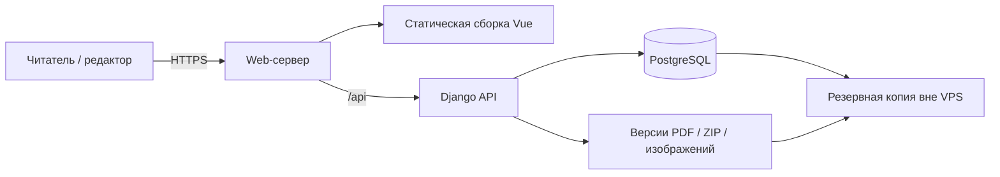

# Собственный сервер, аккаунты и хранилище заданий

Обсуждение 08.10.2026. Это предложение следующего этапа: сейчас сайт сохраняет материалы в GitHub и не имеет собственного сервера авторизации/БД. Кнопка инструкции уже реализована отдельно; этот документ не означает, что серверный вход внедрён или VPS арендован.

## Предлагаемый вариант

Для проекта с ежегодной передачей другому студенту: существующий Vue-интерфейс + Django API + PostgreSQL, размещённые на одном VPS. Django выбран как кандидат из-за готовых пользователей, паролей, сессий, групп и разрешений, а также административного интерфейса для владельца. Финальный стек можно согласовать до реализации; возможен ASP.NET Core Identity, если поддерживать сервер будет удобнее на C#.

Функции аккаунтов и прав предоставляются [системой авторизации Django](https://docs.djangoproject.com/en/5.2/topics/auth/default/). Готовая система не заменяет нашу проверку прав на конкретный год/направление: такие назначения необходимо реализовать отдельно.

Один домен для сайта и API позволяет использовать обычные защищённые cookie-сессии без хранения bearer-token в браузере. На сервере потребуется настроить reverse proxy, TLS, процессы приложения, постоянные тома, ограниченный сетевой доступ и обновления. Внешне доступны HTTPS и ограниченный администраторский SSH; PostgreSQL не публикуется в интернет.

Для начала ориентир ресурсов — 2 vCPU, 4 ГБ RAM и 40–80 ГБ SSD. Это оценка для небольшого учебного сайта, а не результат нагрузочного теста. Большой поток скачиваний может сделать важнее ограничения трафика и файловый объём, чем CPU. Провайдера и тариф выбрать после определения бюджета, региона и условий размещения данных; цена в этом документе не фиксируется.

## Кто владеет аккаунтами

| Роль | Права |
|---|---|
| Владелец / преподаватель | Приглашение и отключение редакторов, назначения, публикация выпусков, исправление архива, восстановление |
| Редактор / студент | Работа с назначенными годами и направлениями, создание черновиков, загрузка приложений, предпросмотр; передача готового выпуска владельцу |
| Читатель | Просмотр опубликованных заданий и архива без аккаунта |

Публичной регистрации редакторов не предусматривается. Первый владелец создаётся на сервере штатным инструментом фреймворка без пароля по умолчанию. Дальше он выдаёт отдельные учётные записи или одноразовые приглашения со сроком действия. При смене студента старый доступ отключается, история авторства сохраняется. Владелец домена, VPS и резервных копий должен быть постоянным участником проекта — например преподавателем; студенческий доступ к редактору не означает доступ по SSH к серверу.

Отдельное разрешение на публикацию полезно: студент может собрать 2028 год, а преподаватель проверит его и откроет читателям. Правила проверяются сервером при каждом запросе; скрытая кнопка Vue не является механизмом авторизации.

## Защита входа

Предлагаем обязательную двухфакторную защиту административных ролей: пароль + приложение-аутентификатор, с кодами восстановления; при выборе готового проверенного компонента можно использовать passkeys. MFA добавляется к выбранному фреймворку явно, не считается автоматически включённой при установке Django. [Рекомендации OWASP по MFA](https://cheatsheetseries.owasp.org/cheatsheets/Multifactor_Authentication_Cheat_Sheet.html).

Пароли хранятся только как стойкие хеши штатной системой; предпочтителен Argon2id при настроенной поддержке. Для Django нужно явно включить соответствующий hasher, стандартная конфигурация использует другой алгоритм. Придумывать собственную криптографию и таблицу с открытыми паролями не требуется. [Django: password management](https://docs.djangoproject.com/en/5.2/topics/auth/passwords/), [OWASP: password storage](https://cheatsheetseries.owasp.org/cheatsheets/Password_Storage_Cheat_Sheet.html).

Сессии хранятся на сервере, браузер получает только cookie с Secure/HttpOnly/SameSite. Предусмотреть CSRF-проверку операций изменения, истечение сессии, смену идентификатора при входе, отзыв сессий при отключении пользователя, повторное подтверждение чувствительных операций. Ограничить попытки входа по аккаунту и адресу, не раскрывать существование аккаунта в ответах; не вводить бесконечную блокировку, которой посторонний может заблокировать владельца. [OWASP: session management](https://cheatsheetseries.owasp.org/cheatsheets/Session_Management_Cheat_Sheet.html), [authentication](https://cheatsheetseries.owasp.org/cheatsheets/Authentication_Cheat_Sheet.html).

В журнал записываются входы, изменения ролей, публикации и правки; пароли, одноразовые коды, cookie и секреты в журнал не попадают. Восстановление доступа — через заранее настроенный процесс с короткоживущими одноразовыми ссылками или административное восстановление, а не универсальный «резервный пароль» в исходниках.

## Где лежат задания

| Данные | Хранилище |
|---|---|
| Учётные записи, права, сессии | PostgreSQL через штатные модели авторизации |
| Годы, направления, метаданные КИМ, назначения редакторов | PostgreSQL |
| Разделы, блоки текста/кода, чек-листы, словарь | JSONB в версиях курса, с нашей схемой валидации |
| PDF, ZIP, документы и изображения | Отдельный постоянный файловый том; при росте — объектное S3-совместимое хранилище |
| Метаданные файла: имя, тип, размер, хеш, автор, версия | PostgreSQL; в базе хранится ссылка/ключ файла, а не base64 ZIP |
| История редактирования и событий | Версии в PostgreSQL и журнал |
| Код сайта и конфигурация развёртывания без секретов | GitHub |

Предварительная модель:

- `editions`: уникальный год; текущий выпуск выбирается в настройках сайта через FK.
- `specialties`: стабильный ID специальности.
- `course_releases`: направление в конкретном году, ссылка на опубликованную версию.
- `course_revisions`: неизменяемый снимок JSON-контента, номер версии, автор, дата.
- `editor_assignments`: кому разрешены какие год/направление и операции.
- `attachments` и `revision_attachments`: постоянные версии файлов и связь с конкретным снимком.
- `audit_events`: публикации, роли, исправления; учётные записи/сессии используют штатные модели.

Обычное редактирование создаёт новую ревизию, не переписывает опубликованный снимок. Читатель получает только опубликованную ревизию, редактор — свой текущий черновик. Публикация выполняется транзакцией: проверка контента и файлов, назначение published revision и при необходимости текущего года. Новые файлы сначала завершают загрузку и проверку; незавершённый файл не может попасть в опубликованную ревизию. При конкурентном редактировании сервер проверяет исходный номер версии/ETag и возвращает конфликт вместо потери чужой работы.

Черновые файлы располагаются вне общего публичного каталога и отдаются только после проверки прав. После публикации вложение становится доступным по постоянному адресу. Нельзя разрешать пользователю выбирать произвольный путь на диске. Лимиты размера, проверка допустимых типов и запрет исполнения загрузок задаются сервером.

## Резервные копии и передача проекта

Ежедневно сохранять согласованную копию БД и файлов **за пределами этого VPS**. Начальный вариант — `pg_dump`, копирование неизменяемых файлов и manifest с их ключами/хешами, хранение нескольких дневных/недельных копий. Для согласованности можно снять дамп, затем скопировать все referenced immutable-файлы из его manifest; файлы не должны удаляться в этот промежуток. Пароли БД, MFA-ключи и резервные копии должны иметь отдельный защищённый доступ.

`pg_dump` создаёт согласованный снимок одной БД; он не включает каталог PDF/ZIP и все серверные роли автоматически. Поэтому требуется отдельный файловый backup и при необходимости backup глобальных объектов PostgreSQL. [PostgreSQL: SQL Dump](https://www.postgresql.org/docs/current/backup-dump.html).

Проверять восстановление на отдельной временной машине. Наличие файла backup ещё не доказывает, что сайт и все приложения можно восстановить. Для начала целевые RPO до 24 часов и RTO в пределах рабочего дня; это предложенные цели, которые надо подтвердить проверкой восстановления.

Развёртывание приложения не удаляет БД/файлы: постоянные тома отделены от контейнера/каталога новой версии. Перед миграциями БД — проверенная копия и план отката. Git остаётся хранилищем кода; каталог заданий в БД становится единственным рабочим источником, а JSON используется для экспорта/импорта и переноса.

## Как перейти с текущей версии

1. Поднять серверное приложение, PostgreSQL, отдельный файловый том и тестовую среду; включить TLS и подготовить владельца/MFA.
2. Реализовать авторизацию, права по году/направлению, private draft API, публикацию и журнал.
3. Импортировать существующий `content/catalog.json` и файлы `public/materials` как выпуск 2027; сверить количества, хеши и ссылки. Сохранить прежние адреса файлов или настроить совместимые маршруты.
4. Переключить Vue на public API и authenticated editor API. Текущий браузерный backend-клиент GitHub заменить серверным хранилищем; локальный JSON-backup и запасной draft оставить.
5. Убрать черновики из публичной сборки/публичного API. Прежний публичный Git-материал при переносе не становится секретным задним числом.
6. Проверить отсутствие доступа к чужим годам/файлам, отзыв аккаунта, конфликты версий, архив, большой ZIP, резервное восстановление.
7. Подключить выбранный домен и перейти на VPS после проверки. При отказе сервера публичный статический экспорт опубликованных материалов можно сохранить как дополнительный резерв.

Аренда сервера — только инфраструктура; эти серверные функции необходимо реализовать. Сейчас внедрённый редактор продолжает работать через GitHub, без собственных паролей/БД и без изменений внешнего хостинга.
