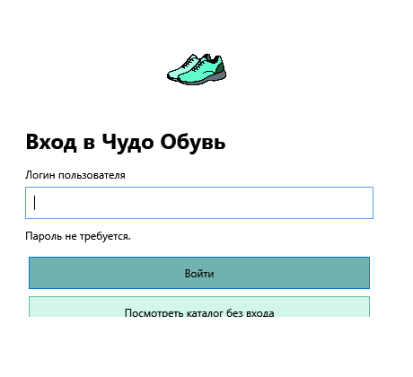
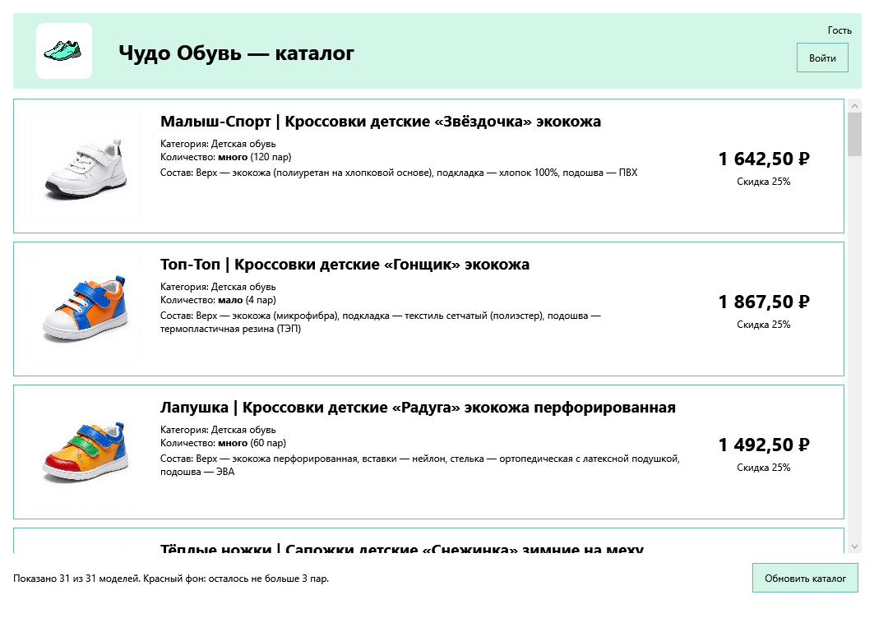
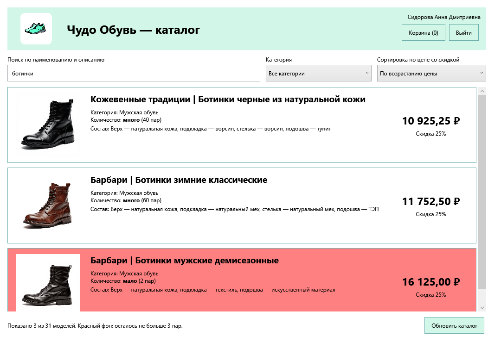
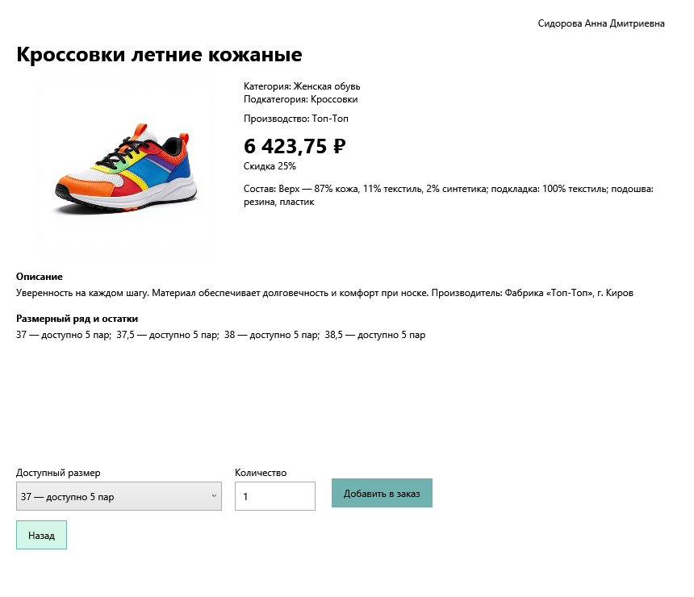
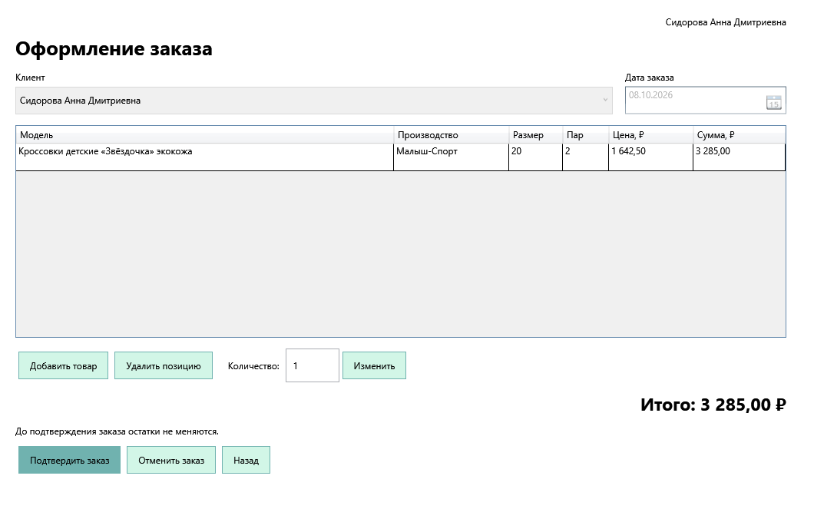
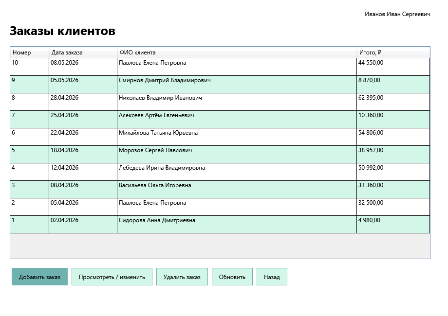
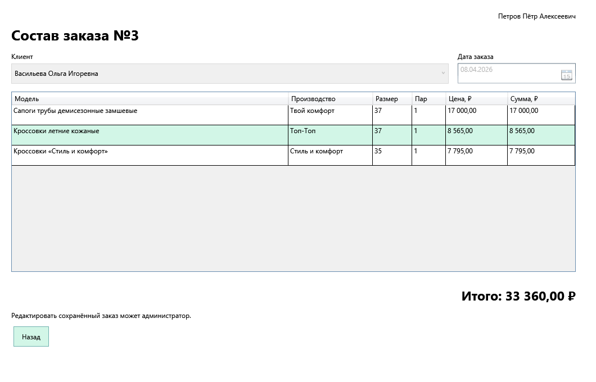
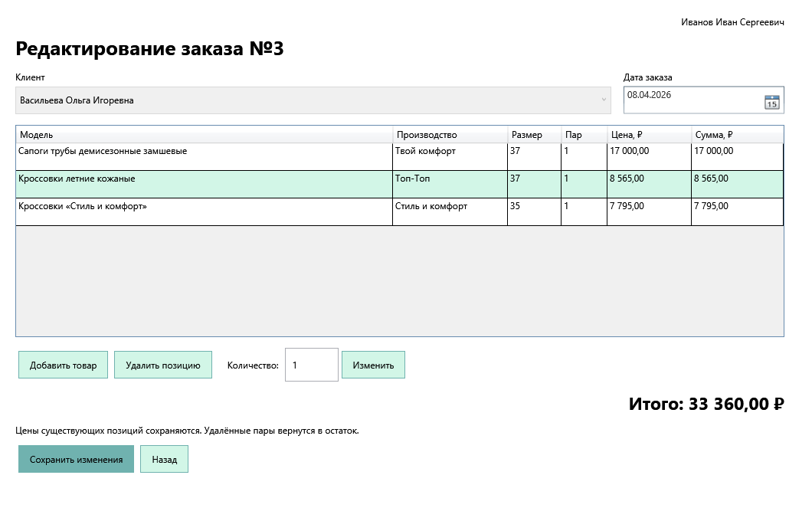

# Чудо Обувь — подробное решение для программистов

По архиву ProgrammerExam_WPF_PostgreSQL_2027.zip; КИМ 09.02.07-2-2027. Версия 9 октября 2026 года. Для работы с приложением нужен Windows. Основной путь использует Visual Studio, pgAdmin и Проводник.

Изображения и локальные документы доступны рядом с этим файлом в комплекте ProgrammerExam-Guide.zip. Внешние ссылки ведут на официальную документацию.

## 00 Подготовить Windows и запустить «Чудо Обувь»

Устанавливаем инструменты через окна, распаковываем именно ваш архив, создаём PostgreSQL и запускаем готовый магазин. Терминал для основного маршрута не нужен.

Результат: Открывается окно входа, гость видит 31 модель; исходники ShoeShop.sln собираются в Visual Studio.

### Как проходить эту инструкцию

Здесь разбирается ваш ProgrammerExam_WPF_PostgreSQL_2027.zip, а не абстрактный магазин. Внутри — «Чудо Обувь»: один WPF-проект ShoeShop на C#, PostgreSQL, 31 модель обуви и система заказов. Названия кнопок, окон, файлов и таблиц ниже совпадают с этим комплектом.

1. Сначала пройдите подготовку: установите программы, распакуйте архив, создайте БД и запустите готовое приложение. Посмотрите результат, прежде чем писать свой код.
2. В задании 1 разберите 10 таблиц, перенесите импорт, получите ER в PDF и SQL с данными. Это основа приложения.
3. В задании 2 создайте проект в Visual Studio и воспроизведите каталог: изображения, цены, скидки, остатки и стиль. Полные файлы из архива приведены прямо в уроках.
4. В задании 3 разберите вход, фильтры, карточку модели, корзину и подтверждение. В задании 4 — общий список заказов, роли, редактирование, удаление и сдачу.
5. После каждого раздела сравнивайте наблюдаемый результат с указанной проверкой. Если он отличается, используйте раздел с ошибками, а не продолжайте вслепую.

| Этап | Время в КИМ | Результат |
| --- | --- | --- |
| Подготовка дома | Вне 210 минут | Среда установлена, пример открывается |
| 1. База | 50 минут | Схема, данные, ER PDF, SQL |
| 2. Алгоритм и каталог | 40 минут | Скидка и список товаров |
| 3. Оформление заказа | 60 минут | Вход, поиск, карточка, корзина |
| 4. Работа с заказами | 60 минут | Менеджер, администратор, передача файлов |

**ПА и ГИА.** ПА включает задания 1–2: 1 час 30 минут. ГИА базового уровня включает задания 1–4: 3 часа 30 минут. Полный исходник ниже уже содержит все функции. Когда воспроизводите его для обучения, некоторые классы понадобятся раньше соответствующего задания: это объясняется в карте файлов.

- [Ваш архив ProgrammerExam](ProgrammerExam_WPF_PostgreSQL_2027.zip) — Исходники, исполняемые файлы, SQL, Excel, документы и проверки.

### Найти нужные папки в архиве

| Папка / файл | Что внутри | Когда нужен |
| --- | --- | --- |
| Source/ShoeShop.sln | Решение Visual Studio, один проект ShoeShop | Изучение и сборка C# |
| Source/ShoeShop | XAML окон, C#, database.json, Assets | Воспроизведение приложения |
| App | Готовый ShoeShop.exe и все зависимости | Быстрый запуск на Windows |
| Database | 01_schema.sql, 02_data.sql, shoe_shop_2027.sql | Создание и перенос БД |
| Resources | 5 XLSX для импорта | Проверка исходных данных |
| Documents | ER PDF/SVG, пояснения, 8 снимков окон | Сравнение результатов |
| Tests | Проверки, сценарии и сохранённый отчёт | Проверка функций |
| Start.cmd | Запускает готовое приложение из App | Открывать двойным щелчком |

Архив не содержит отдельного API, веб-сервера, EF Core или SQL Server. Окна WPF вызывают Db.cs; тот отправляет SQL в PostgreSQL через Npgsql. Сайт «По полочкам» показывает инструкцию, а WPF запускается отдельно на вашем Windows-компьютере.

1. В Проводнике найдите загруженный ZIP → правая кнопка → «Извлечь всё…». Укажите, например, C:\Exam\ProgrammerExamReference → «Извлечь».
2. Откройте извлечённую папку. Если сначала видите только ProgrammerExam, зайдите в неё: здесь должны быть App, Source, Database, Resources и Documents.
3. В Проводнике включите показ расширений: «Вид → Показать → Расширения имён файлов» (Windows 11) либо «Вид → Расширения имён файлов» (Windows 10). Так database.json не превратится в database.json.txt.
4. Оставьте одну распакованную копию как эталон. Для самостоятельного проекта создайте другую папку C:\Exam\ShoeShopPractice. Не редактируйте единственный экземпляр исходного комплекта.

### Подготовить подходящие версии

| Компонент | Версия в примере | Что проверить в окнах |
| --- | --- | --- |
| Windows | WPF требует Windows | Параметры → Система → О системе, тип системы |
| Visual Studio | Для .NET 9 — VS 2022 17.12 или новее с нужным SDK | Справка → О программе |
| .NET SDK | 9, проект net9.0-windows | Visual Studio Installer → Отдельные компоненты |
| .NET Desktop Runtime | 9, для готового приложения | Страница загрузок .NET 9 → Windows → Desktop Runtime |
| PostgreSQL | Скрипты автора рассчитаны на установленный PostgreSQL 18 | pgAdmin → подключение к серверу |
| Npgsql | 9.0.3, зафиксирован в .csproj | Зависимости → Пакеты проекта ShoeShop |

SDK нужен, чтобы собирать исходники. Desktop Runtime нужен, чтобы запускать готовый WPF. Более новая среда другого семейства не гарантирует запуск готового exe из архива: он запрашивает .NET 9. А готовые DLL Npgsql не устанавливают сам PostgreSQL.

**Статья Microsoft и версия архива.** В актуальном учебнике Microsoft может предлагаться .NET 10 или другой текущий шаблон. Здесь выбирайте .NET 9, потому что именно он указан в ShoeShop.csproj. Если .NET 9 отсутствует в списке, установите его SDK и перезапустите Visual Studio.

- [Microsoft — установка .NET на Windows](https://learn.microsoft.com/en-us/dotnet/core/install/windows)
- [Microsoft — загрузки .NET 9](https://dotnet.microsoft.com/en-us/download/dotnet/9.0)

### Установить Visual Studio без консоли

1. Откройте официальный сайт Visual Studio и скачайте подходящую редакцию для вашей учебной среды. Запустите установщик.
2. В Visual Studio Installer откройте вкладку «Рабочие нагрузки» / Workloads. Отметьте «Разработка классических приложений .NET» / .NET desktop development.
3. Перейдите в «Отдельные компоненты» / Individual components. Проверьте наличие .NET 9 SDK и компонентов WPF. Если нужный SDK не предлагается установленной версией Installer, используйте официальный установщик .NET 9 SDK для Windows.
4. Нажмите «Установить» или «Изменить». Дождитесь завершения. Затем запустите Visual Studio.
5. Если Visual Studio уже стоит, откройте Пуск → Visual Studio Installer → карточка вашей версии → «Изменить». Включите ту же нагрузку; заново устанавливать всю IDE не требуется.
6. В самой Visual Studio откройте «Вид → Обозреватель решений» / Solution Explorer. Панель справа понадобится для файлов, пакетов и свойств проекта.

- [Microsoft — изменение установленной Visual Studio](https://learn.microsoft.com/en-us/visualstudio/install/modify-visual-studio?view=vs-2022)
- [Microsoft — первый WPF-проект](https://learn.microsoft.com/en-us/visualstudio/get-started/csharp/tutorial-wpf?view=vs-2022)

### Установить PostgreSQL и открыть pgAdmin

1. Откройте официальную страницу PostgreSQL → Windows → ссылка на установщик. Запустите скачанный установщик.
2. На выборе компонентов оставьте PostgreSQL Server и pgAdmin 4. Выберите папки установки и данных, затем нажимайте Next.
3. Задайте пароль пользователя postgres и запишите его. В архиве стоит admin; если вы выбрали другой пароль, позже впишите свой в database.json. Не нужно менять уже существующий пароль ради примера.
4. Порт оставьте 5432, если он свободен. Если ваш существующий сервер работает на другом порту, запишите фактический порт и используйте его при подключении.
5. Закончите установку. Дополнительные продукты Stack Builder для этого примера не нужны. Через Пуск откройте pgAdmin 4.
6. Если pgAdmin запрашивает мастер-пароль, задайте его отдельно. Это пароль хранилища pgAdmin, а не пароль postgres и не пароль входа в «Чудо Обувь».

- [PostgreSQL — установка для Windows](https://www.postgresql.org/download/windows/)

### Подключить сервер в pgAdmin

1. Слева раскройте Servers. Если локальный PostgreSQL уже есть, нажмите его и введите установленный пароль postgres.
2. Если сервера нет: правая кнопка на Servers → Register → Server… / «Зарегистрировать → Сервер». На General введите понятное имя, например PostgreSQL local.
3. На Connection укажите Host name/address = 127.0.0.1, Port = 5432 либо ваш порт, Maintenance database = postgres, Username = postgres, Password = ваш пароль.
4. Нажмите Save. Раскройте сервер: должны появиться Databases, Login/Group Roles и другие узлы.
5. При connection refused откройте Пуск → «Службы» / Services → найдите postgresql… → проверьте состояние «Выполняется». Если остановлена, нажмите «Запустить» и повторите подключение.
6. При password authentication failed исправьте пароль подключения. Мастер-пароль pgAdmin сюда не подходит.

- [pgAdmin — окно подключения сервера](https://www.pgadmin.org/docs/pgadmin4/latest/server_dialog.html)

### Создать базу shoe_shop_2027 кнопками

1. На подключённом сервере нажмите Databases правой кнопкой → Create → Database… / «Создать → База данных».
2. На General в поле Database напишите shoe_shop_2027. Owner оставьте postgres. На Definition проверьте UTF8, если параметр доступен.
3. Нажмите Save. Раскройте Databases и найдите новую базу. Если не появилась, нажмите Databases правой кнопкой → Refresh.
4. Нажмите именно shoe_shop_2027 правой кнопкой → Query Tool / «Инструмент запросов». В заголовке и подключении инструмента должна быть shoe_shop_2027.
5. Откройте в Query Tool файл Database/shoe_shop_2027.sql кнопкой Open File, и выполните весь скрипт кнопкой Execute script / F5. Снимите выделение отдельного фрагмента перед запуском.
6. Во вкладке Messages проверьте отсутствие ошибок. Обновите узел Schemas → public → Tables: должно появиться 10 таблиц.

**Новая база создаётся у вас.** Фраза автора архива «база уже создана на этом компьютере» относится к его компьютеру. На вашем компьютере ZIP сам по себе не создаёт БД. Не запускайте полный скрипт второй раз в уже заполненной базе: он создаёт таблицы и импортирует данные заново.

- [pgAdmin — создание базы](https://www.pgadmin.org/docs/pgadmin4/latest/database_dialog.html)
- [pgAdmin — редактор запросов](https://www.pgadmin.org/docs/pgadmin4/latest/query_tool.html)

### Указать своё подключение в database.json

1. В Проводнике откройте App → database.json правой кнопкой → «Открыть с помощью → Блокнот».
2. В ConnectionString оставьте Database=shoe_shop_2027. Проверьте Host, Port, Username и замените Password=admin на свой пароль postgres при необходимости.
3. Сохраните файл через «Файл → Сохранить». Не меняйте внешние фигурные скобки, имя ConnectionString и двойные кавычки JSON.
4. Для сборки исходников отдельно исправьте Source/ShoeShop/database.json. Приложение читает конфигурацию рядом с exe, а Visual Studio копирует её из проекта при сборке.
5. Если пароль содержит специальные символы, соблюдайте синтаксис JSON и строки подключения Npgsql. Для сложного значения используйте правила quoted values из документации; не удаляйте точки с запятой наугад.

**App/database.json и Source/ShoeShop/database.json**

```json
{
  "ConnectionString": "Host=127.0.0.1;Port=5432;Database=shoe_shop_2027;Username=postgres;Password=admin;Timeout=5;Command Timeout=10"
}
```

AppContext.BaseDirectory указывает папку запускаемой программы. Поэтому исправление файла в Source не меняет отдельную готовую копию App. В этом архиве название — database.json; файл appsettings.json программа не ищет.

- [Npgsql — параметры подключения](https://www.npgsql.org/doc/connection-string-parameters.html)

### Запустить готовый пример и проверить роли

1. Откройте корень распакованного ProgrammerExam → дважды нажмите Start.cmd. Либо откройте App → ShoeShop.exe. Переносите вместе всю App, а не только exe.
2. На форме «Чудо Обувь — вход» нажмите «Посмотреть каталог без входа». Должны появиться 31 модель, фотографии, цена и остаток. Корзины, общего списка заказов и фильтров у гостя нет.
3. Нажмите «Войти» в каталоге гостя. В поле «Логин пользователя» введите asidorova → «Войти». В правом верхнем углу появится «Сидорова Анна Дмитриевна». Пароль не вводится.
4. Нажмите «Выйти». Войдите papetrov. Теперь есть кнопка «Заказы», но сохранённый заказ менеджер только просматривает.
5. Снова выйдите и войдите isivanov. В «Заказы» доступно «Просмотреть / изменить». Администратор может редактировать дату и состав сохранённого заказа.
6. Если окно просит установить .NET, поставьте Windows Desktop Runtime 9 нужной архитектуры. Если сообщает ошибку PostgreSQL, сначала проверьте сервер и database.json.



Исходный снимок из архива. Поля пароля здесь нет.

| Роль | Логин для проверки | ФИО |
| --- | --- | --- |
| Клиент | asidorova | Сидорова Анна Дмитриевна |
| Менеджер | papetrov | Петров Пётр Алексеевич |
| Администратор | isivanov | Иванов Иван Сергеевич |

Скидка вычисляется на текущую дату компьютера. В исходном импорте заказы относятся к апрелю и маю 2026 года. Если в предыдущем календарном месяце по модели нет заказов, будет 25%. Поэтому цены на вашем экране могут отличаться от старых снимков; менять часы Windows ради картинки не нужно.

### Открыть и собрать исходное решение

1. В Visual Studio выберите «Открыть проект или решение» / Open a project or solution → Source/ShoeShop.sln → «Открыть».
2. В Обозревателе решений раскройте ShoeShop. При запросе восстановления пакетов разрешите восстановление NuGet. В проекте указан Npgsql 9.0.3.
3. Если восстановление не началось, нажмите решение правой кнопкой → Restore NuGet Packages / «Восстановить пакеты NuGet». Подключение к источнику пакетов должно быть доступно в вашей учебной среде.
4. Откройте database.json проекта и укажите своё подключение. Нажмите «Файл → Сохранить всё».
5. Выберите «Сборка → Собрать решение» / Build Solution. Во вкладке «Вывод» установите источник «Сборка» и прочитайте итог. Ошибки смотрите через «Вид → Список ошибок».
6. Нажмите ShoeShop правой кнопкой → «Назначить запускаемым проектом» / Set as Startup Project. Нажмите зелёную кнопку запуска / F5.
7. После проверки закройте окно программы или нажмите «Отладка → Остановить отладку». Только затем продолжайте редактирование файлов.

- [Microsoft — решения и проекты](https://learn.microsoft.com/en-us/visualstudio/ide/solutions-and-projects-in-visual-studio?view=vs-2022)
- [Microsoft — NuGet в Visual Studio](https://learn.microsoft.com/en-us/nuget/consume-packages/install-use-packages-visual-studio)

### Если первый запуск не получился

| Что видите | Причина | Куда нажать / что исправить |
| --- | --- | --- |
| net9.0 отсутствует | Не установлен SDK или слишком старая VS | Installer → Изменить; официальный .NET 9 SDK; перезапуск VS |
| Npgsql namespace not found / NU1301 | Не восстановлен пакет / недоступен источник | Решение → Restore NuGet Packages; параметры NuGet источников |
| database shoe_shop_2027 does not exist | База не создана на этом сервере | pgAdmin → Databases; создать и загрузить SQL |
| relation products does not exist | SQL выполнен в другой базе либо не выполнен | Query Tool именно shoe_shop_2027; Messages |
| password authentication failed | Неверный пароль PostgreSQL | Исправить Password в используемом database.json |
| Фото исчезли после копирования exe | Перенесён неполный комплект | Скопировать всю App с Assets и DLL |
| Конфигурация не найдена | Нет database.json рядом с исполняемой программой | Свойства файла → Content / Copy if newer; пересобрать |
| Программа видна, но дизайнер XAML ругается | Не собраны зависимые классы / временная ошибка дизайнера | Проверить Список ошибок сборки и завершить вставку всех файлов |

### Проверка готовности

- [ ] Windows, .NET 9, PostgreSQL и Npgsql 9.0.3 готовы для работы
- [ ] База shoe_shop_2027 создана, подключение в database.json соответствует серверу
- [ ] В базе 31 модель, 92 товарные позиции и 1274 доступные пары
- [ ] Готовый каталог и исходное решение открываются без ошибок
- [ ] Проверил гостя, клиента, менеджера и администратора без поля пароля

## 01 Создать базу обувного магазина и перенести импорт

От исходных Excel до нормализованной базы, ER в PDF и проверенного SQL. Объясняем каждый ключ и сохраняем дробные размеры, исторические цены и текущие остатки.

Результат: База shoe_shop_2027: 10 таблиц, 9 FK; 20 пользователей, 31 модель, 35 размеров, 92 остатка, 10 заказов и 30 строк; ER_Diagram.pdf и SQL с данными.

### Прочитать исходное условие и отделить сущности

1. Откройте файл «Описание предметной области» из материалов сайта. Выпишите: пользователь, роль, модель обуви, размер, доступный остаток, заказ и строки заказа.
2. Откройте «Руководство по стилю». Отдельно запишите Calibri, белый фон, #D2F6E7, #70B2AF и #ff8080 при суммарном остатке модели ≤ 3.
3. Откройте Resources/Products_import.xlsx. Одна строка описывает модель обуви: категорию, подкатегорию, производство, имя, картинку, описание, состав и базовую цену.
4. Откройте Stock_Items_import.xlsx. Здесь одна строка уже означает модель конкретного размера. Остаток относится к этому сочетанию, а не ко всем размерам сразу.
5. Откройте Orders_import.xlsx. Номер заказа повторяется в нескольких строках: это один заказ с несколькими позициями. Не создавайте 30 разных заказов из 30 строк.
6. В исходном задании пароль при входе не требуется. Не добавляйте таблицу паролей и форму регистрации вместо требуемого входа по логину.

- [Описание предметной области](Materials/bb5ccb908ad829e1-domain.docx)
- [Руководство по стилю](Materials/bc04c41aeeb1bd74-style-guide.docx)
- [КИМ программистов](Materials/4e60c7c140a3a597-kim.pdf) — Схема и импорт: с. 30–31 и 35–36; функции приложения: с. 37–42.

### Разложить данные по 10 таблицам

| Таблица | Ключ и важные поля | Смысл |
| --- | --- | --- |
| roles | id PK, name UNIQUE | Три роли, ID 1/2/3 используются кодом |
| users | id PK, login UNIQUE, ФИО, role_id FK | Пользователь и его роль |
| categories | id PK, name UNIQUE | Детская, женская, мужская обувь |
| subcategories | id PK, category_id FK, name | Подкатегория внутри категории |
| manufacturers | id PK, name UNIQUE | Производитель / производство |
| products | id PK, subcategory_id FK, manufacturer_id FK, image_name, name, description, composition, price | Модель, общая для всех её размеров |
| sizes | id PK, value numeric(4,1) UNIQUE | Размеры, включая половинные |
| stock_items | id PK, product_id FK, size_id FK, quantity | Доступные пары конкретной модели и размера |
| orders | id PK, order_date, user_id FK | Шапка заказа: дата и клиент |
| order_items | id PK, order_id FK, stock_item_id FK, quantity, unit_price | Состав и цена покупки |

Цепочки чтения: products → subcategories → categories; stock_items → products и sizes; order_items → stock_items → products/sizes; orders → users → roles. Таким образом список заказов получает ФИО клиента, а состав — модель, производителя и размер, без копирования справочников в каждую строку.

### Объяснить третью нормальную форму на примерах

1. Не храните строку «37, 37.5, 38, 38.5» в колонке sizes модели. Каждый размер — отдельная запись sizes; доступное количество — отдельная запись stock_items.
2. Не переносите название производителя в каждую строку заказа. В products хранится manufacturer_id, а имя читается из manufacturers.
3. Не храните category_id вместе с subcategory_id в products: категория уже определяется подкатегорией. Иначе модель можно случайно записать в мужскую категорию и женскую подкатегорию.
4. Не храните ФИО клиента в каждой строке заказа. orders содержит user_id; фамилия, имя и отчество принадлежат users.
5. Не записывайте итог заказа отдельным редактируемым числом. Считайте SUM(quantity × unit_price) по order_items, чтобы сумма не расходилась с составом.
6. При этом unit_price в order_items необходима: это цена покупки в прошлом. Она не обязана равняться сегодняшней products.price и не пересчитывается при изменении цен каталога.

**Модель и товарная позиция.** Одна модель может иметь несколько доступных размеров. Product.Id отвечает за модель, StockId — за модель и размер. В заказ добавляется StockId. Если сохранять только Product.Id, вы потеряете информацию о размере.

- [PostgreSQL — ограничения таблиц](https://www.postgresql.org/docs/18/ddl-constraints.html)

### Выбрать типы, ключи и правила удаления

| Решение в SQL | Зачем оно нужно | Пример ошибки, которую предотвращает |
| --- | --- | --- |
| numeric(4,1) для sizes.value | Сохраняет половинные размеры | 37.5 не превращается в 37 |
| numeric(12,2) для price и unit_price | Десятичные денежные значения | Цена хранится в рублях с копейками |
| integer для quantity | Количество пар — целое | Нельзя купить 1.5 пары |
| CHECK quantity >= 0 в stock_items | Остаток не бывает отрицательным | Запрет списания ниже нуля |
| CHECK quantity > 0 в order_items | В заказе нужны положительные количества | Запрет пустого количества и возврата через −1 |
| UNIQUE(product_id, size_id) | Один остаток на модель и размер | Две строки одного размера не складываются случайно |
| UNIQUE(order_id, stock_item_id) | Одна товарная позиция на строку заказа | Повторное добавление увеличивает количество |
| ON DELETE RESTRICT | Справочники и связанные данные нельзя удалить случайно | Пользователь с заказами остаётся доступен |
| ON DELETE CASCADE у order_items.order_id | Удаление шапки удаляет состав | Не остаются строки несуществующего заказа |

CASCADE удаляет строки заказа, но не возвращает складской остаток. Возврат делает Db.DeleteOrder в транзакции перед удалением шапки. Если вручную выполнить DELETE FROM orders в pgAdmin, приложение не успеет вернуть пары. Для обычной работы удаляйте заказ через кнопку программы.

### Создать таблицы через Query Tool

1. Если подготовка уже загрузила полный shoe_shop_2027.sql, ваша рабочая база готова. Для самостоятельного повторения создайте новую пустую базу shoe_shop_practice через Databases → Create → Database.
2. Откройте Query Tool именно у новой базы. Нажмите Open File → выберите Database/01_schema.sql. Ниже приведён точный текст этого файла.
3. Проверьте, что не выделена одна строка. Нажмите Execute script / F5, чтобы исполнить BEGIN, все CREATE TABLE и COMMIT.
4. Откройте Messages. При успехе обновите public → Tables. Должны появиться 10 таблиц.
5. Если получили ошибку внутри транзакции, выполните ROLLBACK; в том же Query Tool, исправьте причину и повторите в пустой базе. Не дописывайте INSERT в уже аварийную транзакцию.
6. При relation already exists вы открыли заполненную базу или повторили схему. Для нового прогона используйте другую пустую базу. Удалять рабочую базу не требуется.

**Database/01_schema.sql — точная схема из архива**

```sql
BEGIN;

CREATE TABLE roles (
    id integer PRIMARY KEY,
    name varchar(80) NOT NULL UNIQUE
);

CREATE TABLE users (
    id integer GENERATED BY DEFAULT AS IDENTITY PRIMARY KEY,
    last_name varchar(80) NOT NULL,
    first_name varchar(80) NOT NULL,
    middle_name varchar(80) NOT NULL,
    login varchar(80) NOT NULL UNIQUE,
    role_id integer NOT NULL REFERENCES roles(id) ON DELETE RESTRICT
);

CREATE TABLE categories (
    id integer PRIMARY KEY,
    name varchar(80) NOT NULL UNIQUE
);

CREATE TABLE subcategories (
    id integer PRIMARY KEY,
    category_id integer NOT NULL REFERENCES categories(id) ON DELETE RESTRICT,
    name varchar(80) NOT NULL,
    UNIQUE (category_id, name)
);

CREATE TABLE manufacturers (
    id integer PRIMARY KEY,
    name varchar(100) NOT NULL UNIQUE
);

CREATE TABLE products (
    id integer GENERATED BY DEFAULT AS IDENTITY PRIMARY KEY,
    subcategory_id integer NOT NULL REFERENCES subcategories(id) ON DELETE RESTRICT,
    manufacturer_id integer NOT NULL REFERENCES manufacturers(id) ON DELETE RESTRICT,
    image_name varchar(200),
    name varchar(200) NOT NULL,
    description text NOT NULL,
    composition text NOT NULL,
    price numeric(12,2) NOT NULL CHECK (price >= 0),
    UNIQUE (name, manufacturer_id)
);

CREATE TABLE sizes (
    id integer PRIMARY KEY,
    value numeric(4,1) NOT NULL UNIQUE CHECK (value > 0)
);

CREATE TABLE stock_items (
    id integer GENERATED BY DEFAULT AS IDENTITY PRIMARY KEY,
    product_id integer NOT NULL REFERENCES products(id) ON DELETE RESTRICT,
    size_id integer NOT NULL REFERENCES sizes(id) ON DELETE RESTRICT,
    quantity integer NOT NULL CHECK (quantity >= 0),
    UNIQUE (product_id, size_id)
);

CREATE TABLE orders (
    id integer GENERATED BY DEFAULT AS IDENTITY PRIMARY KEY,
    order_date date NOT NULL,
    user_id integer NOT NULL REFERENCES users(id) ON DELETE RESTRICT
);

CREATE TABLE order_items (
    id integer GENERATED BY DEFAULT AS IDENTITY PRIMARY KEY,
    order_id integer NOT NULL REFERENCES orders(id) ON DELETE CASCADE,
    stock_item_id integer NOT NULL REFERENCES stock_items(id) ON DELETE RESTRICT,
    quantity integer NOT NULL CHECK (quantity > 0),
    unit_price numeric(12,2) NOT NULL CHECK (unit_price >= 0),
    UNIQUE (order_id, stock_item_id)
);

CREATE INDEX ix_order_items_stock ON order_items(stock_item_id);
CREATE INDEX ix_orders_date ON orders(order_date);
COMMIT;
```

Порядок таблиц важен: сначала roles и users, categories и subcategories, manufacturers, затем products, sizes и stock_items; после них orders и order_items. Внешний ключ должен ссылаться на уже созданную таблицу. BEGIN/COMMIT группирует создание схемы в одну операцию.

### Проверить все пять Excel перед импортом

| Файл | Строк без заголовка | Куда попадут данные |
| --- | --- | --- |
| Users_import.xlsx | 20 | users + справочник roles |
| Products_import.xlsx | 31 | products + categories/subcategories/manufacturers |
| Sizes_import.xlsx | 35 | sizes |
| Stock_Items_import.xlsx | 92 | stock_items |
| Orders_import.xlsx | 30, объединяются в 10 заказов | orders + order_items |

1. В Excel откройте каждый XLSX из Resources. Не сортируйте одну колонку отдельно от остальных: соответствие имени, производителя, размера и количества должно сохраниться.
2. В Users сопоставьте столбцы фамилия, имя, отчество, логин и роль. В исходном заголовке есть опечатка «Отчетсво» — это поле middle_name, а не новый отдельный атрибут.
3. В Products сохраните названия файлов картинок как строки. Проверьте, что в Source/ShoeShop/Assets/Images есть соответствующие PNG.
4. В Sizes выставьте числовой формат с одним десятичным знаком. Размеры 36.5, 37.5 и другие половинные значения должны оставаться отдельными числами. В русской Excel они могут показываться через запятую; SQL-литерал записывается с точкой.
5. В Orders различайте шапку и строки. Один номер → одна дата и один клиент. В каждой строке находите StockId по модели, производителю и размеру.
6. Сохраните подготовленные копии файлов отдельно. Исходные XLSX нужны для сравнения и не должны исчезать после подготовки данных.

### Очистить пробелы и согласовать названия

1. В копии Excel добавьте вспомогательные колонки очищенных названий. Для русской Excel можно использовать СЖПРОБЕЛЫ(ПОДСТАВИТЬ(A2;СИМВОЛ(160);" ")); для английской — TRIM(SUBSTITUTE(A2,CHAR(160)," ")). Применяйте к нужной текстовой колонке, а не к датам и числам.
2. Протяните формулу вниз. Скопируйте полученные значения → «Специальная вставка → Значения». Сверьте исходную и очищенную колонки. Не меняйте содержательные знаки внутри названия.
3. Уберите внешние пробелы и неразрывные пробелы при сопоставлении модели. В архиве это устраняет лишний пробел у «Кроссовки „Азимут Бег“» и расхождение женских туфель с металлическими вставками.
4. Отдельно зафиксируйте явное соответствие: «Черные туфли в классическом стиле» из остатков/заказов → «Черные туфли в классическом стиле — база для деловых образов» из Products, производитель в обоих случаях «Барбари».
5. Сопоставляйте пару «очищенное название + производитель». Один производитель или только похожее название не определяет модель однозначно.
6. Если название не удалось сопоставить, вынесите строку в список ошибок и исправьте соответствие. Не создавайте лишнюю модель автоматически, иначе получите больше 31 товара.

**Не вычитать историю из остатков.** Столбец Stock_Items_import.xlsx уже называется «Количество доступное для заказа». Это текущий доступный остаток. Импорт старых 10 заказов не уменьшает его снова. Начальная сумма должна быть 1274 пары.

- [Пояснения импорта из архива](Documents/Explanation.md)

### Перенести подготовленные данные в PostgreSQL

1. В новой базе с уже созданной схемой откройте Query Tool → Open File → Database/02_data.sql. Для учебного повторения готовый SQL показывает весь результат подготовки Excel.
2. Прочитайте первые INSERT: roles, users, categories, subcategories, manufacturers. Затем идут products и sizes, stock_items, orders, order_items. Связанные ID должны существовать к моменту вставки.
3. Нажмите Execute script / F5 для всего файла. Проверьте Messages и заключительный COMMIT.
4. В конце файла найдите пять вызовов setval. Они синхронизируют генераторы ID с вручную вставленными users/products/stock_items/orders/order_items, чтобы следующий новый заказ не пытался получить уже занятый ID.
5. Если preparing data делаете самостоятельно, сохраняйте один и тот же справочник ID при обработке всех файлов. В SQL строки обрамляются одинарными кавычками; внутреннюю одинарную кавычку удваивают. Даты записывайте как YYYY-MM-DD, десятичные числа — через точку.
6. Для продолжения работы именно с этой учебной базой поменяйте Database в своём Source/ShoeShop/database.json на shoe_shop_practice и пересоберите. Для запуска эталонного App используйте его отдельную конфигурацию.

pgAdmin импортирует CSV в таблицы, но не читает пять XLSX и не строит связи за вас. Здесь выбран перенос подготовленными INSERT, поэтому не нужна установка драйвера Excel или работа в терминале. Полный файл ниже позволяет проследить каждое соответствие ID.

**Database/02_data.sql — полный импорт 5 XLSX**

```sql
BEGIN;

INSERT INTO roles (id, name) VALUES
(1, 'Администратор'),
(2, 'Менеджер'),
(3, 'Авторизованный пользователь');

INSERT INTO users (id, last_name, first_name, middle_name, login, role_id) VALUES
(1, 'Иванов', 'Иван', 'Сергеевич', 'isivanov', 1),
(2, 'Петров', 'Пётр', 'Алексеевич', 'papetrov', 2),
(3, 'Сидорова', 'Анна', 'Дмитриевна', 'asidorova', 3),
(4, 'Кузнецова', 'Екатерина', 'Андреевна', 'ekuznetsova', 2),
(5, 'Смирнов', 'Дмитрий', 'Владимирович', 'dsmirnov', 3),
(6, 'Попов', 'Алексей', 'Николаевич', 'apopov', 1),
(7, 'Васильева', 'Ольга', 'Игоревна', 'ovasileva', 3),
(8, 'Соколов', 'Павел', 'Викторович', 'psokolov', 2),
(9, 'Михайлова', 'Татьяна', 'Юрьевна', 'tmikhailova', 3),
(10, 'Новикова', 'Наталья', 'Сергеевна', 'nnovikova', 2),
(11, 'Фёдоров', 'Андрей', 'Максимович', 'afedorov', 1),
(12, 'Морозов', 'Сергей', 'Павлович', 'smorozov', 3),
(13, 'Волкова', 'Юлия', 'Александровна', 'jvolkova', 2),
(14, 'Алексеев', 'Артём', 'Евгеньевич', 'aalekseev', 3),
(15, 'Лебедева', 'Ирина', 'Владимировна', 'ilebedeva', 3),
(16, 'Егоров', 'Никита', 'Денисович', 'negorov', 2),
(17, 'Павлова', 'Елена', 'Петровна', 'epavlova', 3),
(18, 'Козлов', 'Роман', 'Олегович', 'rkozlov', 1),
(19, 'Степанова', 'Виктория', 'Романовна', 'vstepanova', 2),
(20, 'Николаев', 'Владимир', 'Иванович', 'vnikolaev', 3);

INSERT INTO categories (id, name) VALUES
(1, 'Детская обувь'),
(2, 'Женская обувь'),
(3, 'Мужская обувь');

INSERT INTO manufacturers (id, name) VALUES
(1, 'Малыш-Спорт'),
(2, 'Топ-Топ'),
(3, 'Лапушка'),
(4, 'Тёплые ножки'),
(5, 'Северята'),
(6, 'Весна'),
(7, 'Здоровый шаг'),
(8, 'Карапуз'),
(9, 'Маленький франт'),
(10, 'Барбари'),
(11, 'Твой комфорт'),
(12, 'Стиль и комфорт'),
(13, 'Кожевенные традиции'),
(14, 'Модный силуэт'),
(15, 'Азимут'),
(16, 'Берестов');

INSERT INTO subcategories (id, category_id, name) VALUES
(1, 1, 'Кроссовки'),
(2, 1, 'Сапоги'),
(3, 1, 'Босоножки'),
(4, 1, 'Туфли'),
(5, 2, 'Сапоги'),
(6, 2, 'Босоножки'),
(7, 2, 'Туфли'),
(8, 2, 'Кроссовки'),
(9, 3, 'Кроссовки'),
(10, 3, 'Туфли'),
(11, 3, 'Ботинки');

INSERT INTO products (id, subcategory_id, manufacturer_id, image_name, name, description, composition, price) VALUES
(1, 1, 1, 'IMG_KS_195217.png', 'Кроссовки детские «Звёздочка» экокожа', 'Кроссовки детские «Звёздочка» экокожа. Производитель: ООО «Малыш-Спорт», г. Смоленск', 'Верх — экокожа (полиуретан на хлопковой основе), подкладка — хлопок 100%, подошва — ПВХ', 2190),
(2, 1, 2, 'IMG_KS_195213.png', 'Кроссовки детские «Гонщик» экокожа', 'Кроссовки детские «Гонщик» экокожа. Производитель: Фабрика «Топ-Топ», г. Киров', 'Верх — экокожа (микрофибра), подкладка — текстиль сетчатый (полиэстер), подошва — термопластичная резина (ТЭП)', 2490),
(3, 1, 3, 'IMG_KS_195222.png', 'Кроссовки детские «Радуга» экокожа перфорированная', 'Кроссовки детские «Радуга» экокожа перфорированная. Производитель: ИП Смирнова Л.В. (бренд «Лапушка»), г. Вологда', 'Верх — экокожа перфорированная, вставки — нейлон, стелька — ортопедическая с латексной подушкой, подошва — ЭВА', 1990),
(4, 2, 4, 'IMG_KB_185501.png', 'Сапожки детские «Снежинка» зимние на меху', 'Сапожки детские «Снежинка» зимние на меху. Производитель: ООО «Тёплые ножки», г. Новосибирск', 'Верх — экокожа морозостойкая, утеплитель — искусственный мех (акрил 70%, полиэстер 30%), подкладка — флис, подошва — термоэластопласт (ТЭП)', 3490),
(5, 2, 5, 'IMG_KB_164816.png', 'Сапожки детские «Медвежонок» демисезонные непромокаемые', 'Сапожки детские «Медвежонок» демисезонные непромокаемые. Производитель: Компания «Северята», г. Архангельск', 'Верх — плащёвая ткань с водоотталкивающей пропиткой (полиэстер 100%), отделка — экокожа, подкладка — микрофибра, мембрана — AirTex, подошва — резина', 3190),
(6, 2, 6, 'IMG_KB_164811.png', 'Сапожки детские «Принцесса» кожаные', 'Сапожки детские «Принцесса» кожаные. Производитель: Мастерская «Весна», г. Тула', 'Верх — натуральная кожа (КРС), подкладка — шерсть натуральная (70%), байка (30%), стелька — войлочная, подошва — полиуретан', 4290),
(7, 3, 7, 'IMG_KSd_195207.png', 'Сандалии детские «Пчёлка» ортопедические летние', 'Сандалии детские «Пчёлка» ортопедические летние. Производитель: ООО «Здоровый шаг», г. Воронеж', 'Верх — нубук натуральный, подкладка — кожа растительного дубления, стелька — анатомическая с супинатором (латекс + пробка), подошва — каучук', 2790),
(8, 3, 8, 'IMG_KSd_185508.png', 'Сандалии детские «Морячок» текстильные с фиксатором', 'Сандалии детские «Морячок» текстильные с фиксатором. Производитель: ИП Кузнецов А.Д. (бренд «Карапуз»), г. Краснодар', 'Верх — джинсовая ткань (хлопок 100%), окантовка — искусственная кожа, подкладка — хлопок, подошва — ЭВА лёгкая', 1690),
(9, 4, 9, 'IMG_KSho_185512.png', 'Туфли детские «Бантик» лаковые праздничные', 'Туфли детские «Бантик» лаковые праздничные. Производитель: Дом обуви «Маленький франт», г. Москва', 'Верх — искусственная лаковая кожа (ПВХ), носок усиленный — термопластичный полиуретан, подкладка — кожа искусственная дышащая, стелька — анатомическая с амортизацией, подошва — полиуретан', 2390),
(10, 5, 10, 'IMG_WB_170905.png', 'Сапоги зимние натуральная кожа', 'Сапоги женские зимние, нескользящая, устойчивая подошва, натуральный мех. Производитель: Дом обуви «Барбари», г. Новороссийск', 'Верх — натуральная кожа, подкладка — евромех, натуральный мех, текстильный утеплитель, подошва — резина', 25000),
(11, 5, 10, 'IMG_WB_170859.png', 'Сапоги осенние натуральная кожа', 'Сапоги женские демисезонные из высококачественной натуральной кожи. Производитель: Дом обуви «Барбари», г. Новороссийск', 'Верх — натуральная кожа, подкладка — текстильный утеплитель, стелька — текстиль, подошва — ТПР', 15000),
(12, 5, 11, 'IMG_WB_170906.png', 'Сапоги трубы демисезонные замшевые', 'Сапоги женские демисезонные замшевые. Производитель: ОАО «Твой комфорт», г. Ярославль', 'Верх — натуральная замша, утепленные, тракторная подошва, стелька — байка, подошва — резина', 17000),
(13, 6, 12, 'IMG_WSd_174332.png', 'Босоножки «Песчаный берег» коричневые', 'Коричневая кожаная модель с открытым носком, боковой пряжкой и закрытым каблуком. Производитель: ИП «Стиль и комфорт», г. Санкт-Петербург', 'Верх — 100% козья кожа, подкладка — 100% кожа; подошва: 100% кожа', 7500),
(14, 6, 13, 'IMG_WSd_185156.png', 'Женские босоножки «Черный кофе» со скульптурным каблуком', 'Открытый носок и ремешок со сборной пряжкой, низкий каблук и резиновая подошва гарантируют комфорт. Производитель: ЗАО «Кожевенные традиции», г. Вятка', 'Верх — кожа собственного производств, подкладка — кожа; подошва: резина', 5600),
(15, 6, 14, 'IMG_WSd_185551.png', 'Босоножки женские «Летний бриз»', 'Босоножки женские кожаные белые, регулируемый ремешок, закрытый каблук и кожаная подошва. Производитель: ООО «Модный силуэт», г. Кострома', 'Верх — натуральная кожа, подкладка — натуральная кожа, подошва — кожа', 7130),
(16, 7, 14, 'IMG_WSho_174409.png', 'Демисезонные туфли натуральная кожа', 'Комфортные лаконичные лодочки, классический дизайна с современными акцентами. Производитель: ООО «Модный силуэт», г. Кострома', 'Верх — натуральная овечья кожа, подкладка и стелька — натуральная овечья кожа, подошва — резина', 12340),
(17, 7, 13, 'IMG_WSho_185202.png', 'Туфли женские натуральная кожа с металлическими вставками', 'Стильные туфли для весеннего и летнего сезона. Производитель: ЗАО «Кожевенные традиции», г. Вятка', 'Верх — натуральная телячьей кожа, металлическая пряжка, подкладка и стелька— натуральная овечья кожа, подошва — резина', 7757),
(18, 7, 12, 'IMG_WSho_185545.png', 'Туфли классические лодочки натуральная кожа', 'Модель из натуральной кожи, классический острый носок и изящная шпилька. Производитель: ИП «Стиль и комфорт», г. Санкт-Петербург', 'Верх — натуральная кожа, подкладка и стелька — натуральная кожа, подошва — тунит', 7550),
(19, 8, 2, 'IMG_WS_174110.png', 'Кроссовки белые с оранжевым и красным', 'Многослойный верх из кожи и текстиля. Производитель: Фабрика «Топ-Топ», г. Киров', 'Верх — 70% кожа, 30% текстиль, подкладка — текстиль, подошва — резина', 9450),
(20, 8, 2, 'IMG_WS_185528.png', 'Кроссовки летние кожаные', 'Уверенность на каждом шагу. Материал обеспечивает долговечность и комфорт при носке. Производитель: Фабрика «Топ-Топ», г. Киров', 'Верх — 87% кожа, 11% текстиль, 2% синтетика; подкладка: 100% текстиль; подошва: резина, пластик', 8565),
(21, 8, 12, 'IMG_WS_185535.png', 'Кроссовки кожаные', 'Кроссовки женские из натуральной кожи. Производитель: ИП «Стиль и комфорт», г. Санкт-Петербург', 'Верх — натуральная кожа, подкладка — кожа, подошва — полиуретан', 8765),
(22, 8, 12, 'IMG_WS_185538.png', 'Кроссовки «Стиль и комфорт»', 'Кроссовки женские из натуральной кожи и синтетических материалов, сетчатые вставки. Производитель: ИП «Стиль и комфорт», г. Санкт-Петербург', 'Верх — 70% кожа, 20% полиамид, 10% полиуретан; подкладка — текстиль, подошва — ТПУ', 7795),
(23, 9, 15, 'IMG_MS_185531.png', 'Кроссовки для бега «Драйв»', 'Сочетание стиля, комфорта и современных технологий. Производитель: Фабрика «Азимут», г. Санкт-Петербург', 'Верх — сетка, подкладка — текстиль, подошва — резина', 6550),
(24, 9, 15, 'IMG_MS_185532.png', 'Кроссовки «Азимут Бег»', 'Универсальный выбор для повседневного использования. Производитель: Фабрика «Азимут», г. Санкт-Петербург', 'Верх — 6% кожа, 29% текстиль, 15% полимерные материалы; подкладка — 100% текстиль; подошва — полимерные материалы, резина', 7890),
(25, 9, 2, 'IMG_MS_185533.png', 'Кроссовки', 'Кроссовки для мужчин, идеальное сочетание стиля и комфорта. Производитель: Фабрика «Топ-Топ», г. Киров', 'Верх — 56% кожа, 29% текстиль, 15% полимерные материалы; подкладка — 100% текстиль; подошва — полимерные материалы, резина', 9567),
(26, 10, 10, 'IMG_MSho_190514.png', 'Черные туфли в классическом стиле — база для деловых образов', 'Модель выполнена из натуральной кожи, на резиновой подошве. Производитель: Дом обуви «Барбари», г. Новороссийск', 'Верх — натуральная кожа, подкладка — текстиль, стелька — натуральная кожа, подошва — резина', 24569),
(27, 10, 16, 'IMG_MSho_190518.png', 'Туфли мужские светлые классика демисезонные', 'Туфли на низком каблуке кожаные', 'Верх — натуральная кожа, подкладка — текстиль, стелька — натуральная кожа, подошва — ТЭП', 10155),
(28, 10, 16, 'IMG_MSho_191612.png', 'Туфли из натуральной кожи', 'Модель выполнена из натуральной кожи, на резиновой подошве, поддеживает классический и деловой стиль образов. Производитель: Дом обуви «Берестов», г. Москва', 'Верх — натуральная кожа, подкладка — натуральная кожа, стелька — натуральная кожа, подошва — резина', 25625),
(29, 11, 10, 'IMG_MB_174349.png', 'Ботинки мужские демисезонные', 'Ботинки из натуральной кожи темно-коричневого и черного цвета на шнурках. Производитель: Дом обуви «Берестов», г. Москва', 'Верх — натуральная кожа, подкладка — текстиль, подошва — искусственный материал', 21500),
(30, 11, 13, 'IMG_MB_191200.png', 'Ботинки черные из натуральной кожи', 'Ботинки представляют баланс традиций и современности. Выполнены из натуральной кожи насыщенного черного цвета. Производитель: ЗАО «Кожевенные традиции», г. Вятка', 'Верх — натуральная кожа, подкладка — ворсин, стелька — ворсин, подошва — тунит', 14567),
(31, 11, 10, 'IMG_MB_191205.png', 'Ботинки зимние классические', 'Выбор на каждый день — натуральная кожа, натуральный мех. Производитель: Дом обуви «Барбари», г. Новороссийск', 'Верх — натуральная кожа, подкладка — натуральный мех, стелька — натуральный мех, подошва — ТЭП', 15670);

INSERT INTO sizes (id, value) VALUES
(1, 18),
(2, 19),
(3, 20),
(4, 21),
(5, 22),
(6, 23),
(7, 24),
(8, 25),
(9, 26),
(10, 27),
(11, 28),
(12, 29),
(13, 30),
(14, 31),
(15, 32),
(16, 33),
(17, 34),
(18, 35),
(19, 36),
(20, 36.5),
(21, 37),
(22, 37.5),
(23, 38),
(24, 38.5),
(25, 39),
(26, 39.5),
(27, 40),
(28, 40.5),
(29, 41),
(30, 41.5),
(31, 42),
(32, 42.5),
(33, 43),
(34, 44),
(35, 45);

INSERT INTO stock_items (id, product_id, size_id, quantity) VALUES
(1, 1, 3, 20),
(2, 1, 4, 20),
(3, 1, 5, 20),
(4, 1, 6, 20),
(5, 1, 7, 20),
(6, 1, 8, 20),
(7, 2, 16, 2),
(8, 2, 17, 2),
(9, 3, 2, 30),
(10, 3, 3, 30),
(11, 4, 2, 15),
(12, 4, 3, 15),
(13, 5, 4, 5),
(14, 5, 5, 5),
(15, 5, 6, 5),
(16, 6, 1, 4),
(17, 6, 2, 4),
(18, 6, 3, 4),
(19, 7, 4, 4),
(20, 7, 5, 4),
(21, 7, 6, 4),
(22, 7, 7, 4),
(23, 8, 10, 7),
(24, 8, 11, 7),
(25, 8, 12, 7),
(26, 8, 13, 7),
(27, 9, 1, 7),
(28, 9, 2, 7),
(29, 9, 3, 7),
(30, 10, 19, 12),
(31, 10, 21, 12),
(32, 11, 25, 2),
(33, 11, 27, 2),
(34, 12, 21, 5),
(35, 12, 25, 5),
(36, 12, 27, 5),
(37, 13, 19, 10),
(38, 13, 21, 10),
(39, 13, 23, 10),
(40, 13, 25, 10),
(41, 13, 27, 10),
(42, 14, 18, 3),
(43, 15, 21, 23),
(44, 15, 25, 23),
(45, 15, 27, 23),
(46, 16, 19, 25),
(47, 16, 21, 25),
(48, 16, 23, 25),
(49, 17, 19, 4),
(50, 17, 23, 4),
(51, 17, 25, 4),
(52, 17, 27, 4),
(53, 18, 18, 9),
(54, 18, 23, 9),
(55, 19, 18, 2),
(56, 19, 19, 2),
(57, 20, 21, 5),
(58, 20, 22, 5),
(59, 20, 23, 5),
(60, 20, 24, 5),
(61, 21, 18, 16),
(62, 21, 19, 16),
(63, 21, 23, 16),
(64, 21, 25, 16),
(65, 22, 18, 3),
(66, 22, 23, 3),
(67, 23, 30, 18),
(68, 23, 31, 18),
(69, 23, 32, 18),
(70, 23, 33, 18),
(71, 24, 23, 50),
(72, 24, 24, 50),
(73, 24, 25, 50),
(74, 24, 26, 50),
(75, 24, 27, 50),
(76, 24, 29, 50),
(77, 25, 29, 3),
(78, 25, 31, 3),
(79, 25, 34, 3),
(80, 26, 27, 23),
(81, 26, 29, 23),
(82, 26, 33, 23),
(83, 27, 31, 15),
(84, 27, 33, 15),
(85, 27, 34, 15),
(86, 28, 34, 3),
(87, 29, 29, 1),
(88, 29, 31, 1),
(89, 30, 31, 20),
(90, 30, 33, 20),
(91, 31, 29, 30),
(92, 31, 31, 30);

INSERT INTO orders (id, order_date, user_id) VALUES
(1, '2026-04-02', 3),
(2, '2026-04-05', 17),
(3, '2026-04-08', 7),
(4, '2026-04-12', 15),
(5, '2026-04-18', 12),
(6, '2026-04-22', 9),
(7, '2026-04-25', 14),
(8, '2026-04-28', 20),
(9, '2026-05-05', 5),
(10, '2026-05-08', 17);

INSERT INTO order_items (id, order_id, stock_item_id, quantity, unit_price) VALUES
(1, 1, 1, 1, 2190),
(2, 1, 20, 1, 2790),
(3, 2, 30, 1, 25000),
(4, 2, 39, 1, 7500),
(5, 3, 34, 1, 17000),
(6, 3, 57, 1, 8565),
(7, 3, 65, 1, 7795),
(8, 4, 50, 1, 7757),
(9, 4, 48, 1, 12340),
(10, 4, 44, 1, 7130),
(11, 4, 62, 1, 8765),
(12, 4, 32, 1, 15000),
(13, 5, 77, 1, 9567),
(14, 5, 87, 1, 21500),
(15, 5, 73, 1, 7890),
(16, 6, 80, 1, 24569),
(17, 6, 89, 1, 14567),
(18, 6, 91, 1, 15670),
(19, 7, 16, 1, 4290),
(20, 7, 2, 2, 2190),
(21, 7, 24, 1, 1690),
(22, 8, 86, 1, 25625),
(23, 8, 75, 3, 7890),
(24, 8, 70, 2, 6550),
(25, 9, 7, 1, 2490),
(26, 9, 14, 2, 3190),
(27, 10, 53, 1, 7550),
(28, 10, 43, 1, 7130),
(29, 10, 46, 1, 12340),
(30, 10, 61, 2, 8765);

SELECT setval(pg_get_serial_sequence('users', 'id'), 20, true);

SELECT setval(pg_get_serial_sequence('products', 'id'), 31, true);

SELECT setval(pg_get_serial_sequence('stock_items', 'id'), 92, true);

SELECT setval(pg_get_serial_sequence('orders', 'id'), 10, true);

SELECT setval(pg_get_serial_sequence('order_items', 'id'), 30, true);

COMMIT;
```

- [PostgreSQL — последовательности и setval](https://www.postgresql.org/docs/18/functions-sequence.html)

### Проверить импорт одним запросом

1. Откройте новое окно Query Tool у своей заполненной базы. Вставьте запрос ниже.
2. Выполните Execute script / F5. В Data Output сравните каждую строку с ожидаемым значением.
3. Если models=32, ищите несогласованное имя, которое создало дубликат. Если orders=30, вы перенесли строки как шапки.
4. Если available_pairs меньше 1274 сразу после импорта, проверьте, не вычитали ли исторические заказы ещё раз. Если значения изменились после ваших покупок — это уже рабочие изменения, сравнивайте чистый импорт в другой базе.
5. Сохраните запрос кнопкой Save As под именем verify_import.sql в папке Database собственного проекта.

**Проверка количества записей и 9 внешних ключей**

```sql
SELECT 'roles' AS entity, COUNT(*) AS actual, 3 AS expected FROM roles
UNION ALL SELECT 'users', COUNT(*), 20 FROM users
UNION ALL SELECT 'categories', COUNT(*), 3 FROM categories
UNION ALL SELECT 'subcategories', COUNT(*), 16 FROM subcategories
UNION ALL SELECT 'manufacturers', COUNT(*), 11 FROM manufacturers
UNION ALL SELECT 'products', COUNT(*), 31 FROM products
UNION ALL SELECT 'sizes', COUNT(*), 35 FROM sizes
UNION ALL SELECT 'stock_items', COUNT(*), 92 FROM stock_items
UNION ALL SELECT 'orders', COUNT(*), 10 FROM orders
UNION ALL SELECT 'order_items', COUNT(*), 30 FROM order_items
UNION ALL SELECT 'available_pairs', SUM(quantity), 1274 FROM stock_items;

SELECT COUNT(*) AS foreign_keys
FROM information_schema.table_constraints
WHERE table_schema = 'public' AND constraint_type = 'FOREIGN KEY';
```

### Посмотреть товары и строки заказов с именами

**Сверка модели, размера, клиента и исторической цены**

```sql
SELECT p.id, p.name, m.name AS manufacturer, s.value AS size, si.quantity
FROM stock_items si
JOIN products p ON p.id = si.product_id
JOIN manufacturers m ON m.id = p.manufacturer_id
JOIN sizes s ON s.id = si.size_id
ORDER BY p.id, s.value;

SELECT o.id AS order_id, o.order_date,
       u.last_name || ' ' || u.first_name || ' ' || u.middle_name AS customer,
       p.name, m.name AS manufacturer, s.value AS size,
       oi.quantity, oi.unit_price, oi.quantity * oi.unit_price AS line_total
FROM orders o
JOIN users u ON u.id = o.user_id
JOIN order_items oi ON oi.order_id = o.id
JOIN stock_items si ON si.id = oi.stock_item_id
JOIN products p ON p.id = si.product_id
JOIN manufacturers m ON m.id = p.manufacturer_id
JOIN sizes s ON s.id = si.size_id
ORDER BY o.id, oi.id;
```

1. Выполните первый SELECT: ожидается 92 строки. Найдите «Кроссовки летние кожаные» Топ-Топ и проверьте наличие 37.5 и 38.5.
2. Выделите второй SELECT и выполните его отдельно: ожидается 30 строк для заказов 1–10. Проверьте дату, ФИО и цену на примере первого заказа из Excel.
3. Для заказа 1 первая позиция — детские «Звёздочка», размер 20, количество 1, цена 2190. Это историческая цена, даже если сегодня карточка модели показывает 1642,50 со скидкой.
4. Обратите внимание, что один order_id встречается несколько раз. Это нормальная связь «один заказ — много строк», а не дублирование шапки.

### Получить ER-диаграмму и сохранить PDF

1. В pgAdmin нажмите заполненную базу правой кнопкой → ERD For Database. В версиях с отдельным меню откройте Tools → ERD Tool и используйте генерацию из базы.
2. В диаграмме должны быть все 10 таблиц и 9 соединений. Кнопка Show details раскрывает атрибуты, Auto align выравнивает таблицы, Zoom to fit вписывает схему в экран. Разместите справочники рядом с зависимыми таблицами; строки связей не должны закрывать атрибуты.
3. Увеличьте масштаб и проверьте поля: у orders — id, order_date, user_id; у order_items — order_id, stock_item_id, quantity, unit_price; у stock_items — product_id, size_id, quantity.
4. Сохраните редактируемую схему через Save / Save As. Для PDF нажмите Download image / «Скачать изображение» на панели ERD, либо перенесите схему в редактор диаграмм с экспортом PDF.
5. Если экспортируется PNG/SVG: откройте изображение приложением, поддерживающим печать → «Печать» → Microsoft Print to PDF → альбомная ориентация и масштаб вписать в страницу. При мелком тексте увеличьте формат страницы или используйте векторную схему.
6. Сохраните в Documents/ER_Diagram.pdf. Откройте полученный PDF отдельно, увеличьте до 150–200% и проверьте читаемость, PK/FK и отсутствие обрезанных таблиц.
7. Сравните со схемой из архива по ссылке ниже. Готовый PDF показывает результат автора; при самостоятельном выполнении сдавайте схему, соответствующую собственной БД.

| Внешний ключ | Куда ведёт |
| --- | --- |
| users.role_id | roles.id |
| subcategories.category_id | categories.id |
| products.subcategory_id | subcategories.id |
| products.manufacturer_id | manufacturers.id |
| stock_items.product_id | products.id |
| stock_items.size_id | sizes.id |
| orders.user_id | users.id |
| order_items.order_id | orders.id |
| order_items.stock_item_id | stock_items.id |

- [ER из вашего архива — PDF](Documents/ER_Diagram.pdf)
- [ER из вашего архива — SVG](Documents/ER_Diagram.svg)
- [pgAdmin — возможности ERD Tool](https://www.pgadmin.org/docs/pgadmin4/latest/erd_tool.html)

### Сохранить SQL с данными через Backup

1. У заполненной базы в pgAdmin откройте правой кнопкой Backup… / «Резервная копия». В Filename укажите файл своей папки Database, например shoe_shop_2027_export.sql.
2. В Format выберите Plain. В параметрах оставьте и схему, и данные: Only data и Only schema не должны исключать нужную часть. Названия вкладок и переключателей отличаются между версиями.
3. Для переноса на другой компьютер отключите сохранение Owner и Privileges, если там нет ваших ролей. Проверьте, что не включена команда создания исходной базы, если собираетесь проверять дамп в базе с другим именем.
4. Нажмите Backup. Откройте окно процесса/лог и убедитесь, что он завершился успешно. Расширение .sql само по себе не делает Custom-дамп текстовым.
5. Откройте полученный файл Блокнотом. Он должен содержать создание таблиц и данные (INSERT либо COPY), а не только SELECT запросы проверки.
6. Сохраните вместе ER_Diagram.pdf и README с названием базы. .dt применяется для 1С; для этого WPF-решения результат базы — SQL.

- [pgAdmin — Backup и Plain SQL](https://www.pgadmin.org/docs/pgadmin4/latest/backup_dialog.html)
- [Полный SQL, приложенный автором](Database/shoe_shop_2027.sql)

### Проверить SQL в другой пустой базе

1. Создайте новую базу shoe_shop_restore_check. Откройте Query Tool именно у неё.
2. Для полного SQL из архива откройте shoe_shop_2027.sql и выполните весь файл. Затем повторите запрос количества: 10 таблиц, 9 FK, 1274 пары.
3. Если проверяете свой Plain-дамп и в нём INSERT — его можно выполнить в Query Tool. Если он содержит COPY FROM stdin и строки \., используйте Restore для Plain, когда ваша версия pgAdmin это поддерживает, либо сформируйте Plain-дамп с INSERT в параметрах Backup. Не удаляйте строки COPY вручную.
4. Не запускайте 01_schema.sql после полного SQL: схема уже создана. И не загружайте 02_data.sql второй раз после полного SQL: данные уже есть.
5. Откройте программу с Database=shoe_shop_restore_check в отдельной копии конфигурации. Каталог и вход должны работать так же, как на исходном импорте.
6. Зафиксируйте в README, что SQL восстановлен в пустую базу. Только эта проверка показывает, что переданный файл действительно переносит схему и данные.

**Где чаще всего теряют баллы.** Не хватает связи подкатегория → категория; размер объявлен integer; заказ хранит строку вместо StockId; нет PDF; есть только схема без данных; отсутствует setval после явных ID. Эти ошибки проверяются до перехода к WPF.

### Проверка готовности

- [ ] На ER видны все таблицы, атрибуты, PK и 9 FK
- [ ] Размеры дробные; модели и остатки по размерам хранятся раздельно
- [ ] Импортированы 31 модель, 92 позиции, 35 размеров, 20 пользователей, 10 заказов и 30 строк
- [ ] Согласованы названия, исторические заказы не вычтены повторно, остаток 1274
- [ ] SQL с данными восстанавливается в пустую БД, ER сохранён в PDF
- [ ] Могу объяснить 3НФ, цену покупки и правила удаления связанных данных

## 02 Создать WPF-проект, алгоритм скидки и каталог

Создаём ShoeShop в Visual Studio, подключаем Npgsql и ресурсы, разбираем C# и XAML, получаем каталог с правильными ценами, картинками и подсветкой остатков.

Результат: Приложение «Чудо Обувь» читает 31 модель из PostgreSQL, вычисляет 25% за предыдущий календарный месяц и оформляет каталог по макету.

### Понять устройство проекта перед вставкой кода

| Файл | За что отвечает | Где разбираем |
| --- | --- | --- |
| ShoeShop.csproj | Платформа, Npgsql, иконка и копирование ресурсов | Задание 2 |
| Models.cs | User, Product, SizeOption, CartLine, Order, Category | Задание 2 |
| Db.cs | SQL: вход, каталог, размеры, заказы, транзакции | Полный файл в задании 2, методы заказов в 3–4 |
| Ui.cs | Сообщения, ввод количества, подтверждение | Задание 3 |
| App.xaml / App.xaml.cs | Общие стили, культура и окно входа | Задание 2 |
| LoginWindow.xaml / .cs | Логин и вход гостя | Задание 3 |
| MainWindow.xaml / .cs | Каталог, фильтры, навигация, корзина | Разметка в 2, действия в 3 |
| ProductWindow.xaml / .cs | Подробная карточка и выбор размера | Задание 3 |
| OrderWindow.xaml / .cs | Черновик, подтверждение и редактирование | Задания 3–4 |
| OrdersWindow.xaml / .cs | Список заказов сотрудников | Задание 4 |
| database.json | Подключение PostgreSQL | Подготовка |
| Assets | Логотип, иконка, заглушка, 31 изображение | Задание 2 |

XAML задаёт внешний вид, файл .xaml.cs выполняет действия. Это две части одного класса окна. Например, x:Class="ShoeShop.MainWindow" и partial class MainWindow обязаны совпасть. x:Name="ProductsList" создаёт поле для C#, а MouseLeftButtonUp="Product_Click" связывает событие с методом.

**Как повторять полный пример.** Чтобы каталог можно было запускать сразу, ниже сначала добавляются все файлы окон из архива как основа. После этого разбираем и заменяем их точным кодом по заданиям. Если набираете полностью с нуля, до первой сборки вставьте также файлы из заданий 3–4: MainWindow уже обращается к ProductWindow, OrderWindow и OrdersWindow.

### Создать ShoeShop кнопками Visual Studio

1. В Visual Studio нажмите «Файл → Создать → Проект» / Create a new project. В поиске шаблонов напишите WPF.
2. Выберите «Приложение WPF» / WPF Application с C#. Нужен современный .NET-шаблон, а не отдельный шаблон «WPF App (.NET Framework)». Нажмите «Далее».
3. Имя проекта задайте ShoeShop, имя решения — ShoeShop, расположение — C:\Exam\ShoeShopPractice. Нажмите «Далее».
4. В следующем окне выберите .NET 9.0 → «Создать». Если доступны только другие версии, вернитесь к разделу установки SDK.
5. В правой панели решения должны появиться App.xaml и MainWindow.xaml. Нажмите «Файл → Сохранить всё».
6. Для дальнейших вставок используйте namespace ShoeShop. Если выбрали другое имя проекта, нужно согласованно менять namespace, x:Class, AssemblyName и pack URI во всех файлах. Для первого повторения проще оставить исходное имя.

- [Microsoft — создание WPF-проекта](https://learn.microsoft.com/en-us/visualstudio/get-started/csharp/tutorial-wpf?view=vs-2022)

### Добавить классы и окна через интерфейс

1. Нажмите проект ShoeShop правой кнопкой → «Добавить → Класс…» / Add → Class. Создайте Models.cs, затем Db.cs и Ui.cs. В каждый файл вставляется полный одноимённый код вместо шаблонного класса.
2. Удалите только созданную шаблоном пару MainWindow.xaml / MainWindow.xaml.cs в собственном новом проекте. Затем нажмите проект → «Добавить → Существующий элемент…» / Add → Existing Item.
3. Откройте Source/ShoeShop из распакованного эталона. Выделите все 10 файлов пяти окон: LoginWindow, MainWindow, ProductWindow, OrderWindow, OrdersWindow — .xaml и .xaml.cs каждого. Нажмите «Добавить», чтобы копировать в проект.
4. Если создаёте окна вручную, используйте «Добавить → Окно (WPF)…». Введите точное имя, например ProductWindow.xaml: Visual Studio создаст и .xaml, и .xaml.cs. Не добавляйте эти окна как обычные текстовые файлы.
5. Раскройте стрелку рядом с XAML: вложенный .xaml.cs должен быть доступен. Разметку открывайте двойным щелчком на XAML; код — через «Просмотреть код» / View Code или F7.
6. Не вставляйте C# в панель дизайнера и не вставляйте XAML в .cs. Для каждого блока в уроке заголовок указывает точный целевой файл.

У скопированных файлов должен быть Build Action: Page для окон XAML и Compile для C#. Проверьте через выделение файла → F4 / окно «Свойства». App.xaml имеет ApplicationDefinition. InitializeComponent генерируется сборкой из XAML, вручную его писать не нужно.

### Подключить Npgsql через NuGet

1. Нажмите проект ShoeShop правой кнопкой → «Управление пакетами NuGet…» / Manage NuGet Packages.
2. На вкладке Browse / «Обзор» найдите Npgsql. Выберите пакет с точным именем Npgsql, а не EntityFrameworkCore-провайдер.
3. В списке Version укажите 9.0.3 → Install / «Установить». Подтвердите изменения пакетов и дождитесь окончания восстановления.
4. В Обозревателе решений раскройте «Зависимости → Пакеты». Там должен быть Npgsql (9.0.3).
5. Если версия или источник не видны, откройте «Сервис → Параметры → Диспетчер пакетов NuGet → Источники пакетов» и проверьте источник. На экзамене используйте подготовленные площадкой пакеты и доступную среду.

NuGet добавляет PackageReference в .csproj, а using Npgsql; позволяет обращаться к NpgsqlConnection и NpgsqlCommand. Сервер PostgreSQL при этом устанавливается отдельно.

- [Microsoft — установка пакета в Visual Studio](https://learn.microsoft.com/en-us/nuget/consume-packages/install-use-packages-visual-studio)

### Добавить изображения, логотип, иконку и JSON

1. В Проводнике скопируйте папку Assets целиком из Source/ShoeShop эталона в папку собственного проекта рядом с .csproj. В ней должны быть Images, logo.png, logo.ico и picture.png.
2. Через «Добавить → Существующий элемент» добавьте database.json из эталона либо создайте JSON-файл. Укажите свои Host, Port, Database, Username и Password.
3. В SDK-проекте файлы в папке обычно появляются автоматически. Если нет, нажмите «Показать все файлы» в Обозревателе решений и включите нужные элементы в проект.
4. Для logo.png и logo.ico используйте ресурс WPF — Resource. Для фотографий и picture.png — Content и «Копировать, если новее» / Copy if newer. database.json тоже должен копироваться.
5. Если вручную добавляли отдельные записи Content/Resource, затем проверьте .csproj: не должно быть двух одинаковых Include. Проще заменить весь проектный файл точным текстом следующего раздела.
6. Изображения не перерисовывайте и не растягивайте с изменением пропорций. В XAML используется Stretch="Uniform"; отсутствие фотографии покрывает Assets/picture.png.

- [Microsoft — pack URI и встроенные ресурсы](https://learn.microsoft.com/en-us/dotnet/desktop/wpf/app-development/pack-uris-in-wpf)

### Настроить полный ShoeShop.csproj

1. Нажмите проект ShoeShop правой кнопкой → «Изменить файл проекта» / Edit Project File. В современных SDK-проектах откроется XML.
2. Замените содержимое точным кодом ниже. Если ваши файлы пока не добавлены, сначала выполните предыдущие шаги, чтобы ссылки на Assets и database.json существовали.
3. Сохраните. Visual Studio перечитает проект. При запросе перезагрузки согласитесь.
4. Проверьте net9.0-windows, UseWPF=true, Npgsql=9.0.3 и AssemblyName=ShoeShop. Последнее должно совпасть с pack URI логотипа и иконки.
5. Не добавляйте одновременно ручные Resource для logo.png/logo.ico и повторные строки из этого блока. Ошибка duplicate items означает, что записи задвоены.

**ShoeShop → ShoeShop.csproj**

```xml
<Project Sdk="Microsoft.NET.Sdk">
  <PropertyGroup>
    <OutputType>WinExe</OutputType>
    <TargetFramework>net9.0-windows</TargetFramework>
    <UseWPF>true</UseWPF>
    <ImplicitUsings>enable</ImplicitUsings>
    <Nullable>enable</Nullable>
    <ApplicationIcon>Assets/logo.ico</ApplicationIcon>
    <AssemblyName>ShoeShop</AssemblyName>
    <Product>Чудо Обувь</Product>
  </PropertyGroup>
  <ItemGroup>
    <PackageReference Include="Npgsql" Version="9.0.3" />
    <Content Include="Assets/**/*" Exclude="Assets/logo.png;Assets/logo.ico" CopyToOutputDirectory="PreserveNewest" />
    <Resource Include="Assets/logo.png" />
    <Resource Include="Assets/logo.ico" />
    <Content Include="database.json" CopyToOutputDirectory="PreserveNewest" />
  </ItemGroup>
</Project>
```

WinExe убирает консоль у оконного приложения. ImplicitUsings даёт стандартные using, Nullable включает проверку nullable-ссылок. Content с PreserveNewest переносит фотографии и JSON в выходную папку. Resource встраивает logo.png/logo.ico внутрь сборки. Поэтому для двух видов картинок используются разные пути.

### Создать модели данных и вычисляемые свойства

1. Откройте Models.cs. Выделите шаблонный текст целиком и вставьте блок ниже. Сохраните файл.
2. Найдите User.IsAdmin и User.IsStaff. В SQL роли: 1 — администратор, 2 — менеджер, 3 — клиент. IsStaff объединяет роли 1 и 2.
3. Найдите Product: он хранит базовую Price, процент Discount, общий Quantity и данные карточки. FinalPrice, PriceText, StockText и CardBackground вычисляются из этих значений.
4. Найдите SizeOption.StockId и CartLine.StockId. В заказе сохраняется товарная позиция модель+размер, а не только Product.Id.
5. Найдите Order.Total и CartLine.Total. Сумма строки — цена за пару × количество, итог заказа складывается из строк.

**ShoeShop → Models.cs**

```csharp
using System.Globalization;
using System.IO;

namespace ShoeShop;

public class User
{
    public int Id { get; set; }
    public string Login { get; set; } = "";
    public string FullName { get; set; } = "";
    public int RoleId { get; set; }
    public bool IsAdmin => RoleId == 1;
    public bool IsStaff => RoleId == 1 || RoleId == 2;
}

public class Product
{
    public int Id { get; set; }
    public int CategoryId { get; set; }
    public string Category { get; set; } = "";
    public string Subcategory { get; set; } = "";
    public string Name { get; set; } = "";
    public string Manufacturer { get; set; } = "";
    public string Description { get; set; } = "";
    public string Composition { get; set; } = "";
    public string ImageName { get; set; } = "";
    public decimal Price { get; set; }
    public int Discount { get; set; }
    public int Quantity { get; set; }
    public decimal FinalPrice => CalculatePrice(Price, Discount);
    public string PriceText => FinalPrice.ToString("N2", CultureInfo.GetCultureInfo("ru-RU")) + " ₽";
    public string DiscountText => Discount == 0 ? "Без скидки" : "Скидка 25%";
    public string StockText => Quantity > 5 ? "много" : "мало";
    public string CardBackground => Quantity <= 3 ? "#ff8080" : "#FFFFFF";
    public string ImagePath => GetImagePath(ImageName);

    public static decimal CalculatePrice(decimal price, int discount)
    {
        return Math.Round(price * (100 - discount) / 100m, 2, MidpointRounding.AwayFromZero);
    }

    public static string GetImagePath(string imageName)
    {
        string image = Path.Combine(AppContext.BaseDirectory, "Assets", "Images", Path.GetFileName(imageName));
        if (File.Exists(image))
            return image;
        return Path.Combine(AppContext.BaseDirectory, "Assets", "picture.png");
    }
}

public class SizeOption
{
    public int StockId { get; set; }
    public decimal Size { get; set; }
    public int Available { get; set; }
    public string Display => $"{Size:0.#} — доступно {Available} пар";
}

public class CartLine
{
    public int StockId { get; set; }
    public string Name { get; set; } = "";
    public string Manufacturer { get; set; } = "";
    public decimal Size { get; set; }
    public int Quantity { get; set; }
    public decimal UnitPrice { get; set; }
    public decimal Total => UnitPrice * Quantity;
}

public class Order
{
    public int Id { get; set; }
    public DateTime Date { get; set; }
    public int UserId { get; set; }
    public string FullName { get; set; } = "";
    public decimal Total { get; set; }
}

public class Category
{
    public int Id { get; set; }
    public string Name { get; set; } = "";
}
```

Price имеет тип decimal, поэтому 0.75m и 100m не переводят деньги в неточный двоичный double. CalculatePrice округляет до двух знаков с MidpointRounding.AwayFromZero. CultureInfo ru-RU оформляет рубли, а не меняет их числовое значение.

- [Microsoft — decimal для десятичных значений](https://learn.microsoft.com/en-us/dotnet/csharp/language-reference/builtin-types/floating-point-numeric-types)
- [Microsoft — Math.Round](https://learn.microsoft.com/en-us/dotnet/api/system.math.round?view=net-9.0)

### Разобрать скидку за предыдущий календарный месяц

1. Возьмите дату расчёта calculationDate. В рабочей программе это DateTime.Today. Создайте первый день её месяца: new DateTime(year, month, 1). В коде он назван monthEnd — это правая граница проверяемого прошлого месяца.
2. Получите левую границу monthStart = monthEnd.AddMonths(-1). Для мая это 1 апреля, для января 2027 — 1 декабря 2026.
3. Через order_items → stock_items → orders найдите заказ хотя бы одного размера данной модели в интервале order_date >= monthStart и order_date < monthEnd.
4. Если EXISTS нашёл строку, Discount=0. Если не нашёл — Discount=25. Количество заказов не влияет: достаточно одного факта заказа.
5. Посчитайте Price × (100 − Discount) / 100. Для 2190 рублей со скидкой 25%: 2190 × 0.75 = 1642.50.
6. Для объяснения алгоритма нарисуйте схему: дата → границы месяца → есть заказ модели? → 0% / 25% → итоговая цена. Проверяйте все размеры модели вместе, а не только выбранный размер.

| Дата расчёта | Проверяемый период | Почему |
| --- | --- | --- |
| 10.05.2026 | 01.04.2026 ≤ дата < 01.05.2026 | Полный апрель |
| 31.05.2026 | 01.04.2026 ≤ дата < 01.05.2026 | Всё ещё апрель, не последние 30 дней |
| 01.06.2026 | 01.05.2026 ≤ дата < 01.06.2026 | Полный май |
| 15.01.2027 | 01.12.2026 ≤ дата < 01.01.2027 | AddMonths обрабатывает переход года |

**Почему скидка есть у всех моделей.** На чистом импорте даты заказов — апрель и май 2026. Если запускаете программу в месяце, чей предыдущий месяц не содержит этих заказов, 25% у всех моделей — ожидаемое поведение. Для проверки границ тесты вызывают GetProducts с заданной датой; часы компьютера не меняют.

- [Microsoft — DateTime.AddMonths](https://learn.microsoft.com/en-us/dotnet/api/system.datetime.addmonths?view=net-9.0)
- [PostgreSQL — EXISTS](https://www.postgresql.org/docs/18/functions-subquery.html)

### Проверить алгоритм отдельным SQL в pgAdmin

**SQL-проверка скидки для апреля как предыдущего месяца**

```sql
-- Учебная дата: май 2026. Рабочий C# передаёт свою текущую дату.
WITH bounds AS (
  SELECT DATE '2026-04-01' AS from_date, DATE '2026-05-01' AS to_date
)
SELECT p.id, p.name, p.price,
       CASE WHEN EXISTS (
         SELECT 1 FROM order_items oi
         JOIN stock_items si ON si.id = oi.stock_item_id
         JOIN orders o ON o.id = oi.order_id
         CROSS JOIN bounds b
         WHERE si.product_id = p.id
           AND o.order_date >= b.from_date AND o.order_date < b.to_date
       ) THEN 0 ELSE 25 END AS discount
FROM products p ORDER BY p.id;
```

1. В Query Tool вставьте этот запрос и выполните. Он читает данные и не меняет заказы.
2. На чистом импорте модель id=1 имеет заказ в апреле — discount=0. Модель id=3 в апреле не заказана — discount=25.
3. Поменяйте только границы на 2026-05-01 и 2026-06-01. Теперь учитываются майские заказы. Так видно, что алгоритм зависит от периода, а не от постоянного списка товаров.
4. Для реального приложения не вставляйте эти фиксированные даты в Db.cs: там параметры формируются из calculationDate.

### Создать Db.cs: подключение и все SQL-операции

1. Откройте Db.cs → замените весь шаблон точным кодом ниже → сохраните. В файле собраны методы всех четырёх заданий, чтобы приложение имело необходимые зависимости.
2. Прочитайте LoadConnectionString: JSON берётся из папки exe. OpenConnection открывает соединение и освобождает его при неудачном подключении.
3. Найдите Command: значения получают параметры p0, p1 и т. д. В SQL пишется @p0. Логин и введённые числа не склеиваются с текстом запроса.
4. Найдите ReadProducts: количество суммируется по всем stock_items модели; COALESCE даёт 0, если остатков нет; CASE/EXISTS вычисляет скидку.
5. Найдите FilterProducts: поиск и категория сужают одну коллекцию, сортировка применяет FinalPrice. Нет отдельной кнопки «Найти».
6. Методы SaveOrder и DeleteOrder пока прочитайте по названиям. Их транзакции подробно разобраны в заданиях 3–4; не удаляйте их из файла, потому что скопированные окна уже на них ссылаются.

**ShoeShop → Db.cs — полный исходный файл**

```csharp
using System.IO;
using System.Text.Json;
using Npgsql;

namespace ShoeShop;

public static class Db
{
    public static string ConnectionString { get; set; } = LoadConnectionString();

    private static string LoadConnectionString()
    {
        using JsonDocument config = JsonDocument.Parse(File.ReadAllText(Path.Combine(AppContext.BaseDirectory, "database.json")));
        return config.RootElement.GetProperty("ConnectionString").GetString()!;
    }

    private static NpgsqlConnection OpenConnection()
    {
        NpgsqlConnection connection = new NpgsqlConnection(ConnectionString);
        try
        {
            connection.Open();
            return connection;
        }
        catch
        {
            connection.Dispose();
            throw;
        }
    }

    private static NpgsqlCommand Command(NpgsqlConnection connection, string sql, params object[] values)
    {
        NpgsqlCommand command = new NpgsqlCommand(sql, connection);
        for (int i = 0; i < values.Length; i++)
            command.Parameters.AddWithValue("p" + i, values[i]);
        return command;
    }

    private static User ReadUser(NpgsqlDataReader reader)
    {
        return new User
        {
            Id = reader.GetInt32(0),
            Login = reader.GetString(1),
            FullName = reader.GetString(2),
            RoleId = reader.GetInt32(3)
        };
    }

    public static User? Login(string login)
    {
        using NpgsqlConnection connection = OpenConnection();
        using NpgsqlCommand command = Command(connection,
            "SELECT id, login, last_name || ' ' || first_name || ' ' || middle_name, role_id FROM users WHERE login = @p0", login.Trim());
        using NpgsqlDataReader reader = command.ExecuteReader();
        return reader.Read() ? ReadUser(reader) : null;
    }

    public static List<User> GetUsers()
    {
        using NpgsqlConnection connection = OpenConnection();
        using NpgsqlCommand command = Command(connection,
            "SELECT id, login, last_name || ' ' || first_name || ' ' || middle_name, role_id FROM users ORDER BY last_name, first_name");
        using NpgsqlDataReader reader = command.ExecuteReader();
        List<User> users = new List<User>();
        while (reader.Read())
            users.Add(ReadUser(reader));
        return users;
    }

    public static List<Category> GetCategories()
    {
        using NpgsqlConnection connection = OpenConnection();
        using NpgsqlCommand command = Command(connection, "SELECT id, name FROM categories ORDER BY name");
        using NpgsqlDataReader reader = command.ExecuteReader();
        List<Category> categories = new List<Category> { new Category { Id = 0, Name = "Все категории" } };
        while (reader.Read())
            categories.Add(new Category { Id = reader.GetInt32(0), Name = reader.GetString(1) });
        return categories;
    }

    public static List<Product> GetProducts(DateTime? calculationDate = null)
    {
        using NpgsqlConnection connection = OpenConnection();
        return ReadProducts(connection, calculationDate ?? DateTime.Today);
    }

    private static List<Product> ReadProducts(NpgsqlConnection connection, DateTime calculationDate)
    {
        DateTime monthEnd = new DateTime(calculationDate.Year, calculationDate.Month, 1);
        DateTime monthStart = monthEnd.AddMonths(-1);
        // Границы календарного месяца корректны и при переходе с января на декабрь.
        string sql = """
            SELECT p.id, c.id, c.name, sc.name, p.name, m.name, p.description, p.composition,
                   COALESCE(p.image_name, ''), p.price,
                   COALESCE((SELECT SUM(quantity) FROM stock_items WHERE product_id = p.id), 0)::integer,
                   CASE WHEN EXISTS (
                       SELECT 1 FROM order_items oi
                       JOIN stock_items si ON si.id = oi.stock_item_id
                       JOIN orders o ON o.id = oi.order_id
                       WHERE si.product_id = p.id AND o.order_date >= @p0 AND o.order_date < @p1
                   ) THEN 0 ELSE 25 END
            FROM products p
            JOIN subcategories sc ON sc.id = p.subcategory_id
            JOIN categories c ON c.id = sc.category_id
            JOIN manufacturers m ON m.id = p.manufacturer_id
            ORDER BY p.id
            """;
        using NpgsqlCommand command = Command(connection, sql, DateOnly.FromDateTime(monthStart), DateOnly.FromDateTime(monthEnd));
        using NpgsqlDataReader reader = command.ExecuteReader();
        List<Product> products = new List<Product>();
        while (reader.Read())
        {
            products.Add(new Product
            {
                Id = reader.GetInt32(0), CategoryId = reader.GetInt32(1),
                Category = reader.GetString(2), Subcategory = reader.GetString(3),
                Name = reader.GetString(4), Manufacturer = reader.GetString(5),
                Description = reader.GetString(6), Composition = reader.GetString(7),
                ImageName = reader.GetString(8), Price = reader.GetDecimal(9),
                Quantity = reader.GetInt32(10), Discount = reader.GetInt32(11)
            });
        }
        return products;
    }

    public static List<Product> FilterProducts(List<Product> products, string search, int categoryId, int sort)
    {
        IEnumerable<Product> result = products;
        if (categoryId != 0)
            result = result.Where(p => p.CategoryId == categoryId);
        if (!string.IsNullOrWhiteSpace(search))
        {
            string text = search.Trim();
            result = result.Where(p => p.Name.Contains(text, StringComparison.OrdinalIgnoreCase) || p.Description.Contains(text, StringComparison.OrdinalIgnoreCase));
        }
        if (sort == 1)
            result = result.OrderBy(p => p.FinalPrice).ThenBy(p => p.Name);
        if (sort == 2)
            result = result.OrderByDescending(p => p.FinalPrice).ThenBy(p => p.Name);
        return result.ToList();
    }

    public static List<SizeOption> GetSizes(int productId)
    {
        using NpgsqlConnection connection = OpenConnection();
        using NpgsqlCommand command = Command(connection,
            "SELECT si.id, s.value, si.quantity FROM stock_items si JOIN sizes s ON s.id = si.size_id WHERE si.product_id = @p0 ORDER BY s.value", productId);
        using NpgsqlDataReader reader = command.ExecuteReader();
        List<SizeOption> sizes = new List<SizeOption>();
        while (reader.Read())
            sizes.Add(new SizeOption { StockId = reader.GetInt32(0), Size = reader.GetDecimal(1), Available = reader.GetInt32(2) });
        return sizes;
    }

    public static int GetAvailableStock(int stockId, int? orderId = null)
    {
        using NpgsqlConnection connection = OpenConnection();
        using NpgsqlCommand command = Command(connection, "SELECT quantity FROM stock_items WHERE id = @p0", stockId);
        object? result = command.ExecuteScalar();
        if (result == null)
            throw new InvalidOperationException("Товарная позиция не найдена. Обновите каталог.");
        int available = (int)result;
        if (orderId.HasValue)
        {
            using NpgsqlCommand reserved = Command(connection, "SELECT quantity FROM order_items WHERE order_id = @p0 AND stock_item_id = @p1", orderId.Value, stockId);
            available += (int?)reserved.ExecuteScalar() ?? 0;
        }
        return available;
    }

    private static User RequireUser(NpgsqlConnection connection, int userId)
    {
        using NpgsqlCommand command = Command(connection,
            "SELECT id, login, last_name || ' ' || first_name || ' ' || middle_name, role_id FROM users WHERE id = @p0", userId);
        using NpgsqlDataReader reader = command.ExecuteReader();
        if (!reader.Read())
            throw new InvalidOperationException("Пользователь не найден. Войдите в систему заново.");
        return ReadUser(reader);
    }

    public static List<Order> GetOrders(User actor)
    {
        using NpgsqlConnection connection = OpenConnection();
        if (!RequireUser(connection, actor.Id).IsStaff)
            throw new InvalidOperationException("Просматривать все заказы могут только менеджер и администратор.");
        using NpgsqlCommand command = Command(connection, """
            SELECT o.id, o.order_date, o.user_id, u.last_name || ' ' || u.first_name || ' ' || u.middle_name,
                   COALESCE(SUM(oi.quantity * oi.unit_price), 0)
            FROM orders o JOIN users u ON u.id = o.user_id
            LEFT JOIN order_items oi ON oi.order_id = o.id
            GROUP BY o.id, u.id ORDER BY o.order_date DESC, o.id DESC
            """);
        using NpgsqlDataReader reader = command.ExecuteReader();
        List<Order> orders = new List<Order>();
        while (reader.Read())
        {
            orders.Add(new Order
            {
                Id = reader.GetInt32(0), Date = reader.GetDateTime(1), UserId = reader.GetInt32(2),
                FullName = reader.GetString(3), Total = reader.GetDecimal(4)
            });
        }
        return orders;
    }

    public static List<CartLine> GetOrderLines(User actor, int orderId)
    {
        using NpgsqlConnection connection = OpenConnection();
        User user = RequireUser(connection, actor.Id);
        using NpgsqlCommand access = Command(connection, "SELECT user_id FROM orders WHERE id = @p0", orderId);
        object? owner = access.ExecuteScalar();
        if (owner == null || (!user.IsStaff && (int)owner != user.Id))
            throw new InvalidOperationException("Заказ не найден или недоступен этому пользователю.");
        return ReadOrderLines(connection, orderId);
    }

    private static List<CartLine> ReadOrderLines(NpgsqlConnection connection, int orderId)
    {
        using NpgsqlCommand command = Command(connection, """
            SELECT si.id, p.name, m.name, s.value, oi.quantity, oi.unit_price
            FROM order_items oi JOIN stock_items si ON si.id = oi.stock_item_id
            JOIN products p ON p.id = si.product_id JOIN manufacturers m ON m.id = p.manufacturer_id
            JOIN sizes s ON s.id = si.size_id WHERE oi.order_id = @p0 ORDER BY oi.id
            """, orderId);
        using NpgsqlDataReader reader = command.ExecuteReader();
        List<CartLine> lines = new List<CartLine>();
        while (reader.Read())
        {
            lines.Add(new CartLine
            {
                StockId = reader.GetInt32(0), Name = reader.GetString(1), Manufacturer = reader.GetString(2),
                Size = reader.GetDecimal(3), Quantity = reader.GetInt32(4), UnitPrice = reader.GetDecimal(5)
            });
        }
        return lines;
    }

    public static int SaveOrder(User actor, int customerId, DateTime date, List<CartLine> lines, int? orderId = null)
    {
        if (lines.Count == 0 || lines.Any(l => l.Quantity <= 0))
            throw new InvalidOperationException("Добавьте хотя бы одну позицию. Количество должно быть целым числом больше нуля.");
        if (lines.Select(l => l.StockId).Distinct().Count() != lines.Count)
            throw new InvalidOperationException("Одинаковые модель и размер должны находиться в одной строке заказа.");
        using NpgsqlConnection connection = OpenConnection();
        using NpgsqlTransaction transaction = connection.BeginTransaction();
        User user = RequireUser(connection, actor.Id);
        if (orderId.HasValue && !user.IsAdmin)
            throw new InvalidOperationException("Редактировать сохранённый заказ может только администратор.");
        if (!user.IsStaff && customerId != user.Id)
            throw new InvalidOperationException("Вы можете оформить заказ только на своё имя.");
        RequireUser(connection, customerId);
        List<CartLine> oldLines = new List<CartLine>();
        int id;
        if (orderId.HasValue)
        {
            using NpgsqlCommand find = Command(connection, "SELECT id FROM orders WHERE id = @p0 FOR UPDATE", orderId.Value);
            if (find.ExecuteScalar() == null)
                throw new InvalidOperationException("Заказ уже удалён. Обновите список.");
            id = orderId.Value;
            oldLines = ReadOrderLines(connection, id);
            ReturnStock(connection, id);
            using NpgsqlCommand delete = Command(connection, "DELETE FROM order_items WHERE order_id = @p0", id);
            delete.ExecuteNonQuery();
            using NpgsqlCommand update = Command(connection, "UPDATE orders SET order_date = @p0 WHERE id = @p1", DateOnly.FromDateTime(date), id);
            update.ExecuteNonQuery();
        }
        else
        {
            using NpgsqlCommand add = Command(connection, "INSERT INTO orders (order_date, user_id) VALUES (@p0, @p1) RETURNING id", DateOnly.FromDateTime(DateTime.Today), customerId);
            id = (int)add.ExecuteScalar()!;
        }
        Dictionary<int, Product> products = ReadProducts(connection, DateTime.Today).ToDictionary(p => p.Id);
        foreach (CartLine line in lines.OrderBy(l => l.StockId))
        {
            // Условие в UPDATE не даёт продать остаток дважды. Любая ошибка откатывает весь заказ.
            using NpgsqlCommand reserve = Command(connection,
                "UPDATE stock_items SET quantity = quantity - @p0 WHERE id = @p1 AND quantity >= @p0 RETURNING product_id", line.Quantity, line.StockId);
            object? productId = reserve.ExecuteScalar();
            if (productId == null)
                throw new InvalidOperationException($"Недостаточно товара «{line.Name}», размер {line.Size:0.#}. Обновите каталог и уменьшите количество.");
            CartLine? old = oldLines.FirstOrDefault(l => l.StockId == line.StockId);
            decimal price = old == null ? products[(int)productId].FinalPrice : old.UnitPrice;
            using NpgsqlCommand item = Command(connection,
                "INSERT INTO order_items (order_id, stock_item_id, quantity, unit_price) VALUES (@p0, @p1, @p2, @p3)", id, line.StockId, line.Quantity, price);
            item.ExecuteNonQuery();
        }
        transaction.Commit();
        return id;
    }

    private static void ReturnStock(NpgsqlConnection connection, int orderId)
    {
        using NpgsqlCommand command = Command(connection, """
            UPDATE stock_items si SET quantity = si.quantity + oi.quantity
            FROM order_items oi WHERE oi.stock_item_id = si.id AND oi.order_id = @p0
            """, orderId);
        command.ExecuteNonQuery();
    }

    public static void DeleteOrder(User actor, int orderId)
    {
        using NpgsqlConnection connection = OpenConnection();
        using NpgsqlTransaction transaction = connection.BeginTransaction();
        if (!RequireUser(connection, actor.Id).IsStaff)
            throw new InvalidOperationException("Удалять сохранённые заказы могут только менеджер и администратор.");
        using NpgsqlCommand find = Command(connection, "SELECT id FROM orders WHERE id = @p0 FOR UPDATE", orderId);
        if (find.ExecuteScalar() == null)
            throw new InvalidOperationException("Заказ уже удалён. Обновите список.");
        ReturnStock(connection, orderId);
        using NpgsqlCommand command = Command(connection, "DELETE FROM orders WHERE id = @p0", orderId);
        command.ExecuteNonQuery();
        transaction.Commit();
    }
}
```

using перед соединением, командой, reader и транзакцией освобождает ресурсы при выходе из области видимости. ReadProducts получает дату как аргумент, что позволяет проверять переход января на декабрь. Новые проекты Npgsql могут использовать NpgsqlDataSource, но этот архив применяет NpgsqlConnection; здесь воспроизводится именно его реализация.

- [Npgsql — команды, параметры и транзакции](https://www.npgsql.org/doc/basic-usage.html)
- [Microsoft — using и освобождение ресурсов](https://learn.microsoft.com/en-us/dotnet/csharp/language-reference/statements/using)

### Задать общий стиль в App.xaml

1. Откройте App.xaml → перейдите в XAML-панель → замените содержимое блоком ниже.
2. Проверьте StartupUri="LoginWindow.xaml". Создаваемый шаблон обычно запускал MainWindow, но пример начинает с входа.
3. В Window-стиле задаются Calibri, FontSize=16, русский язык, белый фон, иконка и положение по центру экрана.
4. Button-стиль задаёт поля вокруг текста, высоту, #D2F6E7 и рамку #70B2AF. Целевые кнопки в окнах отдельно получают фон #70B2AF.
5. DataGrid-стиль выключает автосоздание колонок и ручное добавление пустых строк. Колонки с понятными русскими заголовками задаются в каждом окне.

**ShoeShop → App.xaml**

```xml
<Application x:Class="ShoeShop.App"
 xmlns="http://schemas.microsoft.com/winfx/2006/xaml/presentation"
 xmlns:x="http://schemas.microsoft.com/winfx/2006/xaml"
 StartupUri="LoginWindow.xaml" ShutdownMode="OnLastWindowClose">
 <Application.Resources>
  <Style TargetType="Window">
   <Setter Property="FontFamily" Value="Calibri"/>
   <Setter Property="FontSize" Value="16"/>
   <Setter Property="Language" Value="ru-RU"/>
   <Setter Property="Background" Value="White"/>
   <Setter Property="Icon" Value="pack://application:,,,/ShoeShop;component/Assets/logo.ico"/>
   <Setter Property="WindowStartupLocation" Value="CenterScreen"/>
  </Style>
  <Style TargetType="Button">
   <Setter Property="Padding" Value="14,7"/>
   <Setter Property="Margin" Value="4"/>
   <Setter Property="MinHeight" Value="36"/>
   <Setter Property="Background" Value="#D2F6E7"/>
   <Setter Property="BorderBrush" Value="#70B2AF"/>
  </Style>
  <Style TargetType="TextBox">
   <Setter Property="Padding" Value="7"/>
   <Setter Property="VerticalContentAlignment" Value="Center"/>
   <Setter Property="MinHeight" Value="36"/>
  </Style>
  <Style TargetType="ComboBox">
   <Setter Property="MinHeight" Value="36"/>
   <Setter Property="VerticalContentAlignment" Value="Center"/>
  </Style>
  <Style TargetType="DataGrid">
   <Setter Property="AutoGenerateColumns" Value="False"/>
   <Setter Property="IsReadOnly" Value="True"/>
   <Setter Property="CanUserAddRows" Value="False"/>
   <Setter Property="SelectionMode" Value="Single"/>
   <Setter Property="SelectionUnit" Value="FullRow"/>
   <Setter Property="RowHeight" Value="36"/>
   <Setter Property="HeadersVisibility" Value="Column"/>
   <Setter Property="AlternatingRowBackground" Value="#D2F6E7"/>
  </Style>
 </Application.Resources>
</Application>
```

Style без x:Key применяется ко всем элементам указанного TargetType, если значение не переопределено в конкретном окне. Изменение общего шрифта здесь сразу распространяется на окна приложения.

- [Microsoft — стили и шаблоны WPF](https://learn.microsoft.com/en-us/dotnet/desktop/wpf/controls/styles-and-templates)

### Настроить культуру и обработку ошибок запуска

1. Откройте App.xaml.cs через стрелку под App.xaml. Вставьте код ниже.
2. В OnStartup выставлена ru-RU для культуры и языка. Это форматирует даты и копейки в окнах.
3. DispatcherUnhandledException передаёт необработанную ошибку в Ui.Error. Это резервный уровень обработки, а конкретные операции ещё используют try/catch.
4. Для сборки Ui.cs должен быть добавлен. Его точный код есть в задании 3; при сборке нового проекта сначала скопируйте его из архива.

**ShoeShop → App.xaml.cs**

```csharp
using System.Globalization;
using System.Windows;

namespace ShoeShop;

public partial class App : Application
{
    protected override void OnStartup(StartupEventArgs e)
    {
        CultureInfo culture = CultureInfo.GetCultureInfo("ru-RU");
        CultureInfo.DefaultThreadCurrentCulture = culture;
        CultureInfo.DefaultThreadCurrentUICulture = culture;
        DispatcherUnhandledException += (sender, args) =>
        {
            args.Handled = true;
            Ui.Error(args.Exception);
        };
        base.OnStartup(e);
    }
}
```

### Собрать разметку каталога MainWindow.xaml

1. Откройте MainWindow.xaml. Выделите весь шаблон и вставьте этот XAML. После сохранения дизайнер может потребовать сборку проекта.
2. Сверху DockPanel расположен Border с логотипом, названием компании, ФИО и кнопками. Центральная область отведена списку моделей, снизу — обновление и счётчик.
3. Найдите ItemsControl.ItemTemplate: это шаблон одной карточки. Для каждой Product WPF подставит её ImagePath, Name, Manufacturer, Composition и PriceText.
4. Найдите Background="{Binding CardBackground}": это цвет конкретной модели по общему остатку. Нельзя красить по количеству одного размера.
5. Найдите MouseLeftButtonUp="Product_Click". Карточка открывается одним нажатием; двойное нажатие используется только в отдельном списке заказов.
6. Фильтры уже включены в разметку полного решения, но доступ гостю скрывает MainWindow.xaml.cs. Реальные обработчики показаны в задании 3.

**ShoeShop → MainWindow.xaml**

```xml
<Window x:Class="ShoeShop.MainWindow"
 xmlns="http://schemas.microsoft.com/winfx/2006/xaml/presentation"
 xmlns:x="http://schemas.microsoft.com/winfx/2006/xaml"
 Title="Чудо Обувь — каталог" Width="1080" Height="780" MinWidth="900" MinHeight="620">
 <DockPanel Margin="16">
  <Border DockPanel.Dock="Top" Background="#D2F6E7" Padding="12" Margin="0,0,0,12">
   <Grid>
    <Grid.ColumnDefinitions><ColumnDefinition Width="100"/><ColumnDefinition Width="*"/><ColumnDefinition Width="Auto"/></Grid.ColumnDefinitions>
    <Image Source="pack://application:,,,/ShoeShop;component/Assets/logo.png" Height="68" Stretch="Uniform"/>
    <TextBlock Grid.Column="1" Text="Чудо Обувь — каталог" FontSize="26" FontWeight="Bold" VerticalAlignment="Center" Margin="16,0"/>
    <StackPanel Grid.Column="2" HorizontalAlignment="Right">
     <TextBlock x:Name="UserNameText" Text="Гость" HorizontalAlignment="Right" Margin="0,0,0,4"/>
     <StackPanel Orientation="Horizontal">
      <Button x:Name="CartButton" Content="Корзина (0)" Click="Cart_Click"/>
      <Button x:Name="OrdersButton" Content="Заказы" Click="Orders_Click"/>
      <Button x:Name="ExitButton" Content="Выйти" Click="Exit_Click"/>
     </StackPanel>
    </StackPanel>
   </Grid>
  </Border>
  <Grid x:Name="FiltersPanel" DockPanel.Dock="Top" Margin="0,0,0,12">
   <Grid.ColumnDefinitions><ColumnDefinition Width="*"/><ColumnDefinition Width="240"/><ColumnDefinition Width="235"/></Grid.ColumnDefinitions>
   <StackPanel Margin="0,0,12,0">
    <TextBlock Text="Поиск по наименованию и описанию"/>
    <TextBox x:Name="SearchBox" TextChanged="Filter_Changed" Margin="0,4,0,0"/>
   </StackPanel>
   <StackPanel Grid.Column="1" Margin="0,0,12,0">
    <TextBlock Text="Категория"/>
    <ComboBox x:Name="CategoryBox" DisplayMemberPath="Name" SelectedValuePath="Id" SelectionChanged="Filter_Changed" Margin="0,4,0,0"/>
   </StackPanel>
   <StackPanel Grid.Column="2">
    <TextBlock Text="Сортировка по цене со скидкой"/>
    <ComboBox x:Name="SortBox" SelectedIndex="0" SelectionChanged="Filter_Changed" Margin="0,4,0,0">
     <ComboBoxItem Content="Без сортировки"/><ComboBoxItem Content="По возрастанию цены"/><ComboBoxItem Content="По убыванию цены"/>
    </ComboBox>
   </StackPanel>
  </Grid>
  <DockPanel DockPanel.Dock="Bottom" Margin="0,8,0,0">
   <Button Content="Обновить каталог" Click="Refresh_Click" DockPanel.Dock="Right"/>
   <TextBlock x:Name="CountText" VerticalAlignment="Center" TextWrapping="Wrap"/>
  </DockPanel>
  <ScrollViewer VerticalScrollBarVisibility="Auto" HorizontalScrollBarVisibility="Disabled">
   <ItemsControl x:Name="ProductsList">
    <ItemsControl.ItemTemplate>
     <DataTemplate>
      <Border Background="{Binding CardBackground}" BorderBrush="#70B2AF" BorderThickness="1" Padding="12" Margin="0,0,4,10"
              Cursor="Hand" MouseLeftButtonUp="Product_Click" ToolTip="Открыть карточку товара">
       <Grid>
        <Grid.ColumnDefinitions><ColumnDefinition Width="150"/><ColumnDefinition Width="*"/><ColumnDefinition Width="170"/></Grid.ColumnDefinitions>
        <Image Source="{Binding ImagePath}" Width="138" Height="138" Stretch="Uniform"/>
        <StackPanel Grid.Column="1" Margin="16,0">
         <TextBlock FontSize="19" FontWeight="Bold" TextWrapping="Wrap" Margin="0,0,0,8">
          <Run Text="{Binding Manufacturer, Mode=OneWay}"/><Run Text=" | "/><Run Text="{Binding Name, Mode=OneWay}"/>
         </TextBlock>
         <TextBlock Text="{Binding Category, StringFormat=Категория: {0}}"/>
         <TextBlock>
          <Run Text="Количество: "/><Run Text="{Binding StockText, Mode=OneWay}" FontWeight="Bold"/><Run Text=" "/><Run Text="{Binding Quantity, Mode=OneWay, StringFormat=({0} пар)}"/>
         </TextBlock>
         <TextBlock Text="{Binding Composition, StringFormat=Состав: {0}}" TextWrapping="Wrap" Margin="0,3"/>
        </StackPanel>
        <StackPanel Grid.Column="2" VerticalAlignment="Center" HorizontalAlignment="Center">
         <TextBlock Text="{Binding PriceText}" FontSize="23" FontWeight="Bold" TextAlignment="Center"/>
         <TextBlock Text="{Binding DiscountText}" TextAlignment="Center" Margin="0,6,0,0"/>
        </StackPanel>
       </Grid>
      </Border>
     </DataTemplate>
    </ItemsControl.ItemTemplate>
   </ItemsControl>
  </ScrollViewer>
 </DockPanel>
</Window>
```

- [Microsoft — Binding и источники данных WPF](https://learn.microsoft.com/en-us/dotnet/desktop/wpf/data/)

### Проверить «много», «мало» и красный фон

| Общий остаток модели | Текст | Цвет |
| --- | --- | --- |
| 0, 1, 2 или 3 | мало | #ff8080 |
| 4 или 5 | мало | Белый |
| 6 и больше | много | Белый |

В Models.cs две разные проверки: StockText использует Quantity > 5, а CardBackground — Quantity <= 3. Они не взаимозаменяемы. Модель с 4 парами должна показывать «мало», но оставаться белой.

1. Запустите проект и откройте каталог без входа. Внизу проверьте «Показано 31 из 31 моделей».
2. Найдите модель с 2–3 парами: карточка красная. Проверьте модели с 4–5 и с 6+ парами по SELECT SUM(quantity) из своей БД.
3. Откройте карточку одного товара и сложите остатки размеров. Сумма должна совпасть с общим количеством в каталоге.
4. Для проверки заглушки в отдельной копии временно переименуйте одну фотографию в выходной папке Assets/Images и перезапустите приложение. Должна появиться picture.png. Затем верните файл.
5. Проверьте Title, Calibri, логотип без искажений и иконку. При изменении размера окна не должно исчезать управление каталогом.



Гость видит каталог и открывает карточки, но не оформляет заказы. Снимок из приложенного решения.

### Найти ошибку каталога через Visual Studio

1. Остановите приложение. В MainWindow.xaml.cs найдите products = Db.GetProducts();. Нажмите левое поле редактора у этой строки — появится красная точка останова.
2. Запустите F5 и откройте каталог. Когда выполнение остановится, нажмите F10, чтобы пройти строку без захода внутрь метода.
3. Наведите на products: на чистом импорте Count=31. Раскройте элемент и посмотрите Price, Discount, Quantity и FinalPrice.
4. Для входа внутрь метода используйте F11. В ReadProducts проверьте monthStart и monthEnd. Границы должны соответствовать реальному предыдущему календарному месяцу.
5. Если данные есть, но карточки пустые, проверьте имена свойств в Binding. Если продукты не загружаются — читайте сообщение исключения, параметры соединения и SQL.
6. Снимите точку останова повторным нажатием в левом поле, затем продолжите F5. В «Список ошибок» отличайте ошибки компиляции от сообщения пользователя при ошибке подключения.

- [Microsoft — отладка и точки останова](https://learn.microsoft.com/en-us/visualstudio/debugger/debugger-feature-tour?view=vs-2022)

### Проверка готовности

- [ ] 25% начисляется только при отсутствии заказов модели в предыдущем календарном месяце
- [ ] Цена и остаток модели вычисляются по данным БД и всем размерам
- [ ] Границы 5/6 и 3/4 правильно разделяют текст и цвет
- [ ] Логотип, иконка, Calibri и цвета соответствуют руководству
- [ ] Алгоритмы заказа и скидки могу объяснить по C# и SQL
- [ ] ShoeShop собирается с .NET 9, Npgsql 9.0.3 и полной папкой Assets

## 03 Сделать вход, поиск, карточку и оформление заказа

Пошагово разбираем каждое окно, поле, кнопку и обработчик. Проверяем вход без пароля, совместные фильтры, доступные размеры, состав корзины и защиту остатков.

Результат: Клиент входит по логину, выбирает несколько позиций, меняет черновик и подтверждает заказ; БД и каталог согласованно обновляются.

### Пройти путь клиента до написания кода

1. Запустите эталон и войдите asidorova. Убедитесь, что сверху справа показано ФИО, а кнопка «Корзина (0)» доступна.
2. В поле «Поиск по наименованию и описанию» введите часть названия. Список меняется по мере ввода.
3. Нажмите на карточку модели один раз. В окне товара прочитайте описание и размерный ряд; выберите доступный размер и количество.
4. Нажмите «Добавить в заказ». Закройте информационное сообщение. Вы вернётесь к каталогу; число в кнопке корзины увеличится на число пар, а не на число строк.
5. Добавьте вторую модель либо другой размер первой. Нажмите «Корзина (…)», проверьте обе строки и общий итог.
6. До подтверждения нажмите «Назад»: состав сохранится в памяти клиента. При «Отменить заказ» состав очищается. В БД ни один из этих черновых шагов не создаёт заказ.
7. Только «Подтвердить заказ» и ответ «Да» записывают заказ, дату, состав и уменьшенный остаток. После успеха корзина очищается, каталог перечитывается.

**Три разных идентификатора.** Product.Id — модель, StockId — модель+размер, Order.Id — заказ. Не заменяйте один другим в запросах. Корзина группирует по StockId: два одинаковых размера одной модели объединяются, разные размеры остаются разными строками.

### Создать Ui.cs: сообщения и количество

1. Откройте Ui.cs, вставьте полный код ниже и сохраните.
2. Error показывает ошибку с заголовком «Ошибка» и пиктограммой. Для NpgsqlException даёт инструкцию проверить PostgreSQL и database.json.
3. Info показывает информационное сообщение. Confirm — предупреждение с кнопками «Да/Нет», которое возвращает true только при «Да».
4. DigitsOnly проверяет ввод с клавиатуры. CheckPaste отдельно проверяет вставку из буфера — она не обязана проходить тем же событием, что печать.
5. ReadQuantity ещё раз проверяет результат через int.TryParse и quantity > 0. Это ловит пустую строку, 0 и число вне диапазона int, даже если в поле только цифры.

**ShoeShop → Ui.cs**

```csharp
using System.Windows;
using System.Windows.Controls;
using System.Windows.Input;
using Npgsql;

namespace ShoeShop;

public static class Ui
{
    public static void Error(Exception error)
    {
        string message = error is NpgsqlException
            ? "Не удалось выполнить запрос к PostgreSQL. Проверьте запуск службы и параметры в database.json, затем повторите действие."
            : error.Message;
        MessageBox.Show(message, "Ошибка", MessageBoxButton.OK, MessageBoxImage.Error);
    }

    public static void Info(string text)
    {
        MessageBox.Show(text, "Информация", MessageBoxButton.OK, MessageBoxImage.Information);
    }

    public static bool Confirm(string text)
    {
        return MessageBox.Show(text, "Предупреждение", MessageBoxButton.YesNo, MessageBoxImage.Warning) == MessageBoxResult.Yes;
    }

    public static void DigitsOnly(object sender, TextCompositionEventArgs e)
    {
        e.Handled = e.Text.Any(c => c < '0' || c > '9');
        if (e.Handled)
            Info("Количество вводится целым положительным числом, например 1 или 2.");
    }

    public static void CheckPaste(object sender, DataObjectPastingEventArgs e)
    {
        string? text = e.DataObject.GetData(DataFormats.UnicodeText) as string;
        if (string.IsNullOrEmpty(text) || text.Any(c => c < '0' || c > '9'))
        {
            e.CancelCommand();
            Info("В поле количества можно вставить только цифры.");
        }
    }

    public static int ReadQuantity(TextBox box)
    {
        if (!int.TryParse(box.Text, out int quantity) || quantity <= 0)
            throw new InvalidOperationException("Введите целое количество больше нуля, например 1 или 2.");
        return quantity;
    }
}
```

Ограничение MaxLength=9 в XAML и фильтр цифр не заменяют проверку перед сохранением. В Db.SaveOrder также запрещены неположительные количества, поэтому некорректный вызов вне окна не обходит правила.

- [Microsoft — MessageBox в WPF](https://learn.microsoft.com/en-us/dotnet/desktop/wpf/windows/how-to-open-message-box)

### Оформить LoginWindow.xaml

1. Откройте LoginWindow.xaml → вставьте разметку ниже.
2. Проверьте Title="Чудо Обувь — вход", логотип с Uniform и TextBox x:Name="LoginBox". Поля пароля нет.
3. Кнопка «Войти» вызывает SignIn_Click, а «Посмотреть каталог без входа» — Guest_Click.
4. KeyDown и IsDefault дают возможность входа клавишей Enter. Имя обработчика в XAML должно совпадать с методом в .xaml.cs.

**ShoeShop → LoginWindow.xaml**

```xml
<Window x:Class="ShoeShop.LoginWindow"
 xmlns="http://schemas.microsoft.com/winfx/2006/xaml/presentation"
 xmlns:x="http://schemas.microsoft.com/winfx/2006/xaml"
 Title="Чудо Обувь — вход" Width="460" Height="420" ResizeMode="NoResize">
 <StackPanel Margin="28">
  <Image Source="pack://application:,,,/ShoeShop;component/Assets/logo.png" Height="100" Stretch="Uniform" Margin="0,0,0,12"/>
  <TextBlock Text="Вход в Чудо Обувь" FontSize="24" FontWeight="Bold" Margin="0,0,0,14"/>
  <TextBlock Text="Логин пользователя"/>
  <TextBox x:Name="LoginBox" Margin="0,6,0,10" MaxLength="80" KeyDown="LoginBox_KeyDown"/>
  <TextBlock Text="Пароль не требуется." Margin="0,0,0,12"/>
  <Button Content="Войти" Click="SignIn_Click" Background="#70B2AF" IsDefault="True"/>
  <Button Content="Посмотреть каталог без входа" Click="Guest_Click"/>
 </StackPanel>
</Window>
```

### Подключить вход в LoginWindow.xaml.cs

1. Откройте вложенный LoginWindow.xaml.cs → замените код блоком ниже.
2. InitializeComponent создаёт элементы из XAML. Событие Loaded ставит фокус в LoginBox: можно печатать без дополнительного щелчка.
3. SignIn_Click проверяет непустой логин, затем Db.Login ищет пользователя по параметру @p0. Если записи нет, показывается понятная ошибка.
4. OpenCatalog сначала показывает новый MainWindow, затем закрывает старую форму входа. Такой порядок нужен при ShutdownMode="OnLastWindowClose": приложение не должно завершиться между окнами.
5. Guest_Click передаёт null вместо User. MainWindow использует это как режим гостя и скрывает функции оформления.
6. Проверьте пустой логин, неизвестный unknown и корректный asidorova. Пробелы вокруг корректного логина удаляются в Db.Login; SQL-выражение в поле не становится командой.

**ShoeShop → LoginWindow.xaml.cs**

```csharp
using System.Windows;
using System.Windows.Input;

namespace ShoeShop;

public partial class LoginWindow : Window
{
    public LoginWindow()
    {
        InitializeComponent();
        Loaded += (sender, args) => LoginBox.Focus();
    }

    private void SignIn_Click(object sender, RoutedEventArgs e)
    {
        try
        {
            if (string.IsNullOrWhiteSpace(LoginBox.Text))
                throw new InvalidOperationException("Введите логин из списка пользователей.");
            User? user = Db.Login(LoginBox.Text);
            if (user == null)
                throw new InvalidOperationException("Такой логин не найден. Проверьте написание и раскладку клавиатуры.");
            OpenCatalog(user);
        }
        catch (Exception error)
        {
            Ui.Error(error);
        }
    }

    private void Guest_Click(object sender, RoutedEventArgs e)
    {
        OpenCatalog(null);
    }

    private void OpenCatalog(User? user)
    {
        MainWindow window = new MainWindow(user);
        window.Show();
        Close();
    }

    private void LoginBox_KeyDown(object sender, KeyEventArgs e)
    {
        if (e.Key == Key.Enter)
            SignIn_Click(sender, e);
    }
}
```

**Запрос Db.Login; @p0 передаётся через Parameters**

```sql
SELECT id, login, last_name || ' ' || first_name || ' ' || middle_name, role_id
FROM users WHERE login = @p0;
```

**Особенность экзамена.** Вход без пароля воспроизводит прямо заданное требование. В учебном магазине не нужно добавлять проверку пароля по образцу другого направления: это изменит требуемый пользовательский сценарий.

### Связать каталог с окнами и корзиной

1. Откройте MainWindow.xaml.cs → вставьте полный файл ниже. XAML из задания 2 уже должен быть сохранён.
2. В конструкторе currentUser превращается в поле user. selectForOrder включает pickerMode: тот же каталог используется как окно выбора позиции из формы заказа.
3. LoadCatalog читает products из БД. Справочник CategoryBox заполняется один раз; ready блокирует ранние события фильтрации во время инициализации.
4. Product_Click берёт Product из DataContext нажатой карточки. ProductWindow возвращает SelectedLine через ShowDialog и DialogResult.
5. Одинаковый StockId в корзине объединяется с уже существующей строкой. Итоговое количество проверяется относительно доступного остатка этого размера.
6. Cart_Click открывает OrderWindow. Если window.Saved=true, корзина сбрасывается; иначе сохраняются её текущие Lines. После закрытия каталог перечитывается.
7. В Exit_Click сначала открывается новое окно входа, потом закрывается каталог. Если корзина не пуста, пользователь подтверждает её очистку.

**ShoeShop → MainWindow.xaml.cs**

```csharp
using System.ComponentModel;
using System.Windows;
using System.Windows.Input;

namespace ShoeShop;

public partial class MainWindow : Window
{
    private readonly User? user;
    private readonly bool pickerMode;
    private bool ready;
    private List<Product> products = new List<Product>();
    private List<CartLine> cart = new List<CartLine>();
    public CartLine? SelectedLine { get; private set; }

    public MainWindow(User? currentUser, bool selectForOrder = false)
    {
        InitializeComponent();
        user = currentUser;
        pickerMode = selectForOrder;
        UserNameText.Text = user?.FullName ?? "Гость";
        FiltersPanel.Visibility = user == null ? Visibility.Collapsed : Visibility.Visible;
        CartButton.Visibility = user == null || pickerMode ? Visibility.Collapsed : Visibility.Visible;
        OrdersButton.Visibility = user?.IsStaff == true && !pickerMode ? Visibility.Visible : Visibility.Collapsed;
        ExitButton.Content = pickerMode ? "Назад" : user == null ? "Войти" : "Выйти";
        if (pickerMode)
            Title = "Чудо Обувь — выбор товара для заказа";
        Loaded += (sender, args) => LoadCatalog();
        Closing += OnClosing;
    }

    private void LoadCatalog()
    {
        try
        {
            products = Db.GetProducts();
            if (!ready)
            {
                CategoryBox.ItemsSource = Db.GetCategories();
                CategoryBox.SelectedIndex = 0;
                ready = true;
            }
            ApplyFilters();
        }
        catch (Exception error)
        {
            Ui.Error(error);
        }
    }

    private void ApplyFilters()
    {
        int categoryId = CategoryBox.SelectedValue is int value ? value : 0;
        List<Product> visible = user == null ? products : Db.FilterProducts(products, SearchBox.Text, categoryId, SortBox.SelectedIndex);
        ProductsList.ItemsSource = visible;
        CountText.Text = $"Показано {visible.Count} из {products.Count} моделей. Красный фон: осталось не больше 3 пар.";
    }

    private void Filter_Changed(object sender, RoutedEventArgs e)
    {
        if (ready)
            ApplyFilters();
    }

    private void Product_Click(object sender, MouseButtonEventArgs e)
    {
        if (((FrameworkElement)sender).DataContext is not Product product)
            return;
        ProductWindow window = new ProductWindow(product.Id, user);
        window.Owner = this;
        if (window.ShowDialog() != true || window.SelectedLine == null)
            return;
        if (pickerMode)
        {
            SelectedLine = window.SelectedLine;
            DialogResult = true;
            return;
        }
        CartLine line = window.SelectedLine;
        CartLine? existing = cart.FirstOrDefault(l => l.StockId == line.StockId);
        int quantity = line.Quantity + (existing?.Quantity ?? 0);
        SizeOption? size = Db.GetSizes(product.Id).FirstOrDefault(s => s.StockId == line.StockId);
        if (size == null || quantity > size.Available)
        {
            Ui.Info("С учётом корзины выбрано больше пар, чем доступно. Уменьшите количество в корзине.");
            return;
        }
        if (existing == null)
            cart.Add(line);
        else
            existing.Quantity = quantity;
        UpdateCartButton();
        Ui.Info("Товар добавлен в корзину. Можно выбрать ещё товары или перейти к оформлению.");
    }

    private void UpdateCartButton()
    {
        CartButton.Content = $"Корзина ({cart.Sum(l => (long)l.Quantity)})";
    }

    private void Cart_Click(object sender, RoutedEventArgs e)
    {
        if (user == null)
            return;
        OrderWindow window = new OrderWindow(user, cart);
        window.Owner = this;
        window.ShowDialog();
        cart = window.Saved ? new List<CartLine>() : window.Lines;
        UpdateCartButton();
        LoadCatalog();
    }

    private void Orders_Click(object sender, RoutedEventArgs e)
    {
        if (user?.IsStaff != true)
            return;
        OrdersWindow window = new OrdersWindow(user);
        window.Owner = this;
        window.ShowDialog();
        LoadCatalog();
    }

    private void Refresh_Click(object sender, RoutedEventArgs e)
    {
        LoadCatalog();
    }

    private void Exit_Click(object sender, RoutedEventArgs e)
    {
        if (pickerMode)
        {
            Close();
            return;
        }
        if (cart.Count > 0 && !Ui.Confirm("При выходе несохранённая корзина будет очищена. Выйти?"))
            return;
        cart.Clear();
        new LoginWindow().Show();
        Close();
    }

    private void OnClosing(object? sender, CancelEventArgs e)
    {
        if (!pickerMode && cart.Count > 0)
            e.Cancel = !Ui.Confirm("Заказ ещё не оформлен. Закрыть каталог и очистить корзину?");
    }
}
```

Owner связывает дочернее окно с открывшим его окном; ShowDialog останавливает взаимодействие с владельцем до закрытия диалога. Return из Product_Click при DialogResult != true означает: пользователь вернулся без выбора, и корзину менять не нужно.

- [Microsoft — открытие окна и ShowDialog](https://learn.microsoft.com/en-us/dotnet/desktop/wpf/windows/how-to-open-window-dialog-box)

### Проверить поиск, категорию и сортировку вместе

1. Войдите asidorova. Введите «ботинки» в поиск, выберите «Мужская обувь» в категории, затем «По возрастанию цены». Результат должен удовлетворять всем трём условиям.
2. Поменяйте сортировку на «По убыванию цены». Поиск и категория должны сохраниться; сравниваются цены со скидкой FinalPrice.
3. Выберите «Все категории». Убирается только условие категории: введённый поиск и выбранная сортировка остаются.
4. Полностью очистите поиск. Остаются выбранные категория и сортировка. Для полного сброса отдельно выберите «Все категории» и «Без сортировки».
5. Введите слово, которое есть только в описании, и проверьте результат. Поиск использует Name OR Description, без учёта регистра.
6. Введите заведомо отсутствующее название. Нулевой результат допустим: счётчик показывает 0 из 31, программа продолжает работать.

TextChanged и SelectionChanged запускают ApplyFilters сразу. Db.FilterProducts сначала применяет категорию, затем текст, потом OrderBy / OrderByDescending по FinalPrice с дополнительным ThenBy(Name). Элементы CategoryBox приходят из БД, первый искусственный пункт имеет Id=0.



Снимок исходного решения. ФИО справа, три фильтра работают вместе без кнопки «Найти».

### Создать полную карточку ProductWindow.xaml

1. Откройте ProductWindow.xaml → вставьте разметку ниже.
2. В карточке присутствуют наименование, изображение, категория, подкатегория, производство, цена со скидкой, состав и описание.
3. Внизу SizeRangeText показывает весь размерный ряд с остатками; SizeBox используется для выбора доступных размеров.
4. QuantityBox имеет PreviewTextInput и DataObject.Pasting. В обработчиках вызываются Ui.DigitsOnly и Ui.CheckPaste.
5. Для гостя OrderPanel скрывается, GuestText поясняет необходимость входа; «Назад» остаётся доступна.

**ShoeShop → ProductWindow.xaml**

```xml
<Window x:Class="ShoeShop.ProductWindow"
 xmlns="http://schemas.microsoft.com/winfx/2006/xaml/presentation"
 xmlns:x="http://schemas.microsoft.com/winfx/2006/xaml"
 Title="Чудо Обувь — карточка товара" Width="860" Height="740" MinWidth="750" MinHeight="600">
 <DockPanel Margin="20">
  <TextBlock x:Name="UserNameText" DockPanel.Dock="Top" HorizontalAlignment="Right" Margin="0,0,0,12"/>
  <StackPanel DockPanel.Dock="Bottom" Margin="0,12,0,0">
   <TextBlock x:Name="GuestText" Text="Для оформления заказа войдите по логину." Foreground="#444444"/>
   <StackPanel x:Name="OrderPanel" Orientation="Horizontal" Margin="0,8,0,0">
    <StackPanel Width="255"><TextBlock Text="Доступный размер"/><ComboBox x:Name="SizeBox" DisplayMemberPath="Display" Margin="0,4,0,0"/></StackPanel>
    <StackPanel Width="100" Margin="16,0"><TextBlock Text="Количество"/><TextBox x:Name="QuantityBox" Text="1" MaxLength="9" Margin="0,4,0,0" PreviewTextInput="Quantity_Input" DataObject.Pasting="Quantity_Paste"/></StackPanel>
    <Button x:Name="AddButton" Content="Добавить в заказ" Background="#70B2AF" Click="Add_Click" VerticalAlignment="Bottom"/>
   </StackPanel>
   <Button Content="Назад" Click="Back_Click" HorizontalAlignment="Left" Margin="0,12,0,0"/>
  </StackPanel>
  <ScrollViewer VerticalScrollBarVisibility="Auto">
   <StackPanel>
    <TextBlock Text="{Binding Name}" FontSize="26" FontWeight="Bold" TextWrapping="Wrap"/>
    <Grid Margin="0,16">
     <Grid.ColumnDefinitions><ColumnDefinition Width="270"/><ColumnDefinition Width="*"/></Grid.ColumnDefinitions>
     <Image Source="{Binding ImagePath}" Width="250" Height="220" Stretch="Uniform"/>
     <StackPanel Grid.Column="1" Margin="12,0">
      <TextBlock Text="{Binding Category, StringFormat=Категория: {0}}" TextWrapping="Wrap"/>
      <TextBlock Text="{Binding Subcategory, StringFormat=Подкатегория: {0}}" TextWrapping="Wrap"/>
      <TextBlock Text="{Binding Manufacturer, StringFormat=Производство: {0}}" TextWrapping="Wrap" Margin="0,8"/>
      <TextBlock Text="{Binding PriceText}" FontSize="26" FontWeight="Bold"/>
      <TextBlock Text="{Binding DiscountText}"/>
      <TextBlock Text="{Binding Composition, StringFormat=Состав: {0}}" TextWrapping="Wrap" Margin="0,12"/>
     </StackPanel>
    </Grid>
    <TextBlock Text="Описание" FontWeight="Bold"/>
    <TextBlock Text="{Binding Description}" TextWrapping="Wrap" Margin="0,4,0,16"/>
    <TextBlock Text="Размерный ряд и остатки" FontWeight="Bold"/>
    <TextBlock x:Name="SizeRangeText" TextWrapping="Wrap" Margin="0,4"/>
   </StackPanel>
  </ScrollViewer>
 </DockPanel>
</Window>
```



Все данные загружаются заново при открытии карточки. Размерный ряд и доступный выбор — разные элементы.

### Заполнить карточку из БД и вернуть выбор

1. Откройте ProductWindow.xaml.cs и вставьте код ниже.
2. LoadProduct повторно вызывает Db.GetProducts и выбирает Product по productId. DataContext=product заполняет Binding в XAML.
3. Db.GetSizes возвращает все размеры этой модели. SizeRangeText перечисляет их, включая нулевые остатки; для SizeBox остаются только Available > 0.
4. Если доступных размеров нет, AddButton выключается и выводится сообщение. Нельзя выбрать размер, которого нет в наличии.
5. Add_Click проверяет выбранный SizeOption, положительное целое количество и quantity ≤ size.Available. Потом формирует CartLine.
6. В SelectedLine попадают StockId, Name, Manufacturer, Size, Quantity и текущая FinalPrice. DialogResult=true закрывает окно с успешным выбором; записи заказа ещё нет.

**ShoeShop → ProductWindow.xaml.cs**

```csharp
using System.Windows;
using System.Windows.Input;

namespace ShoeShop;

public partial class ProductWindow : Window
{
    private readonly int productId;
    private Product? product;
    public CartLine? SelectedLine { get; private set; }

    public ProductWindow(int id, User? user)
    {
        InitializeComponent();
        productId = id;
        UserNameText.Text = user?.FullName ?? "Гость";
        OrderPanel.Visibility = user == null ? Visibility.Collapsed : Visibility.Visible;
        GuestText.Visibility = user == null ? Visibility.Visible : Visibility.Collapsed;
        Loaded += (sender, args) => LoadProduct();
    }

    private void LoadProduct()
    {
        try
        {
            product = Db.GetProducts().First(p => p.Id == productId);
            DataContext = product;
            List<SizeOption> sizes = Db.GetSizes(productId);
            SizeRangeText.Text = string.Join(";  ", sizes.Select(s => s.Display));
            List<SizeOption> available = sizes.Where(s => s.Available > 0).ToList();
            SizeBox.ItemsSource = available;
            SizeBox.SelectedIndex = available.Count > 0 ? 0 : -1;
            AddButton.IsEnabled = available.Count > 0;
            if (available.Count == 0)
                SizeRangeText.Text += "\nНет доступных для заказа размеров.";
        }
        catch (Exception error)
        {
            AddButton.IsEnabled = false;
            Ui.Error(error);
        }
    }

    private void Add_Click(object sender, RoutedEventArgs e)
    {
        try
        {
            if (product == null || SizeBox.SelectedItem is not SizeOption size)
                throw new InvalidOperationException("Выберите доступный размер обуви.");
            int quantity = Ui.ReadQuantity(QuantityBox);
            if (quantity > size.Available)
                throw new InvalidOperationException($"Доступно только {size.Available} пар выбранного размера. Уменьшите количество.");
            SelectedLine = new CartLine
            {
                StockId = size.StockId, Name = product.Name, Manufacturer = product.Manufacturer,
                Size = size.Size, Quantity = quantity, UnitPrice = product.FinalPrice
            };
            DialogResult = true;
        }
        catch (Exception error)
        {
            Ui.Error(error);
        }
    }

    private void Back_Click(object sender, RoutedEventArgs e)
    {
        Close();
    }

    private void Quantity_Input(object sender, TextCompositionEventArgs e)
    {
        Ui.DigitsOnly(sender, e);
    }

    private void Quantity_Paste(object sender, DataObjectPastingEventArgs e)
    {
        Ui.CheckPaste(sender, e);
    }
}
```

**Проверка остатка ещё не резервирует.** Остаток в карточке — состояние на момент чтения. Другая копия программы может купить товар раньше подтверждения. Поэтому Db.SaveOrder повторяет проверку атомарным UPDATE внутри транзакции; одной проверки в окне недостаточно.

### Проверить ввод и половинные размеры

1. Найдите «Кроссовки летние кожаные» Топ-Топ. В карточке проверьте 37.5 и 38.5: они не должны исчезать из размерного ряда.
2. Попробуйте напечатать буквы в количестве. Должно появиться сообщение, а буквы не должны остаться в поле.
3. Скопируйте текст abc и вставьте Ctrl+V. CheckPaste должен запретить вставку с сообщением.
4. Удалите число полностью и нажмите «Добавить в заказ». ReadQuantity должен попросить положительное целое число.
5. Введите 0, затем число больше доступного остатка. Обе попытки отклоняются без закрытия карточки и без изменения БД.
6. Выберите допустимый размер и количество 1 → «Добавить в заказ». Убедитесь, что после возврата в каталог корзина содержит именно этот размер.

Запятая и точка в числе пар тоже не допускаются: количество пар целое. Дробное число требуется только для размера, который выбирается из справочника, а не вводится в QuantityBox.

### Собрать OrderWindow.xaml для черновика

1. Откройте OrderWindow.xaml → вставьте XAML ниже.
2. Сверху CustomerBox показывает клиента, DateBox — дату. Клиент не выбирает чужое ФИО; новый заказ всегда датируется сегодня.
3. В LinesGrid колонки: модель, производство, размер, пар, цена за пару и сумма строки. Итог находится под таблицей.
4. Кнопки «Добавить товар», «Удалить позицию», поле «Количество» и «Изменить» работают с выбранной строкой состава.
5. «Подтвердить заказ» сохраняет; «Отменить заказ» очищает черновик; «Назад» закрывает диалог и сохраняет черновик в каталоге. Это разные действия.

**ShoeShop → OrderWindow.xaml**

```xml
<Window x:Class="ShoeShop.OrderWindow"
 xmlns="http://schemas.microsoft.com/winfx/2006/xaml/presentation"
 xmlns:x="http://schemas.microsoft.com/winfx/2006/xaml"
 Title="Чудо Обувь — оформление заказа" Width="1060" Height="680" MinWidth="950" MinHeight="550">
 <DockPanel Margin="20">
  <StackPanel DockPanel.Dock="Top">
   <TextBlock x:Name="UserNameText" HorizontalAlignment="Right"/>
   <TextBlock x:Name="HeadingText" Text="Оформление заказа" FontSize="26" FontWeight="Bold" Margin="0,8,0,14"/>
   <Grid Margin="0,0,0,14">
    <Grid.ColumnDefinitions><ColumnDefinition Width="*"/><ColumnDefinition Width="210"/></Grid.ColumnDefinitions>
    <StackPanel Margin="0,0,16,0"><TextBlock Text="Клиент"/><ComboBox x:Name="CustomerBox" DisplayMemberPath="FullName" SelectedValuePath="Id" Margin="0,4,0,0"/></StackPanel>
    <StackPanel Grid.Column="1"><TextBlock Text="Дата заказа"/><DatePicker x:Name="DateBox" Margin="0,4,0,0" Height="36"/></StackPanel>
   </Grid>
  </StackPanel>
  <StackPanel DockPanel.Dock="Bottom" Margin="0,14,0,0">
   <StackPanel x:Name="EditPanel" Orientation="Horizontal">
    <Button Content="Добавить товар" Click="Add_Click"/>
    <Button Content="Удалить позицию" Click="Remove_Click"/>
    <TextBlock Text="Количество:" VerticalAlignment="Center" Margin="16,0,8,0"/>
    <TextBox x:Name="QuantityBox" Width="70" Text="1" MaxLength="9" PreviewTextInput="Quantity_Input" DataObject.Pasting="Quantity_Paste"/>
    <Button Content="Изменить" Click="Quantity_Click"/>
   </StackPanel>
   <TextBlock x:Name="TotalText" FontSize="23" FontWeight="Bold" HorizontalAlignment="Right" Margin="0,12"/>
   <TextBlock x:Name="HintText" Text="До подтверждения заказа остатки не меняются." TextWrapping="Wrap" Margin="0,0,0,8"/>
   <StackPanel Orientation="Horizontal">
    <Button x:Name="SaveButton" Content="Подтвердить заказ" Background="#70B2AF" Click="Save_Click"/>
    <Button x:Name="CancelOrderButton" Content="Отменить заказ" Click="CancelOrder_Click"/>
    <Button Content="Назад" Click="Back_Click"/>
   </StackPanel>
  </StackPanel>
  <DataGrid x:Name="LinesGrid" SelectionChanged="Line_Changed">
   <DataGrid.Columns>
    <DataGridTextColumn Header="Модель" Binding="{Binding Name}" Width="*"/>
    <DataGridTextColumn Header="Производство" Binding="{Binding Manufacturer}" Width="150"/>
    <DataGridTextColumn Header="Размер" Binding="{Binding Size, StringFormat=0.#, ConverterCulture=ru-RU}" Width="70"/>
    <DataGridTextColumn Header="Пар" Binding="{Binding Quantity}" Width="60"/>
    <DataGridTextColumn Header="Цена, ₽" Binding="{Binding UnitPrice, StringFormat=N2, ConverterCulture=ru-RU}" Width="110"/>
    <DataGridTextColumn Header="Сумма, ₽" Binding="{Binding Total, StringFormat=N2, ConverterCulture=ru-RU}" Width="120"/>
   </DataGrid.Columns>
  </DataGrid>
 </DockPanel>
</Window>
```



До подтверждения это черновик в памяти. Колонки и кнопки совпадают с исходным примером.

### Реализовать действия OrderWindow.xaml.cs

1. Откройте OrderWindow.xaml.cs → вставьте полный код ниже.
2. order=null означает новый черновик; existingOrder!=null — открытый сохранённый заказ. editable разрешает редактирование черновика всем вошедшим, сохранённого заказа — только администратору.
3. В LoadOrder клиенту передаётся список только с ним самим; сотруднику — Db.GetUsers. У нового заказа дата сегодня, у сохранённого — фактическая из БД.
4. RefreshLines сбрасывает ItemsSource и назначает список вновь. Это обновляет DataGrid после изменений обычного List, который сам не уведомляет WPF об изменении Quantity.
5. Add_Click открывает MainWindow(user, true) для выбора товара. Повторный StockId увеличивает количество; новый добавляет строку.
6. Quantity_Click читает число и проверяет доступный остаток. Remove_Click спрашивает подтверждение удаления выбранной строки.
7. Save_Click проверяет клиента, дату и непустой состав, затем спрашивает «Да/Нет» и вызывает Db.SaveOrder. Saved=true устанавливается только после успешного сохранения.
8. CancelOrder_Click очищает Lines. Back_Click просто закрывает окно; для черновика Lines возвращаются каталогу, для сохранённого заказа локальные изменения не записываются.

**ShoeShop → OrderWindow.xaml.cs**

```csharp
using System.Windows;
using System.Windows.Controls;
using System.Windows.Input;

namespace ShoeShop;

public partial class OrderWindow : Window
{
    private readonly User user;
    private readonly Order? order;
    private readonly bool editable;
    public List<CartLine> Lines { get; private set; }
    public bool Saved { get; private set; }

    public OrderWindow(User actor, List<CartLine>? draft = null, Order? existingOrder = null)
    {
        InitializeComponent();
        user = actor;
        order = existingOrder;
        editable = order == null || user.IsAdmin;
        Lines = draft?.ToList() ?? new List<CartLine>();
        UserNameText.Text = user.FullName;
        if (order != null)
        {
            Title = $"Чудо Обувь — заказ №{order.Id}";
            HeadingText.Text = user.IsAdmin ? $"Редактирование заказа №{order.Id}" : $"Состав заказа №{order.Id}";
            SaveButton.Content = "Сохранить изменения";
            CancelOrderButton.Visibility = Visibility.Collapsed;
            HintText.Text = user.IsAdmin ? "Цены существующих позиций сохраняются. Удалённые пары вернутся в остаток." : "Редактировать сохранённый заказ может администратор.";
        }
        EditPanel.Visibility = editable ? Visibility.Visible : Visibility.Collapsed;
        SaveButton.Visibility = editable ? Visibility.Visible : Visibility.Collapsed;
        CustomerBox.IsEnabled = order == null && user.IsStaff;
        DateBox.IsEnabled = order != null && user.IsAdmin;
        DateBox.SelectedDate = DateTime.Today;
        DateBox.PreviewTextInput += (sender, args) =>
        {
            if (args.Text.Any(c => !char.IsDigit(c) && c != '.'))
            {
                args.Handled = true;
                Ui.Info("Введите дату в формате ДД.ММ.ГГГГ или выберите её в календаре.");
            }
        };
        DateBox.DateValidationError += (sender, args) =>
        {
            args.ThrowException = false;
            Ui.Info("Указана неверная дата. Выберите дату в календаре.");
            DateBox.SelectedDate = order?.Date ?? DateTime.Today;
        };
        Loaded += (sender, args) => LoadOrder();
    }

    private void LoadOrder()
    {
        try
        {
            CustomerBox.ItemsSource = user.IsStaff ? Db.GetUsers() : new List<User> { user };
            if (order != null)
            {
                Order current = Db.GetOrders(user).First(o => o.Id == order.Id);
                CustomerBox.SelectedValue = current.UserId;
                DateBox.SelectedDate = current.Date;
                Lines = Db.GetOrderLines(user, order.Id);
            }
            else
                CustomerBox.SelectedValue = user.Id;
            RefreshLines();
        }
        catch (Exception error)
        {
            SaveButton.IsEnabled = false;
            Ui.Error(error);
        }
    }

    private void RefreshLines()
    {
        LinesGrid.ItemsSource = null;
        LinesGrid.ItemsSource = Lines;
        TotalText.Text = $"Итого: {Lines.Sum(l => l.Total):N2} ₽";
    }

    private void Add_Click(object sender, RoutedEventArgs e)
    {
        MainWindow picker = new MainWindow(user, true);
        picker.Owner = this;
        if (picker.ShowDialog() != true || picker.SelectedLine == null)
            return;
        CartLine line = picker.SelectedLine;
        CartLine? existing = Lines.FirstOrDefault(l => l.StockId == line.StockId);
        int available;
        try
        {
            available = Db.GetAvailableStock(line.StockId, order?.Id);
        }
        catch (Exception error)
        {
            Ui.Error(error);
            return;
        }
        if ((long)line.Quantity + (existing?.Quantity ?? 0) > available)
        {
            Ui.Info($"С учётом заказа доступно только {available} пар этого размера. Уменьшите количество.");
            return;
        }
        if (existing == null)
            Lines.Add(line);
        else
        {
            if ((long)existing.Quantity + line.Quantity > int.MaxValue)
            {
                Ui.Info("Количество слишком большое. Уменьшите его.");
                return;
            }
            existing.Quantity += line.Quantity;
        }
        RefreshLines();
    }

    private void Remove_Click(object sender, RoutedEventArgs e)
    {
        if (LinesGrid.SelectedItem is not CartLine line)
        {
            Ui.Info("Выберите позицию в таблице для удаления.");
            return;
        }
        if (!Ui.Confirm($"Удалить из заказа «{line.Name}», размер {line.Size:0.#}?"))
            return;
        Lines.Remove(line);
        RefreshLines();
    }

    private void Quantity_Click(object sender, RoutedEventArgs e)
    {
        try
        {
            if (LinesGrid.SelectedItem is not CartLine line)
                throw new InvalidOperationException("Выберите позицию, количество которой нужно изменить.");
            int quantity = Ui.ReadQuantity(QuantityBox);
            int available = Db.GetAvailableStock(line.StockId, order?.Id);
            if (quantity > available)
                throw new InvalidOperationException($"Доступно только {available} пар этого размера. Уменьшите количество.");
            line.Quantity = quantity;
            RefreshLines();
        }
        catch (Exception error)
        {
            Ui.Error(error);
        }
    }

    private void Save_Click(object sender, RoutedEventArgs e)
    {
        try
        {
            if (CustomerBox.SelectedItem is not User customer)
                throw new InvalidOperationException("Выберите клиента из списка.");
            if (DateBox.SelectedDate == null)
                throw new InvalidOperationException("Выберите корректную дату заказа.");
            if (Lines.Count == 0)
                throw new InvalidOperationException("Заказ пуст. Добавьте товар через кнопку «Добавить товар».");
            if (!Ui.Confirm(order == null ? "Подтвердить заказ? Выбранные пары будут списаны из доступного остатка." : "Сохранить изменения заказа и пересчитать остатки?"))
                return;
            int id = Db.SaveOrder(user, customer.Id, DateBox.SelectedDate.Value, Lines, order?.Id);
            Saved = true;
            Ui.Info($"Заказ №{id} сохранён. Остатки товаров обновлены.");
            DialogResult = true;
        }
        catch (Exception error)
        {
            Ui.Error(error);
        }
    }

    private void CancelOrder_Click(object sender, RoutedEventArgs e)
    {
        if (Lines.Count > 0 && !Ui.Confirm("Очистить корзину и отказаться от оформления заказа?"))
            return;
        Lines.Clear();
        Close();
    }

    private void Back_Click(object sender, RoutedEventArgs e)
    {
        if (order != null && editable && !Ui.Confirm("Закрыть заказ без сохранения изменений?"))
            return;
        Close();
    }

    private void Line_Changed(object sender, SelectionChangedEventArgs e)
    {
        if (LinesGrid.SelectedItem is CartLine line)
            QuantityBox.Text = line.Quantity.ToString();
    }

    private void Quantity_Input(object sender, TextCompositionEventArgs e)
    {
        Ui.DigitsOnly(sender, e);
    }

    private void Quantity_Paste(object sender, DataObjectPastingEventArgs e)
    {
        Ui.CheckPaste(sender, e);
    }
}
```

Код этого окна обслуживает и задания 3, и 4. Поэтому здесь уже есть DateBox, права сотрудника и сохранённый order. В следующем задании отдельно разбирается, когда эти элементы включаются и как возвращаются пары.

### Пройти все кнопки черновика

1. Добавьте две разные товарные позиции. Откройте корзину: должны быть две строки, а число на кнопке каталога равно суммарному количеству пар.
2. Выберите строку таблицы → введите 2 в поле «Количество» → «Изменить». Цена за пару остаётся, сумма строки и общий итог увеличиваются.
3. Выберите вторую строку → «Удалить позицию» → сначала «Нет»: строка остаётся. Повторите и нажмите «Да»: исчезает только выбранная строка.
4. Нажмите «Назад», снова откройте корзину. Черновик остаётся в памяти, база и stock_items не изменились.
5. Нажмите «Отменить заказ» → «Да». Корзина становится пустой; нового номера заказа нет.
6. Попробуйте «Подтвердить заказ» с пустой таблицей. Программа должна предложить добавить товар. Пустой заказ в БД не появляется.
7. Соберите состав заново, нажмите «Подтвердить заказ» → «Нет». Состав остаётся; сохранения и списания нет.

**Сумма и актуальная цена.** Цена в черновике показывает стоимость на момент добавления. При подтверждении SaveOrder заново вычисляет цену из БД и игнорирует произвольную UnitPrice, переданную окном. Сохранённая строка уже хранит итоговую историческую цену покупки.

### Разобрать подтверждение заказа по шагам Db.SaveOrder

| Шаг метода | Что происходит | Зачем |
| --- | --- | --- |
| Проверка состава | Нет пустых/неположительных и дублированных StockId | Заказ содержит корректные строки |
| BeginTransaction | Начинается единая операция | Ошибка откатывает всё |
| RequireUser | Актуальная роль читается из БД | Нельзя подменить права объектом окна |
| INSERT orders RETURNING id | Новая шапка с DateTime.Today и customerId | Фиксируются клиент и дата |
| ReadProducts | Повторное вычисление цены из БД | Цена не берётся на доверии из UI |
| UPDATE stock_items WHERE quantity >= запрос | Остаток уменьшается только при достаточном количестве | Защита от перепродажи |
| INSERT order_items | Записываются StockId, количество, цена | Сохраняется состав |
| transaction.Commit | Все изменения фиксируются вместе | Появляется полностью сохранённый заказ |

**Атомарное списание выбранного размера; @p0 — количество, @p1 — StockId**

```sql
UPDATE stock_items
SET quantity = quantity - @p0
WHERE id = @p1 AND quantity >= @p0
RETURNING product_id;
```

Если UPDATE не вернул product_id, этого остатка уже не хватает или позиция исчезла. Метод бросает исключение. Commit не вызывается; Dispose транзакции откатывает и предыдущие строки, и шапку, и списание. Поэтому нельзя вынести INSERT orders до транзакции или выполнять каждый товар в отдельной транзакции.

Обычное «прочитать остаток → проверить в C# → UPDATE без условия» оставляет окно для двух одновременных покупателей. Здесь само изменение проверяет quantity >= requested под блокировкой строки. Позиции обрабатываются по StockId, чтобы операции занимали строки в согласованном порядке.

- [Npgsql — BeginTransaction, Commit и параметры](https://www.npgsql.org/doc/basic-usage.html)
- [PostgreSQL — транзакции](https://www.postgresql.org/docs/18/tutorial-transactions.html)
- [PostgreSQL — блокировки строк](https://www.postgresql.org/docs/18/explicit-locking.html)

### Проверить сохранение и обновление каталога

1. В pgAdmin выполните SELECT COUNT(*) FROM orders; и запишите исходное число. В чистом импорте оно равно 10.
2. Выберите одну позицию с достаточным остатком. В Query Tool запишите её stock_items.id и quantity. Не меняйте значение вручную.
3. В приложении добавьте 2 пары этого размера → корзина → «Подтвердить заказ» → «Да». Запишите номер из сообщения.
4. Число заказов должно вырасти на 1, stock_items.quantity уменьшиться ровно на 2. В order_items новая строка должна иметь quantity=2 и актуальную цену.
5. После закрытия корзины кнопка показывает 0, а каталог отображает новое суммарное количество модели. При переходе через пороги 5 или 3 меняются текст или цвет.
6. Откройте карточку снова: список размеров должен читать обновлённый остаток. Другой уже открытый экземпляр приложения обновите кнопкой «Обновить каталог».

**Проверка нового заказа и остатка; подставьте свой номер**

```sql
SELECT id, order_date, user_id FROM orders ORDER BY id DESC LIMIT 5;
SELECT stock_item_id, quantity, unit_price, quantity * unit_price AS line_total
FROM order_items WHERE order_id = 11; -- замените 11 на полученный номер
SELECT id, product_id, size_id, quantity FROM stock_items ORDER BY id;
```

### Проверить нехватку и отказ без потери данных

1. Для опытов создайте отдельную копию БД или используйте новую тестовую позицию. Сначала запишите число заказов и остаток выбранного StockId.
2. Откройте две копии приложения с одной тестовой базой. В обеих добавьте в черновик последнюю доступную пару одного размера.
3. В первой копии подтвердите заказ. Во второй подтвердите после неё. Вторая должна получить сообщение о недостаточном количестве; отрицательного остатка не будет.
4. Для проверки многострочного отката во второй копии добавьте также другую доступную позицию. При нехватке одной из них весь новый заказ должен не сохраниться, включая доступную позицию.
5. Проверьте число заказов и остатки в pgAdmin. Первая покупка существует, вторая не создаёт частичную шапку или отдельное списание.
6. После проверки удалите созданный тестовый заказ через менеджера/администратора, чтобы вернуть пары. Порядок удаления описан в задании 4.

Черновик не блокирует склад и не обещает наличие. Финальную доступность решает транзакция. Программа сообщает пользователю обновить каталог и уменьшить количество; это ожидаемый результат конкурирующей покупки, а не аварийное завершение.

### Проверка готовности

- [ ] Вход только по логину, ФИО отображается справа, права гостя ограничены
- [ ] Поиск по имени и описанию, категория и сортировка работают совместно и сразу
- [ ] Карточка показывает все данные, дробные размеры и доступный выбор
- [ ] Корзина содержит несколько позиций, количество и удаление работают до подтверждения
- [ ] Подтверждение атомарно сохраняет дату, цену и остатки; отмена не меняет БД
- [ ] Проверены пустой ввод, вставка букв, 0, нехватка и конкурирующая покупка

## 04 Добавить заказы сотрудников, проверить и сдать проект

Разбираем список заказов, создание на выбранного клиента, права менеджера и администратора, пересчёт остатков и проверку результата. Собираем файлы через Visual Studio и передаём их через Git-интерфейс.

Результат: Менеджер и администратор видят и удаляют заказы; только администратор меняет сохранённую дату и состав. Комплект содержит исходники, исполняемые файлы, SQL, ER PDF и README.

### Сверить матрицу прав

| Действие | Гость | Клиент | Менеджер | Администратор |
| --- | --- | --- | --- | --- |
| Каталог и карточка | Да | Да | Да | Да |
| Поиск, категория, сортировка | Скрыты | Да | Да | Да |
| Несохранённый состав: добавить, убрать, изменить | Нет | Да | Да | Да |
| Оформить заказ на себя | Нет | Да | Да | Да |
| Выбрать другого пользователя как клиента | Нет | Нет | Да | Да |
| Общий список и состав заказов | Нет | Нет | Да | Да |
| Удалить целый сохранённый заказ | Нет | Нет | Да | Да |
| Изменить дату/состав сохранённого заказа | Нет | Нет | Нет | Да |

Действие «Удалить позицию» в несохранённой корзине доступно любому вошедшему пользователю. Удаление позиции из уже сохранённого заказа — редактирование администратора. Кнопка «Удалить заказ» в общем списке доступна и менеджеру, и администратору. Это три разных сценария.

**UI и Db.cs проверяют права вместе.** Скрытая кнопка не защищает прямой вызов метода. RequireUser читает роль пользователя из БД при сохранении и удалении, поэтому подмена RoleId у объекта User не даст права администратора.

### Создать таблицу OrdersWindow.xaml

1. Откройте OrdersWindow.xaml → вставьте полный XAML ниже.
2. В верхней части остаётся ФИО вошедшего сотрудника. В таблице выводятся номер, дата, ФИО клиента и итог.
3. Кнопки внизу: «Добавить заказ», «Просмотреть состав», «Удалить заказ», «Обновить», «Назад». У администратора подпись просмотра меняется на «Просмотреть / изменить».
4. Binding к Date форматирует dd.MM.yyyy, Total — N2 с ru-RU. Состав заказа открывается отдельным окном, а не помещается в одну длинную ячейку списка.
5. DataGrid не разрешает ввод прямо в ячейки. Изменение выполняется через отдельную форму с проверками.

**ShoeShop → OrdersWindow.xaml**

```xml
<Window x:Class="ShoeShop.OrdersWindow"
 xmlns="http://schemas.microsoft.com/winfx/2006/xaml/presentation"
 xmlns:x="http://schemas.microsoft.com/winfx/2006/xaml"
 Title="Чудо Обувь — список заказов" Width="920" Height="650" MinWidth="800" MinHeight="500">
 <DockPanel Margin="20">
  <StackPanel DockPanel.Dock="Top">
   <TextBlock x:Name="UserNameText" HorizontalAlignment="Right"/>
   <TextBlock Text="Заказы клиентов" FontSize="26" FontWeight="Bold" Margin="0,8,0,16"/>
  </StackPanel>
  <StackPanel DockPanel.Dock="Bottom" Orientation="Horizontal" Margin="0,14,0,0">
   <Button Content="Добавить заказ" Background="#70B2AF" Click="Add_Click"/>
   <Button x:Name="OpenButton" Content="Просмотреть состав" Click="Open_Click"/>
   <Button Content="Удалить заказ" Click="Delete_Click"/>
   <Button Content="Обновить" Click="Refresh_Click"/>
   <Button Content="Назад" Click="Back_Click"/>
  </StackPanel>
  <DataGrid x:Name="OrdersGrid" MouseDoubleClick="Order_DoubleClick">
   <DataGrid.Columns>
    <DataGridTextColumn Header="Номер" Binding="{Binding Id}" Width="80"/>
    <DataGridTextColumn Header="Дата заказа" Binding="{Binding Date, StringFormat=dd.MM.yyyy}" Width="140"/>
    <DataGridTextColumn Header="ФИО клиента" Binding="{Binding FullName}" Width="*"/>
    <DataGridTextColumn Header="Итого, ₽" Binding="{Binding Total, StringFormat=N2, ConverterCulture=ru-RU}" Width="150"/>
   </DataGrid.Columns>
  </DataGrid>
 </DockPanel>
</Window>
```



Список доступен сотрудникам. После каждой операции он перечитывается из базы.

### Добавить обработчики OrdersWindow.xaml.cs

1. Откройте OrdersWindow.xaml.cs → замените код блоком ниже.
2. LoadOrders получает Db.GetOrders(user). Запрос проверяет IsStaff по реальному пользователю БД.
3. Add_Click открывает новый OrderWindow(user). После закрытия LoadOrders обновляет список, даже если сотрудник отменил создание.
4. Open_Click проверяет выбранную строку. Если ничего не выбрано, показывает инструкцию «Выберите заказ в таблице».
5. Order_DoubleClick вызывает то же открытие для выбранной строки. Это дополнительный быстрый способ, основная кнопка остаётся.
6. Delete_Click сначала требует выбранный заказ, затем задаёт предупреждение с номером. При «Нет» Db.DeleteOrder не вызывается.
7. После успешного удаления перечитывается список и показывается информационное сообщение о возврате остатков.

**ShoeShop → OrdersWindow.xaml.cs**

```csharp
using System.Windows;
using System.Windows.Input;

namespace ShoeShop;

public partial class OrdersWindow : Window
{
    private readonly User user;

    public OrdersWindow(User actor)
    {
        InitializeComponent();
        user = actor;
        UserNameText.Text = user.FullName;
        if (user.IsAdmin)
            OpenButton.Content = "Просмотреть / изменить";
        Loaded += (sender, args) => LoadOrders();
    }

    private void LoadOrders()
    {
        try
        {
            OrdersGrid.ItemsSource = Db.GetOrders(user);
        }
        catch (Exception error)
        {
            Ui.Error(error);
        }
    }

    private void Add_Click(object sender, RoutedEventArgs e)
    {
        OrderWindow window = new OrderWindow(user);
        window.Owner = this;
        window.ShowDialog();
        LoadOrders();
    }

    private void Open_Click(object sender, RoutedEventArgs e)
    {
        if (OrdersGrid.SelectedItem is not Order order)
        {
            Ui.Info("Выберите заказ в таблице.");
            return;
        }
        OrderWindow window = new OrderWindow(user, existingOrder: order);
        window.Owner = this;
        window.ShowDialog();
        LoadOrders();
    }

    private void Delete_Click(object sender, RoutedEventArgs e)
    {
        if (OrdersGrid.SelectedItem is not Order order)
        {
            Ui.Info("Выберите заказ для удаления.");
            return;
        }
        if (!Ui.Confirm($"Удалить заказ №{order.Id}? Все его позиции будут удалены, а пары вернутся в доступный остаток."))
            return;
        try
        {
            Db.DeleteOrder(user, order.Id);
            LoadOrders();
            Ui.Info("Заказ удалён. Остатки товаров обновлены.");
        }
        catch (Exception error)
        {
            Ui.Error(error);
        }
    }

    private void Refresh_Click(object sender, RoutedEventArgs e)
    {
        LoadOrders();
    }

    private void Back_Click(object sender, RoutedEventArgs e)
    {
        Close();
    }

    private void Order_DoubleClick(object sender, MouseButtonEventArgs e)
    {
        if (OrdersGrid.SelectedItem != null)
            Open_Click(sender, e);
    }
}
```

### Разобрать SQL общего списка и состава

**Запрос списка из Db.GetOrders**

```sql
SELECT o.id, o.order_date, o.user_id,
       u.last_name || ' ' || u.first_name || ' ' || u.middle_name AS customer,
       COALESCE(SUM(oi.quantity * oi.unit_price), 0) AS total
FROM orders o
JOIN users u ON u.id = o.user_id
LEFT JOIN order_items oi ON oi.order_id = o.id
GROUP BY o.id, u.id
ORDER BY o.order_date DESC, o.id DESC;
```

1. В pgAdmin выполните запрос: в чистой базе должно быть 10 строк, по одной на заказ.
2. Проследите SUM(oi.quantity * oi.unit_price): итог берётся из исторических цен строк, а не из текущих цен каталога.
3. LEFT JOIN оставляет шапку даже при отсутствии состава; COALESCE заменяет отсутствующую сумму на 0. Приложение запрещает сохранять пустой заказ, но запрос устойчив и к такому состоянию.
4. В Db.GetOrderLines доступ проверяется отдельно: сотрудник читает состав, обычный пользователь — только свой. Общий список Db.GetOrders клиенту запрещён.
5. ФИО получается соединением users, а модель/производитель/размер — цепочкой order_items → stock_items → products/manufacturers/sizes. Не показывайте в интерфейсе только числовые FK.

- [PostgreSQL — группировка и JOIN](https://www.postgresql.org/docs/18/queries-table-expressions.html)
- [PostgreSQL — SUM](https://www.postgresql.org/docs/18/functions-aggregate.html)

### Создать заказ менеджером на выбранного клиента

1. Выйдите из текущей роли, войдите papetrov → «Заказы» → «Добавить заказ».
2. В CustomerBox выберите «Сидорова Анна Дмитриевна». Список в данном архиве содержит всех пользователей; не создавайте свободное текстовое поле ФИО.
3. Проверьте дату: новый заказ всегда датируется сегодня, поле DateBox для нового заказа выключено.
4. Нажмите «Добавить товар». Откроется каталог в pickerMode с кнопкой «Назад», поиском, категорией и сортировкой.
5. Найдите модель по названию → один щелчок по карточке → выберите размер и количество → «Добавить в заказ». Вы вернётесь в форму оформления.
6. Добавьте вторую позицию, проверьте итог → «Подтвердить заказ» → «Да». Запишите полученный номер для следующих проверок.
7. В общем списке найдите этот номер. ФИО в строке должно быть выбранного клиента, а не менеджера. Список обновляется без перезапуска.

У клиента CustomerBox выключен и содержит только его самого. У сотрудника новый заказ может относиться к выбранному customerId. Db.SaveOrder ещё раз запрещает обычному клиенту оформить заказ на чужой ID, даже если окно передаст его ошибочно.

### Проверить ограничения менеджера

1. Под papetrov в списке выберите созданный тестовый заказ → «Просмотреть состав».
2. Проверьте поля: модель, производство, размер, количество, цена за пару, сумма строки и общий итог. Дата и клиент отображаются, но менять их нельзя.
3. У сохранённого заказа менеджеру скрыты EditPanel и SaveButton. Кнопки добавления/удаления позиции и изменения количества отсутствуют.
4. Нажмите «Назад»: список сохраняет выбранную рабочую область, приложение остаётся открытым.
5. Не путайте это с новым заказом менеджера: пока order=null, редактирование черновика разрешено. Ограничение относится к сохранённому order.



Менеджер смотрит сохранённый состав. Для изменения даты или позиций нужно войти администратором.

### Изменить дату и состав администратором

1. Выйдите и войдите isivanov → «Заказы». Выберите только созданный вами тестовый заказ → «Просмотреть / изменить».
2. Нажмите значок календаря в «Дата заказа» и выберите другую дату. Не меняйте дату Windows.
3. Выберите строку состава → введите новое положительное количество → «Изменить». Доступность здесь равна свободному остатку плюс количеству этой позиции в текущем заказе.
4. Нажмите «Добавить товар» и выберите ещё одну доступную позицию. Повторная модель того же размера объединится в одну строку.
5. Выберите другую строку → «Удалить позицию» → подтвердите. Итог в форме пересчитывается.
6. Нажмите «Сохранить изменения» → «Да». После успеха откройте заказ вновь и проверьте дату, состав, итог и остатки.
7. Для оставшейся прежней позиции цена за пару должна сохраниться, даже если сегодня действует другая скидка. Для новой позиции берётся актуальная цена из БД.



Снимок из архива показывает исходный исторический заказ. Для своих опытов используйте созданный тестовый заказ.

В этом решении клиент сохранённого заказа не меняется: CustomerBox выключен при order!=null. SaveOrder обновляет дату и состав. Требование КИМ об изменении даты и удалении позиций выполнено, а пример также позволяет менять количество и добавлять позиции.

### Понять возврат старого состава при редактировании

| Шаг внутри транзакции | Пример одной позиции | Что важно |
| --- | --- | --- |
| До изменения | Свободно 8, в заказе 2 | Доступно для этого заказа 10 |
| SELECT orders FOR UPDATE | Блокируется шапка заказа | Проверяется, что заказ ещё существует |
| ReadOrderLines | Читаются прежние 2 пары и цена | Историческая цена сохранится |
| ReturnStock | 8 + 2 = 10 | Возврат пока не зафиксирован |
| Удаление прежних строк | Старый состав заменяется | Снаружи не должен остаться промежуточный результат |
| UPDATE даты | Записывается выбранная дата | Изменяется только при успешном Commit |
| Новое списание 3 | 10 − 3 = 7 | Не 8 − 3 = 5 |
| Commit | Остаток 7, в заказе 3 | Все части сохранены вместе |

Если хотя бы одной новой позиции не хватает, транзакция откатывает возврат, удаление старых строк, дату и новые списания. Пользователь получает ошибку, прежний заказ остаётся прежним. Именно поэтому возврат нельзя коммитить отдельно от новой записи.

GetAvailableStock(stockId, orderId) добавляет собственный резерв к свободному остатку для проверки редактирования. Это не выдаёт чужие резервы и не увеличивает физический запас — только показывает предел, который можно перераспределить внутри данного заказа.

1. В тестовом заказе увеличьте 2 пары до 3. Проверьте в БД, что свободный остаток уменьшился только на 1.
2. Сохраните прежнюю дату и состав. Затем попробуйте добавить отсутствующее количество через конфликт двух экземпляров программы либо автоматические проверки.
3. После отказа вновь откройте заказ. Дата, старый состав и остатки должны совпадать с последним успешным состоянием.
4. Проверьте, что менеджер не может выполнить этот метод: SaveOrder при orderId.HasValue требует IsAdmin, независимо от видимости кнопок.

### Удалить целый заказ и вернуть пары

1. Войдите менеджером или администратором → «Заказы» → выберите созданный тестовый заказ.
2. Перед удалением запишите его состав и свободные остатки StockId. Удаляйте свой новый заказ, чтобы не менять исходный импорт.
3. Нажмите «Удалить заказ». В предупреждении указан номер и сказано, что пары вернутся в остаток. Нажмите «Нет»: заказ должен остаться.
4. Повторите → «Да». Заказ исчезает из списка, order_items для этого Order.Id больше нет, свободный остаток каждой позиции увеличивается на её количество.
5. Если изначально свободно 10, ваш заказ взял 2, а после правки взял 3, перед удалением свободно 7; удаление возвращает 3 → снова 10.
6. Повторное удаление того же номера из второго открытого окна должно сообщить, что заказ уже удалён. Остаток второй раз не увеличивается.
7. Закройте список заказов. Каталог перечитывается; при необходимости в другой копии нажмите «Обновить каталог».

**Возврат и удаление выполняются вместе; это фрагмент для объяснения**

```sql
-- Фрагмент ReturnStock внутри транзакции Db.DeleteOrder.
UPDATE stock_items si
SET quantity = si.quantity + oi.quantity
FROM order_items oi
WHERE oi.stock_item_id = si.id AND oi.order_id = @p0;
-- Затем DELETE FROM orders WHERE id = @p0;
-- FK ON DELETE CASCADE удалит строки order_items.
-- Commit выполняется только после обеих операций.
```

**Не удалять шапку вручную.** Обычный DELETE FROM orders в pgAdmin запускает каскад, но не вызовет ReturnStock из C#. В учебных проверках обычного удаления используйте кнопку программы; иначе сами создадите расхождение склада.

### Провести ручную проверку по ролям

| Сценарий | Ожидаемый результат |
| --- | --- |
| Гость: открыть карточку | Просмотр есть, оформления нет |
| Клиент: 3 фильтра вместе | Поиск/категория/сортировка сохраняют друг друга |
| Клиент: отменить черновик | Число заказов и остатки прежние |
| Клиент: подтвердить 2 пары | Новый заказ, сегодняшняя дата, остаток −2 |
| Менеджер: создать для клиента | В строке заказа ФИО выбранного клиента |
| Менеджер: открыть сохранённый | Нет действий изменения даты/состава |
| Администратор: увеличить 2→3 | Свободный остаток меняется на −1 |
| Администратор: удалить позицию | Её пары возвращаются, остальные сохраняются |
| Сотрудник: удалить тестовый заказ | Шапка/строки удалены, пары вернулись |
| Нет выбранной строки | Понятное сообщение, приложение не закрывается |
| Не хватает хотя бы одной позиции | Полный откат, частичного заказа нет |

1. Откройте Manual_Checks.md из материалов и выполняйте сценарии на копии БД. Зафиксируйте наблюдаемый результат каждого пункта.
2. Проверьте сообщения: ошибка, предупреждение и информация имеют соответствующие заголовки и пиктограммы.
3. Проверьте «Назад» из карточки, корзины, списка и просмотра заказа. Обратная навигация не должна завершать всё приложение.
4. В конце сравните количество исходных записей и остатки. Если тестировали покупку/редактирование, сначала удалите только созданные вами заказы через приложение.
5. Обнаруженные ошибки исправляйте и проверяйте повторно в затронутом сценарии. Наличие чужого сохранённого отчёта не заменяет ваш запуск.

- [Ручные сценарии из архива](Tests/Manual_Checks.md)
- [Проверка комплекта автором](Tests/Delivery_Checks.md)

### Запустить 50 проверок через Visual Studio

1. В pgAdmin создайте отдельную пустую базу shoe_shop_check_manual. Имя должно начинаться с shoe_shop_check_: это проверяет Program.cs. Загрузите 01_schema.sql, затем 02_data.sql. Рабочую shoe_shop_2027 не используйте.
2. В исходном решении Source/ShoeShop.sln нажмите решение правой кнопкой → «Добавить → Существующий проект…» → Tests/Checks/Checks.csproj.
3. Проверьте ссылку проекта Checks на ShoeShop. В исходном архиве путь ведёт к Source/ShoeShop/ShoeShop.csproj. Если проверяете свою отдельную реализацию, замените эту ссылку на собственный проект через «Зависимости → Добавить ссылку на проект».
4. Проверьте database.json у проверяемого ShoeShop: сервер, порт и пароль должны быть ваши. В выходной папке Checks также должен быть database.json; при отсутствии добавьте файл как Content / Copy if newer.
5. Назначьте Checks запускаемым проектом. Откройте его «Свойства → Отладка» / Debug. В версиях с профилями нажмите «Открыть интерфейс профилей запуска отладки». В поле аргументов командной строки укажите shoe_shop_check_manual.
6. Сохраните профиль. Выполните «Сборка → Собрать решение», затем «Отладка → Запуск без отладки» / Ctrl+F5, чтобы увидеть консольный итог.
7. Ожидается «ИТОГО: 50 успешно, 0 ошибок». При FAIL прочитайте имя сценария и сравните данные с чистым импортом. После исправления повторяйте проверки на заново подготовленной отдельной тестовой базе.
8. Закройте Checks и верните ShoeShop запускаемым проектом. Тестовая база, созданная вручную, автоматически не удаляется: после завершения закройте её соединения и удалите только shoe_shop_check_manual, если она больше не нужна.

**Отчёт в архиве — результат автора.** В Tests/Results.txt приложено «50 успешно, 0 ошибок». Это отчёт проверок автора, а не утверждение, что ваша Windows-среда уже протестирована. В этой методичке исходники и сценарии разобраны; результат своего запуска записывайте отдельно.

Готовый Run-Checks.ps1 сам создаёт и удаляет временную БД, но содержит пароль admin и путь PostgreSQL 18. Здесь предложен маршрут через pgAdmin и Visual Studio, чтобы не требовался PowerShell. Если используете скрипт, предварительно согласуйте его параметры со своей установкой.

- [50 результатов из исходного архива](Tests/Results.txt)
- [Microsoft — свойства отладки проекта](https://learn.microsoft.com/en-us/visualstudio/debugger/project-settings-for-csharp-debug-configurations-dotnetcore?view=vs-2022)

### Собрать исполняемые файлы через Publish

1. Закончите отладку. В верхней панели выберите конфигурацию Release. Нажмите «Сборка → Собрать решение» и проверьте успешный итог.
2. Нажмите проект ShoeShop правой кнопкой → «Опубликовать…» / Publish. Выберите Folder / «Папка» и задайте, например, C:\Exam\Delivery\App.
3. В настройках профиля выберите Release, Target framework .NET 9 и нужную Windows-архитектуру. Для повторения архивного способа выберите Framework-dependent / «Зависимая от платформы» и сохраните настройки.
4. Нажмите Publish. Дождитесь успешного результата. На другом компьютере для такой публикации нужен подходящий .NET Desktop Runtime 9.
5. Если требуется комплект с runtime, выберите Self-contained и Windows-архитектуру проверочного компьютера. Такой вариант больше по размеру и может требовать загрузки runtime packs; проверьте доступную среду.
6. Откройте папку App в Проводнике. Проверьте ShoeShop.exe, DLL, runtimeconfig.json, database.json и Assets. В эталоне App содержит всю папку зависимостей.
7. Запустите ShoeShop.exe напрямую из этой папки, когда Visual Studio остановлена. Пройдите вход и каталог: это проверка передачи исполняемых файлов, а не только отладки в IDE.
8. Не включайте в публичную передачу реальный личный пароль PostgreSQL. В сдаваемом учебном комплекте опишите требуемое локальное подключение и согласуйте параметры с проверочным компьютером.

- [Microsoft — развёртывание .NET приложений](https://learn.microsoft.com/en-us/dotnet/core/deploying/)
- [Microsoft — публикация и развертывание в Visual Studio](https://learn.microsoft.com/en-us/visualstudio/deployment/deploying-applications-services-and-components?view=vs-2022)

### Подготовить структуру сдачи и README

| Что сдавать | Пример пути | Как проверить |
| --- | --- | --- |
| Исходный код как структура файлов | Source/ShoeShop.sln и Source/ShoeShop/* | Открыть решение из передаваемой папки |
| Исполняемый комплект | App/* | Запустить exe вне Visual Studio |
| SQL с данными | Database/shoe_shop_2027.sql | Восстановить в пустую базу |
| ER в PDF | Documents/ER_Diagram.pdf | 10 таблиц, 9 связей, поля и ключи читаемы |
| Описание функций | README.md | Версии, подключение, роли, скидка, запуск |
| Алгоритмы и пояснения | Documents/Explanation.md или собственный документ | Схема заказа и расчёт предыдущего месяца |
| Проверки | Tests/Manual_Checks.md и свой отчёт | Указать реальные результаты собственного запуска |

1. В Проводнике создайте папку Delivery. Соберите Source, App, Database, Documents, Tests и README в понятную структуру.
2. Не заменяйте исходники одним ZIP: КИМ требует структуру с файлами. ZIP удобен для загрузки примера дома, но не является заменой исходного кода в репозитории сдачи.
3. В README укажите название компании, функции каждой роли, требуемые версии, имя базы, способ загрузки SQL и файл database.json.
4. Укажите проверочные логины isivanov, papetrov, asidorova и явно напишите, что пароль входа не требуется по условию.
5. Опишите скидку через границы предыдущего календарного месяца; предупредите, что цены на разных датах меняются.
6. Отдельно объясните, что XLSX остатков уже содержит доступное количество, а сохранённый заказ хранит историческую цену. Ссылки на отчёты автора подписывайте как исходные, свои — как собственные.

**README.md — основа, дополните результатами своих проверок**

```text
# Чудо Обувь

WPF-приложение заказа обуви. .NET 9, Npgsql 9.0.3, PostgreSQL.

## Запуск
1. Создать пустую БД shoe_shop_2027 в pgAdmin.
2. Выполнить Database/shoe_shop_2027.sql.
3. Указать локальное подключение в App/database.json.
4. Запустить App/ShoeShop.exe. Для готового комплекта нужен .NET Desktop Runtime 9.
5. Для сборки открыть Source/ShoeShop.sln в Visual Studio и восстановить NuGet.

## Роли
- Гость: каталог и карточки.
- Клиент asidorova: поиск, фильтры, собственный заказ.
- Менеджер papetrov: общий список, состав, создание и удаление заказов.
- Администратор isivanov: также изменение даты и состава сохранённого заказа.
Пароль входа в приложение не требуется.

## Правила
Скидка 25%: нет заказов модели во всём предыдущем календарном месяце.
Остаток учитывается по модели и размеру. Исторические заказы при импорте
не вычитаются повторно. Создание, изменение и удаление работают транзакционно.

## Проверка
Здесь записать фактические результаты собственного запуска и восстановления SQL.
```

### Передать файлы в предоставленный репозиторий без терминала

1. На экзамене используйте адрес и способ доступа, выданные площадкой. В архиве нет предоставленного вам удалённого репозитория; наличие чужой локальной истории не означает, что ваши файлы уже переданы.
2. В Visual Studio откройте «Git → Клонировать репозиторий…» / Clone Repository. Вставьте выданный URL и выберите локальную папку. Используйте только предоставленные параметры доступа.
3. После клонирования скопируйте через Проводник структуру Delivery в рабочую папку репозитория. Не перезаписывайте скрытую .git и не заменяйте папку чужим репозиторием.
4. Откройте решение из этой папки. Проверьте, что ссылки на проекты и Assets не ведут в папку эталона, которая не передаётся.
5. Откройте «Вид → Изменения Git» / Git Changes. Проверьте список: Source, SQL, PDF, README и требуемая App должны присутствовать. Временные .vs, bin и obj обычно не нужны.
6. Если .gitignore скрывает исполняемые файлы, подготовьте отдельную папку App для сдачи и проверьте правила игнорирования. Для этого задания требуемый исполняемый комплект должен быть в передаваемых результатах.
7. Введите понятное описание, например «База и каталог Чудо Обувь» → «Зафиксировать всё» / Commit All. Затем нажмите Push / «Отправить» для выданного удалённого репозитория.
8. После успешной отправки откройте выданный репозиторий доступным способом и проверьте наличие файлов. Локальный commit без push ещё не передаёт результат.
9. Загружайте промежуточные результаты в ходе выполнения задания, как требует КИМ, а не оставляйте всю передачу на последние секунды. Правила доступа к сети уточняются площадкой.

- [Microsoft — Git в Visual Studio](https://learn.microsoft.com/en-us/visualstudio/version-control/?view=vs-2022)
- [Microsoft — клонирование репозитория](https://learn.microsoft.com/en-us/visualstudio/version-control/git-clone-repository?view=vs-2022)
- [Microsoft — commit в Visual Studio](https://learn.microsoft.com/en-us/visualstudio/version-control/git-make-commit?view=vs-2022)

### Проверить типичные ошибки перед сдачей

| Ошибка | Что исправить |
| --- | --- |
| Менеджер редактирует сохранённую дату | DateBox.IsEnabled = order != null && user.IsAdmin |
| Клиент выбирает чужое ФИО | CustomerBox отключён; Db.SaveOrder проверяет customerId |
| После редактирования лишнее списание | Возвратить старый состав перед новым списанием в одной транзакции |
| Удалили заказ, но пары не вернулись | ReturnStock перед DELETE внутри транзакции |
| Удаление дважды увеличило склад | Блокировка и проверка существования шапки FOR UPDATE |
| Сумма старого заказа изменилась от новой скидки | Использовать сохранённую order_items.unit_price |
| Часть заказа осталась после нехватки | Одна транзакция на шапку, состав и все остатки |
| Отмена уменьшила остаток | Черновик должен оставаться только в памяти |
| Сданы exe без картинок/DLL | Передать полную папку App |
| В репозитории только архив исходников | Передать Source как дерево файлов |
| Есть отчёт автора, но нет своего запуска | Пройти ручные сценарии и восстановление SQL |

Итоговая демонстрация: гость открывает каталог; клиент находит товар и подтверждает несколько позиций; менеджер создаёт заказ на клиента и показывает состав; администратор меняет дату и количество; сотрудник удаляет тестовый заказ с возвратом пар. После каждого действия списки обновляются, ошибки не закрывают приложение.

### Проверка готовности

- [ ] Менеджер и администратор видят список и состав, создают заказ на выбранного клиента
- [ ] Сохранённую дату и состав меняет только администратор; черновик редактируют все вошедшие
- [ ] Редактирование и удаление возвращают остатки транзакционно, списки обновляются
- [ ] Права проверяются и в интерфейсе, и в Db.cs по реальному пользователю БД
- [ ] Подготовлены Source, полная App, SQL с данными, ER PDF и README
- [ ] Собственные проверки выполнены отдельно от исходного отчёта автора
- [ ] Результаты видны в предоставленном репозитории после отправки

## Словарь

**WPF.** Оконный интерфейс .NET для Windows. В этом архиве один проект ShoeShop.

**XAML.** Разметка окна. x:Name создаёт доступное из C# имя, Click указывает обработчик.

**Code behind.** Файл .xaml.cs с логикой конкретного окна. Это часть того же partial class.

**.sln / .csproj.** Решение объединяет проекты, проект задаёт платформу, пакеты и включённые файлы.

**SDK / Desktop Runtime.** SDK собирает исходники, Desktop Runtime запускает готовые WPF-программы. Здесь .NET 9.

**Npgsql.** Пакет 9.0.3 для связи C# с PostgreSQL: соединение, команды, параметры, reader и транзакции.

**database.json.** Файл подключения именно этого архива. Читается из папки запускаемой программы.

**PK / FK.** Первичный ключ определяет запись, внешний ключ ссылается на другую таблицу. Здесь 10 таблиц и 9 FK.

**3НФ.** Справочные свойства хранятся в своих таблицах, зависят от ключа и не дублируются в документах.

**Модель / StockId.** Модель — Product.Id; StockId — конкретная модель и размер из stock_items. В заказ идёт StockId.

**numeric / decimal.** Точные десятичные значения в PostgreSQL / C#, применяются для размеров и денег.

**IDENTITY / setval.** Автоматические ID и настройка следующего значения после импорта явно указанных ID.

**UNIQUE / CHECK.** UNIQUE запрещает дубликат сочетания, CHECK — недопустимое значение количества или цены.

**RESTRICT / CASCADE.** Запрет удаления связанного справочника / автоматическое удаление строк при удалении заказа.

**JOIN / LEFT JOIN.** Соединение связанных таблиц; LEFT JOIN сохраняет шапку заказа даже без состава.

**EXISTS.** Проверка наличия хотя бы одной строки. Есть заказ в прошлом месяце — нет скидки.

**Предыдущий календарный месяц.** От первого дня предыдущего месяца включительно до первого дня текущего, не включая его.

**FinalPrice.** Цена модели после вычисленной скидки; по ней сортируется каталог.

**unit_price.** Зафиксированная цена пары в строке заказа. Сохраняет историческую стоимость.

**DataContext / Binding.** Объект-источник данных и ссылка на его свойство в разметке WPF.

**ItemsSource.** Коллекция для ItemsControl, ComboBox или DataGrid. List перечитывается после изменений.

**pack URI.** Адрес встроенного ресурса WPF. Логотип и иконка встроены в ShoeShop.

**ShowDialog / DialogResult.** Открытие модального окна и результат выбора: true значит позиция выбрана или заказ сохранён.

**Черновик.** Состав в памяти до подтверждения. Отмена и возврат не создают записи и не списывают склад.

**Транзакция / Commit / Rollback.** Все изменения заказа и остатков фиксируются вместе либо полностью отменяются.

**FOR UPDATE.** Блокировка выбранной шапки заказа до завершения операции, с проверкой её существования.

**Параметризованный запрос.** В SQL остаётся @p0, а значение передаётся отдельно в Parameters.

**Конкурирующая покупка.** Два пользователя одновременно покупают один остаток. Условие quantity >= requested защищает списание.

**Framework-dependent / Self-contained.** Публикация с требованием установленного runtime / с включённым runtime для выбранной платформы.

**Commit / Push.** Сохранение версии локально / отправка версии в предоставленный удалённый репозиторий.
